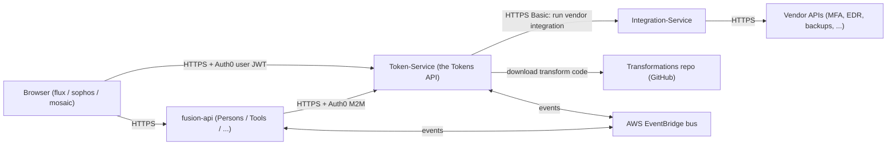
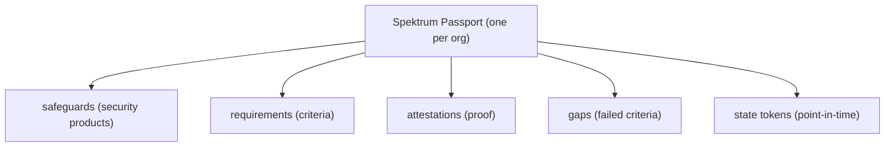
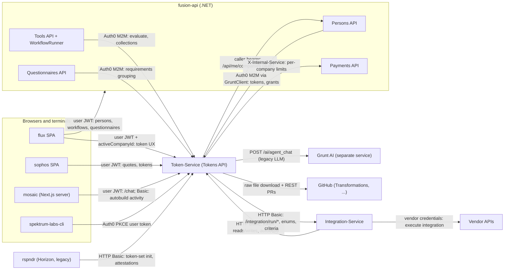
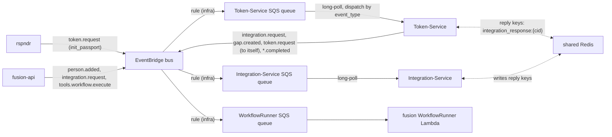
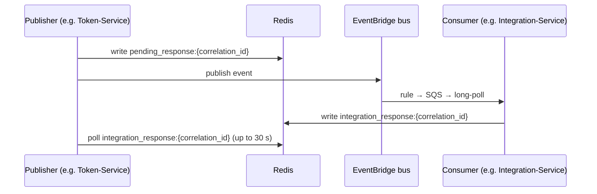
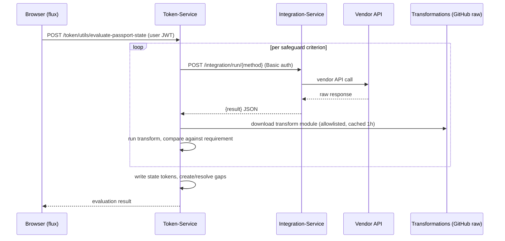
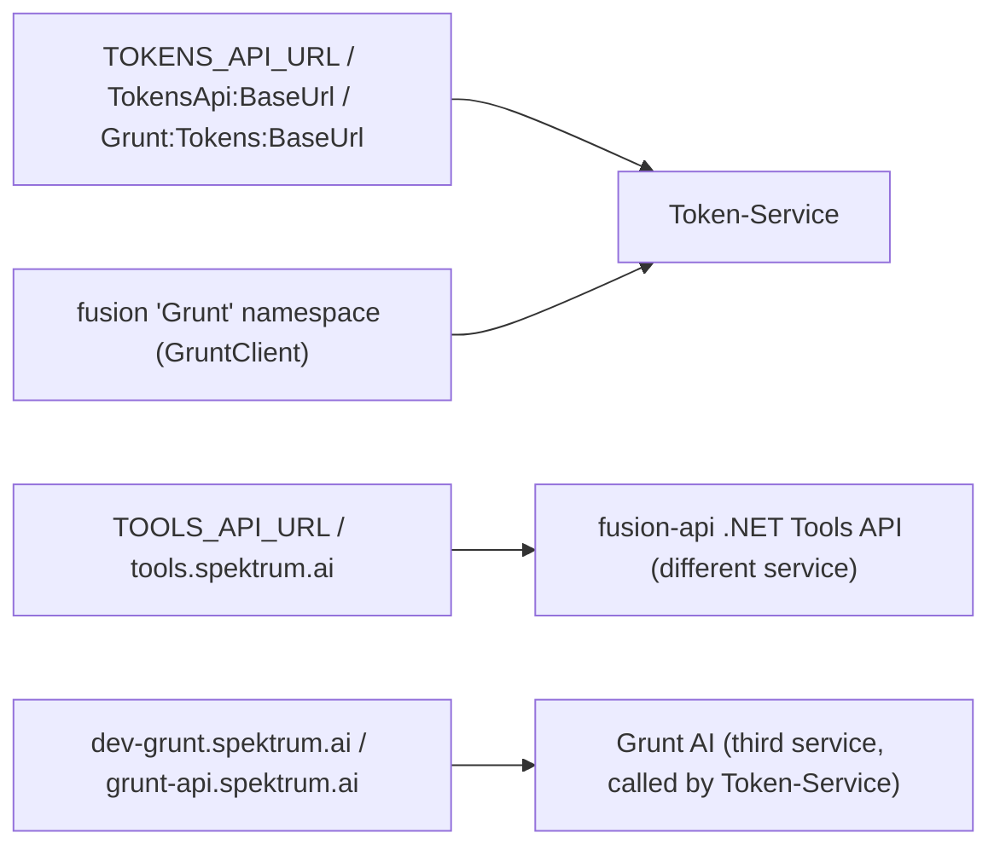

# The Spektrum platform

> Part of the [Transformations onboarding docs](README.md) — the shared platform overview, authored and verified in the Token-Service docs2 set. Verified against Token-Service `develop @ 7a51c9d0` (2026-08-31). Status: draft for engineer review.

**In one sentence:** Spektrum measures an organization's cyber-security posture as a graph of verifiable tokens and turns that measurement into insurance-grade evidence (underwriting reports, quotes, and coverage), across roughly eight services that all orbit one hub, the Token-Service.

## At a glance

- **The product:** cyber-risk posture measurement plus insurance enablement, as the code actually implements it — measure the posture, evaluate it continuously, hand insurers evidence they can price.
- **One passport per org:** every customer organization is a **Spektrum Passport** token whose fields are classic insurance-underwriting intake — company name, domain, revenue, employee counts, protected-record counts (Token-Service: `src/schemas/tokens/spektrum_passport.py:71-93`).
- **A family of tokens:** hanging off the passport are **safeguards** (security products the company runs), **requirements** (criteria those safeguards must satisfy), **attestations** (human- or machine-supplied proof), **gaps** (failed criteria), and point-in-time **state** tokens.
- **Insurance is literal:** quote and coverage tokens carry `insurer`, `broker`, `premium`, `policyNumber`, `endorsements`, `subjectives` (Token-Service: `src/schemas/tokens/coverage_token.py:63-84`); the fusion backend calls a Token-Service `/insurance/quote` endpoint (fusion-api: `src/Spektrum.Fusion.Common.Infrastructure/Grunt/TokenService.cs:11-31`); underwriting-style reports are generated from the graph (Token-Service: `src/routes/reports.py:1068`).
- **Roughly eight codebases, one hub:** the **Token-Service** (this doc set's subject) owns the token graph and is the center of gravity — every other service either reads/writes tokens through its HTTP API or exchanges events with it over a shared AWS EventBridge bus.
- **The supporting cast:** **flux** (browser frontends: the flux resilience SPA, the sophos insurance SPA, the mosaic AI app), **fusion-api** (.NET monorepo of five business APIs: Persons, Tools, Questionnaires, Notifications, Payments), **Integration-Service** (third-party vendor API calls — the "is your MFA actually on?" checks), **rspndr** (legacy identity/company backend), **Transformations** (per-safeguard Python code converting raw vendor responses into evaluable values), **spektrum-labs-cli** (terminal client whose service registry doubles as the best machine-readable map of the platform).
- **One auth story:** the frontends authenticate users with Auth0 and call Token-Service and the fusion APIs with the same bearer token — one audience covers them all (flux: `apps/flux/.env.production:4`).
- **Evaluation in one line:** Token-Service asks Integration-Service to execute the relevant vendor API methods, pipes each raw response through transformation code downloaded from the Transformations repo, and writes the results (state tokens, gaps) back into the graph.
- **Async rides one bus:** passport initialization, task creation, and agent triggers travel as events on one shared EventBridge bus.

This is the **core request path** — the one flow to internalize before anything else. Follow it left to right: a user's browser talks to Token-Service, which fans out to Integration-Service to interrogate real vendor APIs during evaluation.

The token family hanging off each passport:

> [!WARNING]
> **If you remember one confusing fact from this page, make it this:** across every consumer, Token-Service is called the **"Tokens API"** (`VITE_TOKENS_API_URL`, `TokensApi:BaseUrl`, `Grunt:Tokens:BaseUrl`), while the similarly named **"Tools API"** is a completely different service (fusion-api's .NET Tools API), and **"Grunt"** is used both as fusion's internal name for Token-Service *and* as the name of a third, separate AI service. See [Gotchas](#gotchas) and the Token-Service set's `GLOSSARY.md`.

## How it actually works

> [!NOTE]
> **Citation convention:** bare paths (`src/...`) are Token-Service paths at `develop @ 7a51c9d0`. Sibling-repo citations are prefixed with the repo name and reflect the checkouts read during research (see [README.md](README.md) for the verification methodology) — treat sibling line numbers as approximate to what is deployed.

### The cast

#### Token-Service

- **What it is:** a Python/FastAPI application titled "Spektrum labs - Token Service API" (`src/__init__.py:39`) — the subject of the Token-Service docs2 set, starting with its `01-token-service-overview.md`.
- **Owns:** the token graph — passports, safeguards, attestations, requirements, gaps, risks, journeys, grants — stored in AWS Neptune with field-level envelope encryption (see the Token-Service set's `05-data-layer.md`).
- **Route prefixes:** `/token`, `/grants`, `/reports`, `/v1` (journeys), `/analysis`, `/admin`, `/chat` (only when `CHAT_ENABLED`), and more (`src/__init__.py:107-132`).
- **Where it runs:** `tokens.spektrum.ai` (dev: `dev-tokens.spektrum.ai`); local dev on port **8090** (`docker-compose.dev.yml:9-12`).
- **Talks to:** Integration-Service (vendor calls), the fusion Persons API (company resolution during auth, `src/services/auth.py:354-395`), the fusion Payments API (per-company limits, `src/services/usage_limits_client.py:106-137`), the Grunt AI service (legacy LLM path, `src/services/gap_ai_enhancement.py:141`), GitHub (transform downloads and agent-authored PRs, `src/services/github_client.py:13-51`), Slack, and the EventBridge bus.

#### flux

- **What it is:** the frontend monorepo (Turborepo/npm workspaces) of React/Next apps: `apps/flux` (the main resilience SPA, Vite), `apps/sophos`, `apps/mosaic`, `apps/admin`, `apps/auth`, `apps/docs`, plus shared packages, chiefly `@flux/api` (directory listing of `flux/apps`).
- **Auth:** the shared axios client attaches the Auth0 bearer token and derives an `activeCompanyId` header from the JWT claim `https://rspndr.app/roles` (flux: `packages/api/src/lib/api-client.tsx:84-117`).
- **Talks to:** Token-Service (`VITE_TOKENS_API_URL` — the entire token UX: dashboards, safeguards, attestations, posture, reports, grants) and the fusion Persons/Tools/Questionnaires APIs.

#### sophos (inside flux)

- **What it is:** the insurance/quote-facing SPA (flux: `apps/sophos`) — the surface for the quote/coverage side of the product.
- **Auth:** shares the same `@flux/api` client and Token-Service base URL config (flux: `apps/sophos/.env.development:25`).

#### mosaic (inside flux)

- **What it is:** the AI-first app, Next.js 15; its server-side API routes proxy the browser to Token-Service.
- **Talks to:** `POST /chat` and the run-activity/stream/cancel endpoints, forwarding the user's Auth0 token (flux: `apps/mosaic/src/app/api/tokens-chat/route.ts:71` → `src/routes/chat.py:111-112`).
- **Auth exception:** the integration-autobuild activity route authenticates with a service Basic credential instead (`TOKENS_ADMIN_BASIC_USER`/`TOKENS_ADMIN_BASIC_PASS`, flux: `apps/mosaic/src/app/api/integration-activity/[jobId]/route.ts:33-38`).
- **Caveat:** several of its report/data-source routes are drifted and cannot work against Token-Service develop — see Gotcha 3.

#### fusion-api

- **What it is:** a .NET 8 Clean Architecture monorepo of five bounded contexts, each shipped as its own API — Persons, Tools, Questionnaires, Notifications, Payments (root Dockerfiles `Dockerfile.PersonsApi` … `Dockerfile.PaymentsApi`) — plus SQS-driven Lambda workers such as the Tools WorkflowRunner (fusion-api: `src/Spektrum.Fusion.Tools.Workers.WorkflowRunner/Function.cs:36`).
- **Talks to Token-Service:** through a client literally named `GruntClient` with base URL config `Grunt:Tokens:BaseUrl` and Auth0 machine-to-machine tokens (fusion-api: `src/Spektrum.Fusion.Common.Infrastructure/Grunt/GruntClient.cs:13-55`), hitting ~20 token/grants/insurance endpoints (fusion-api: `Grunt/TokenService.cs:11-31`).
- **Publishes:** `person.added`, `integration.request`, and `tools.workflow.execute` events to the shared bus (fusion-api: `Events/EventBridgeService.cs:42-47`).

#### Integration-Service

- **What it is:** a Python/FastAPI service whose structure mirrors Token-Service (its own `app.py`, `src/services/event_bus_client.py`, SQS poller); it executes third-party vendor API integrations from `integration_configs/` and is the platform's **only door to vendor systems**.
- **Where it runs:** `integrations.spektrum.ai`; local port **8081**.
- **Talks to:** Token-Service over HTTP Basic auth for token reads/writes and autobuild delegation (Integration-Service: `src/services/http_client.py:133-138`).
- **Called back by:** Token-Service at `/integration/run/{method}` during safeguard evaluation (`src/utils/evaluate/evaluate.py:2100-2125`).

#### rspndr ("Spektrum Response" / Horizon)

- **What it is:** the legacy .NET web API + web app (rspndr: `readme.md:1-14`), and the platform's original identity/company backend.
- **Still load-bearing:** its Auth0 claim namespace `https://rspndr.app/roles` is still what flux parses for company details (flux: `packages/api/src/lib/api-client.tsx:104`).
- **Founding event:** on company creation it publishes a `token.request` event whose payload method is `init_passport`, which makes Token-Service create the company's passport and token family (rspndr: `webAPI/Horizon.BusinessLogic/DomainEvents/Handlers/CompanyEventHandler.cs:29-42`).
- **Direct calls too:** it calls Token-Service with Basic auth for token-set initialization and attestations (rspndr: `webAPI/Horizon.BusinessLogic/Repository/CompanyRepository.cs:654-716`).

#### Transformations

- **What it is:** a repo of per-safeguard Python modules (`safeguards/{SRN}/*.py`) that convert vendor API responses into evaluable values (Transformations: `README.md:1-8`).
- **Pull-only:** all interaction is initiated by Token-Service — at evaluation time it downloads the module from `raw.githubusercontent.com`, allowlisted to `spektrum-labs/Transformations` as the SSRF choke point (`src/utils/transformation_url.py:16-57`) and cached in-process 1 hour (`src/utils/codeexecutor.py:54-55`).
- **PRs flow back:** Token-Service's agentic pipelines open fix PRs against it (`src/services/github_client.py:35-51`).

#### spektrum-labs-cli

- **What it is:** a Python CLI with Auth0 PKCE login — "The Spektrum platform from your terminal" (spektrum-labs-cli: `README.md:1-5`).
- **Canonical URL map:** its service registry is the canonical machine-readable URL map of the platform (spektrum-labs-cli: `src/spektrum/http/registry.py:44-152`) and is the source for the environment matrix below.
- **Drives:** Token-Service's token, posture, report, journey, merkle, and schedule endpoints (spektrum-labs-cli: `src/spektrum/services/tokens.py:16`).

#### Grunt AI (a separate service)

- **What it is:** mentioned for completeness — a *separate* service at `dev-grunt.spektrum.ai` / `grunt-api.spektrum.ai` that Token-Service calls for legacy LLM work (`POST /ai/agent_chat`, `src/services/ciso_ai_analysis.py:349`).
- **Status:** its repo is not among the platform checkouts, and Token-Service's config marks its legacy gap-enrichment path as effectively dead (`src/schemas/aws_secret.py:240`).
- **Do not confuse:** fusion code *also* calls Token-Service "Grunt" — see Gotcha 1.

> [!NOTE]
> **workflow-integrations is not part of the platform integration map.** It is a single-page React recreation of the spektrum.ai homepage "built for testing GitHub workflows" (workflow-integrations: `README.md:1-4`), with no Token-Service references — it exists so you don't waste an afternoon wondering where it fits.

> [!TIP]
> **platform.sh** — a single bash bring-up script (not a repo) — starts Token-Service (:8090) and Integration-Service (:8081) via their dev composes and health-checks `/health_check`. It refuses to start without the AWS VPN because both Python services abort at import when the dev SQL Server is unreachable (platform.sh:9-11, :25-32). See the Token-Service set's `12-local-development.md` (this repo's own local workflow — `local_tester.py`, no VPN needed — is [12-local-development.md](12-local-development.md)).

### The synchronous HTTP map

This is the flagship diagram: every service, every HTTP arrow, labeled with protocol and purpose. Token-Service sits in the middle — count the arrowheads pointing at `TS` and you have the argument for calling it the hub.

How to read it:

- **Top-left cluster:** everything a human touches — all of it lands on Token-Service with an Auth0 user token, plus an `activeCompanyId` header for org scoping (`src/services/auth.py:667-699`).
- **Peer backends:** the fusion APIs call Token-Service machine-to-machine (fusion-api: `Grunt/GruntClient.cs:37-55`).
- **Both directions:** the two arrows between Token-Service and Integration-Service run in *both* directions — Integration-Service writes tokens, Token-Service executes vendor methods — and both directions use the same shared Basic credential (Gotcha 2).
- **Right side:** Token-Service's own outbound calls are what make evaluation, auth, limits, and the agentic PR pipelines work.

<b>Deep dive:</b> evidence for every arrow

| Arrow | Evidence |
|---|---|
| flux/sophos → Token-Service | flux: `apps/flux/src/config/env.ts:20` |
| mosaic → Token-Service | flux: `apps/mosaic/src/app/api/tokens-chat/route.ts:71` |
| CLI → Token-Service | spektrum-labs-cli: `src/spektrum/services/tokens.py:16` |
| fusion → Token-Service | fusion-api: `Grunt/TokenService.cs:11-31` |
| rspndr → Token-Service | rspndr: `CompanyRepository.cs:709` |
| Integration-Service → Token-Service | Integration-Service: `src/services/http_client.py:133-138` |
| Token-Service → Integration-Service | `src/utils/evaluate/evaluate.py:2100-2125` |
| Token-Service → Persons | `src/services/auth.py:354-395` |
| Token-Service → Payments | `src/services/usage_limits_client.py:106-137` |
| Token-Service → Grunt AI | `src/services/gap_ai_enhancement.py:141` |
| Token-Service → GitHub | `src/services/github_client.py:13-51` |

<b>Deep dive:</b> who calls which Token-Service endpoints (per consumer)

- **flux SPA / sophos**: the whole `/token/*` surface — initialize (passport, safeguard, gap, claim, incident, third-party-requirements, batch asset), `/token/utils/*` (batch reads, attestations, safeguard batches, `evaluate-passport-state`, posture-stream family), `/token/{srn}` and linked-token traversals, unified-token latest-collection reads, `/grants/{passportSrn}` CRUD + `/effective`, `/reports/*` including portfolio jobs, `/v1/nft/*`, `/v1/merkle/*`, `/aws/generate_presigned_url/`, and `/v1/journeys/{srn}/evaluate` (flux: `packages/api/src/features/tokens/*.ts`, e.g. `post-passport.ts:7`, `get-posture.ts:22-25`, `get-effective-capability.ts:17-21`, `get-report.ts:26`). Journey CRUD, by contrast, goes to the Persons API — see Gotcha 7.
- **fusion-api**: the constant block in fusion-api: `Grunt/TokenService.cs:11-31` — `/insurance/quote`, gap-token CRUD, unified-collection reads, `/token/utils/batch`, `/token/utils/initialize/token-set`, `/token/utils/evaluate-passport-state`, bulk-initialize + status, and association edges — plus, further down the same file, `/token/update/token-owner/{srn}` (`TokenService.cs:554`) and `/grants/{passportSrn}/effective` (`TokenService.cs:678`; cached 60 s by `CallerAccessService`, fusion-api: `Grunt/CallerAccessService.cs:27-67`).
- **Integration-Service**: `GET /token/{srn}`, latest-attestation-collection, safeguard(-configuration) token init/patch, `/token/utils/initialize/token-set`, coverage-token init/patch, `POST /admin/integrations/autobuild`, and fail-closed capability checks against `/grants/{srn}/effective` (Integration-Service: `src/services/http_client.py:173-652`, `src/services/capability.py:79-100`).
- **rspndr**: `POST token/utils/initialize/token-set`, `POST /token/utils/attestations`, `GET token/{srn}` (rspndr: `CompanyRepository.cs:709`, `CyberBundleService.cs:916-919`, `OfferingController.cs:735-750`).
- **spektrum-labs-cli**: tokens/attestations/safeguards batches, posture stream, safeguard configuration, passport patch, grants, journeys, merkle proofs, schedules, reports (incl. portfolio jobs), analysis revalidation, `/admin/clients` (spektrum-labs-cli: `src/spektrum/services/tokens.py`). Two near-misses: the CLI's `/journeys/templates…` calls go to the **Persons** API and its `/chats…` calls to the **Tools** API — neither is Token-Service (spektrum-labs-cli: `src/spektrum/services/persons.py:269`, `src/spektrum/services/tools.py:115-135`).

The full Token-Service route inventory lives in the Token-Service set's `11-api-reference.md`.

### The event backbone

Not everything is synchronous. Every service publishes to one shared EventBridge bus (`dev-spektrum-event-bus` in dev); EventBridge rules (infrastructure, not in any repo) fan events out to per-service SQS queues; each Python service long-polls its own queue and dispatches by `event_type`.

Token-Service's half of the bus:

- **Publishing:** batched `put_events` (`src/services/event_bus_client.py:268-283`).
- **Consuming:** a startup long-poll loop on its own queue — 20 s wait, visibility 3600 s, batch 10 (`src/services/token_service.py:44-49`, `app.py:199-201`).
- **Registered handlers:** `token.request`, `person.added`/`person.removed`, `merkle.hash.propagate`, and (behind `AGENT_ENABLED`) `gap.created`/`control.evaluation.failed` (`app.py:147-192`).

The dotted Redis arrows are the **request/reply convention**:

<b>Deep dive:</b> request/reply mechanics, step by step

1. A publisher that wants an answer writes `pending_response:{correlation_id}` before publishing (`src/services/event_bus_client.py:264-266`).
2. It then polls `integration_response:{correlation_id}` for up to 30 s (`:347-367`).
3. The consumer's handler writes that key — Token-Service side `app.py:44-66`; Integration-Service side `src/handlers/integration_handlers.py:29-36`.

> [!IMPORTANT]
> The request/reply pattern only works when both services see the *same* Redis — Gotcha 4. Full detail in the Token-Service set's `08-eventing-and-async.md`.

### One end-to-end flow: evaluating a passport

The single most representative runtime flow crosses four codebases. A user (or a schedule, or a fusion workflow step) asks Token-Service to evaluate a passport; Token-Service interrogates vendors through Integration-Service and scores the results.

<b>Deep dive:</b> the evaluation walkthrough — entry points and mechanics

1. **Entry:** the route is `src/routes/tokens/utilities.py:180`. fusion's equivalent entry is `EvaluatePassportState` (fusion-api: `Grunt/TokenService.cs:614-630`); schedules self-publish a `token.request` event instead (`src/utils/schedules.py:29`).
2. **Vendor call:** the evaluation engine builds an Integration-Service client with the shared Basic credential (`src/utils/evaluate/evaluate.py:2100-2103`), recognizes integration-gateway URLs, and POSTs `{integrator, consumer, parameters}` to `/integration/run/{method}` (`evaluate.py:2105-2125`).
3. **Transform:** the vendor result is piped through the safeguard's transformation module, downloaded from the allowlisted Transformations repo (`src/utils/transformation_url.py:48-57`).
4. **Write-back:** failed criteria become gap tokens, and gap creation publishes `gap.created` back onto the bus — which can re-enter Token-Service as an agent-workflow trigger (`src/services/gap_ai_enhancement.py:290-307`, `app.py:178-192`).

The engine's internals are the Token-Service set's `06-evaluation-engine.md`; the transform-execution slice of that flow — this repo's half — is [02-execution-contract.md](02-execution-contract.md).

### Environments and URLs

The platform runs in three deployed environments plus local. The base URLs below are verbatim from the CLI's service registry (spektrum-labs-cli: `src/spektrum/http/registry.py:44-152`), which is the most reliable URL map in any repo — several repos' own CLAUDE.md port tables contradict their compose files (Gotcha 9).

| Service | prod | stage | dev | local |
|---|---|---|---|---|
| Token-Service ("tokens") | `https://tokens.spektrum.ai` | `https://stage-tokens.spektrum.ai` | `https://dev-tokens.spektrum.ai` | `http://localhost:8090` |
| Integration-Service | `https://integrations.spektrum.ai` | `https://stage-integrations.spektrum.ai` | `https://dev-integrations.spektrum.ai` | `http://localhost:8081` |
| Persons API (fusion) | `https://persons.spektrum.ai/api` | `https://stage-persons.spektrum.ai/api` | `https://dev-persons.spektrum.ai/api` | `http://localhost:5279/api` |
| Tools API (fusion) | `https://tools.spektrum.ai/api` | `https://stage-tools.spektrum.ai/api` | `https://dev-tools.spektrum.ai/api` | `http://localhost:5280/api` |
| Questionnaires API (fusion) | `https://questionnaires.spektrum.ai/api` | `https://stage-questionnaires.spektrum.ai/api` | `https://dev-questionnaires.spektrum.ai/api` | `http://localhost:5281/api` |
| Notifications API (fusion) | `https://notifications.spektrum.ai/api` | `https://stage-notifications.spektrum.ai/api` | `https://dev-notifications.spektrum.ai/api` | `http://localhost:8080/api` |
| Grunt tools API | `https://grunt-api.spektrum.ai` | `https://stage-grunt.spektrum.ai` | `https://dev-grunt.spektrum.ai` | `http://localhost:8000` |
| Grunt AI | `https://grunt-api.spektrum.ai/ai` | `https://stage-grunt.spektrum.ai/ai` | `https://dev-grunt.spektrum.ai/ai` | `http://localhost:8000/ai` |
| Journeys API ("composer") | — | — | — | `http://localhost:8000` (local only, no deploy pipeline) |

- **Per-service override:** every registry URL can be overridden with `SPEKTRUM_{SERVICE}_URL` (spektrum-labs-cli: `src/spektrum/http/registry.py:155-158`).
- **Frontends run outside docker locally:** flux `:5173`, mosaic `:3000`, auth `:3001` (platform.sh:53-56).
- **Shared Auth0 audience** (Token-Service, Integration-Service, and the fusion APIs): `https://dev-api.spektrum.ai` in dev, `https://api.spektrum.ai/api` in prod (flux: `apps/flux/.env.development:5`, `apps/flux/.env.production:4`).

> [!NOTE]
> `api.spektrum.ai` is an Auth0 *audience string*, not a hostname anything actually calls.

Local-dev mechanics (VPN requirement, Redis port collision, compose variants) are in the Token-Service set's `12-local-development.md`; deployed-environment mechanics in its `13-deployment-and-release.md`. This repo deploys differently from every service above — see [13-release-and-branches.md](13-release-and-branches.md).

### Why Token-Service is called the hub

Three structural facts, all visible in the diagrams above:

- **It owns the only shared domain state.** The token graph is the platform's system of record for posture and insurance data, and no other service has its own copy — flux, fusion, Integration-Service, rspndr, and the CLI all read and write it through Token-Service's API (the endpoint inventories in the deep-dive above).
- **It is the center of both communication planes.** Every synchronous arrow in the HTTP map either starts or ends at it, and on the event plane it is both a major publisher and the consumer that handles the platform's founding event (`token.request`/`init_passport` from rspndr, `app.py:112`).
- **It hosts the platform's active machinery.** The evaluation engine, the posture stream, the report generators, the journey evaluator, and the agentic AI subsystem all live inside it (see the Token-Service set's `06-evaluation-engine.md`–`10-onboarding-and-journeys.md`).

> [!IMPORTANT]
> The practical consequence for you: whichever repo you were hired into, most cross-service bugs will have one leg in Token-Service.

## Gotchas

> [!WARNING]
> **Gotcha 1 — the "Tokens" / "Tools" / "Grunt" naming trap.** Learn this before your first cross-repo grep:
>
> - `TOKENS_API_URL`, `TokensApi:BaseUrl`, and `Grunt:Tokens:BaseUrl` all mean **Token-Service**.
> - `TOOLS_API_URL` / `tools.spektrum.ai` is **fusion-api's .NET Tools API**, a different service.
> - `dev-grunt.spektrum.ai` is a third service (**Grunt AI**) that Token-Service *calls*.
> - Token-Service's own dev container is named `grunt-tools-token-api` — all three words in one name (`docker-compose.dev.yml:5`).
> - fusion's HTTP client for Token-Service is a class named `TokenService` inside a `Grunt` namespace (fusion-api: `Grunt/TokenService.cs:9`).

> [!WARNING]
> **Gotcha 2 — one shared Basic credential is committed across repos, and every use of it audits as a single human.** A hardcoded `Authorization: Basic ...` header (base64 of `SophosGruntUser:<password>` — value redacted here, but it is a string literal in the source) sits in:
>
> - Token-Service (`src/services/event_bus_client.py:143`)
> - fusion-api's committed config (fusion-api: `src/Spektrum.Fusion.Persons.Api/appsettings.json:57`)
>
> The same credential surfaces two more ways:
>
> - rspndr commits the *plaintext* username+password three times (rspndr: `webAPI/Horizon.WebApp/appsettings.json:150-163`)
> - mosaic expects the same pair at runtime as `TOKENS_ADMIN_BASIC_USER`/`TOKENS_ADMIN_BASIC_PASS`
>
> Any holder authenticates to Token-Service as `engineering@spektrum.ai` (`src/services/auth.py:724-729`), so audit logs cannot distinguish Integration-Service from rspndr from a leaked credential. Details and status in the Token-Service set's `14-known-issues.md`.

> [!WARNING]
> **Gotcha 3 — some frontend code targets Token-Service routes that do not exist on `develop`.** mosaic's report/data-source proxy routes (flux: `apps/mosaic/src/app/api/workflow/report/generate/route.ts:62-134`, `apps/mosaic/src/app/api/data-sources/revalidate/route.ts:42`) call route shapes Token-Service never serves:
>
> | mosaic calls | actual route on develop |
> |---|---|
> | `/report/{uid}/{type}` | `/reports/{report_type}/{passport_uid}` (`src/routes/reports.py:1068`) |
> | `/report/render` | `/reports/render` (`src/routes/reports.py:1380-1385`) |
> | `/tokens/passport/{uid}/…` | `/token/...` |
> | `/passport/{uid}/analysis/revalidate` | `/analysis/{uid}/revalidate` (`src/routes/analysis.py:99-101`) |
>
> flux's agent-builder calls `/v1/agents/*`, for which no router exists on develop (the only agents route is `/admin/agents/graph`, `src/routes/agent_graph.py:19`). Both flux's own SPA and the CLI use the correct shapes, so treat mosaic/agent-builder call sites as drifted, not as documentation.

> [!WARNING]
> **Gotcha 4 — the event request/reply pattern silently requires a shared Redis, and therefore fails locally by construction.** The publisher polls `integration_response:{correlation_id}` in *its* Redis (`src/services/event_bus_client.py:347-367`); the consumer writes the key in *its own*. Deployed environments share one ElastiCache; local composes each run their own Redis (platform.sh even moves Integration-Service's to host 6380 to dodge the port collision, platform.sh:19-21), so `wait_for_response=True` times out locally no matter what you do.

> [!WARNING]
> **Gotcha 5 — fusion-api's event envelope is double-nested.** Its `EventBridgeService` serializes the whole event model into `Detail`, so consumers see `detail.Detail.payload` (capital D); Token-Service special-cases the descent (`src/services/event_bus_client.py:167-173`; fusion-api: `Events/EventBridgeService.cs:42-47`). Any new consumer of fusion events must replicate that descent or the events route nowhere.

> [!WARNING]
> **Gotcha 6 — both Python services abort at import — not at request time — when the dev SQL Server is unreachable.** `init_db()` runs at module import (`src/__init__.py:25`) and opens a test connection, so a dropped AWS VPN shows up as a container that won't boot (platform.sh:9-11, :25-32). If your local Token-Service dies instantly with a DB traceback, check the VPN before anything else.

> [!WARNING]
> **Gotcha 7 — journeys are split across two services by design.** Journey CRUD lives on the fusion Persons API (flux calls `api.persons.get('/journeys/…')`), while journey *evaluation* and the journey/schedule tokens live on Token-Service (`/v1/journeys/{srn}/evaluate`; flux: `packages/api/src/features/journeys/get-evaluation.ts:20`). A "journey" row in the fusion database and a journey token in the graph are different records glued together by events — see the Token-Service set's `10-onboarding-and-journeys.md`.

> [!WARNING]
> **Gotcha 8 — local port asymmetry between the two Python services.** Integration-Service's fallback URL for Token-Service is `http://host.docker.internal:8080` (Integration-Service: `src/services/http_client.py:135`), but the blessed dev compose serves Token-Service on **8090** (`docker-compose.dev.yml:11-12`); 8080 matches only the debugpy variant. Set `TOKEN_SERVICE_URL` explicitly for any local cross-service work.

> [!WARNING]
> **Gotcha 9 — several in-repo docs are stale; prefer the CLI registry and this doc set.** Token-Service's own `README.md` gives its URL as `https://api.spektrum.ai/mcp`, but every consumer in code reaches it at `tokens.spektrum.ai` (`api.spektrum.ai` appears in code only as the Auth0 audience). fusion-api's CLAUDE.md port table disagrees with its own compose file and with the ports the frontends actually use (spektrum-labs-cli: `src/spektrum/http/registry.py:67-115` is the trustworthy source). The full audit of stale claims is in the Token-Service set's `14-known-issues.md`; this repo's own stale-doc corrections are in [14-known-issues.md](14-known-issues.md).

## Where the code lives

Repositories (GitHub org `spektrum-labs` where verified in code — `src/schemas/aws_secret.py:131-139` names `spektrum-labs/Transformations`, `spektrum-labs/Integration-Service`, `spektrum-labs/Token-Standards-Internal`):

| Area | Repo / path |
|---|---|
| Token graph, evaluation, reports, agents, MCP — the hub | `Token-Service` (this repo; FastAPI app at `app.py`, routers in `src/routes/`, services in `src/services/`) |
| Browser frontends: flux SPA, sophos SPA, mosaic, admin, auth, shared API client | `flux` monorepo (`apps/flux`, `apps/sophos`, `apps/mosaic`, `packages/api`) |
| Persons / Tools / Questionnaires / Notifications / Payments APIs + Lambda workers | `fusion-api` (`src/Spektrum.Fusion.*`; Token-Service client in `src/Spektrum.Fusion.Common.Infrastructure/Grunt/`) |
| Vendor API execution, integration configs | `Integration-Service` (`integration_configs/`, `src/services/`, `src/handlers/`) |
| Legacy identity/company backend (Horizon) | `rspndr` (`webAPI/Horizon.sln`, `web/` Angular app) |
| Per-safeguard transformation code | `Transformations` (`safeguards/{SRN}/*.py`) |
| Terminal client + canonical service registry | `spektrum-labs-cli` (`src/spektrum/http/registry.py`, `src/spektrum/services/`) |
| Token schema standards (agent PR target) | `Token-Standards-Internal` (referenced from Token-Service config; not in the platform checkouts) |
| GitHub-workflow demo site (not part of the platform) | `workflow-integrations` |
| Local bring-up script for the two Python services | `platform.sh` (a single bash script, not a repo) |
