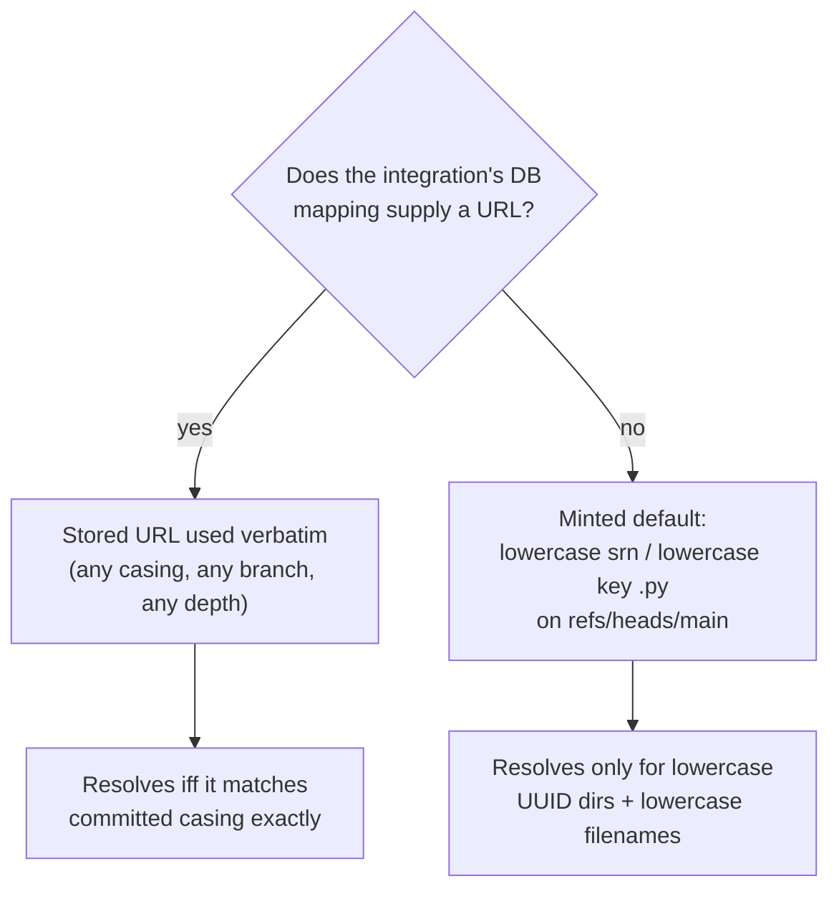

# Transformations: code that IS the deployment

> Part of the [Transformations onboarding docs](README.md). Verified against `develop @ 5c5ccde5` and production `main @ c1d935da` (2026-09-03). Status: draft for engineer review.

**In one sentence:** This repo holds 765 standalone Python transform modules (one per vendor criterion) that Token-Service downloads from GitHub's raw CDN — pinned to `refs/heads/main` — and executes in a [RestrictedPython](GLOSSARY.md#restrictedpython) sandbox during every passport evaluation, so the repo has no deploy pipeline because the repo *is* the deployment.

> [!IMPORTANT]
> **The three defining facts.** Everything else in these docs follows from them:
> 1. **`main` is production, live at fetch time.** Integration-Service mints transformation URLs pinned to `refs/heads/main`; Token-Service fetches and executes them per evaluation. A merge to `main` is an ungated, instant production deploy — worst-case propagation is ≤300 s of GitHub CDN cache plus ≤3600 s of Token-Service's in-process code cache (see [02-execution-contract.md](02-execution-contract.md)).
> 2. **There is no CI, on any branch.** No `.github/` directory, no tests on main, no build, no requirements.txt (verified via `git ls-tree` at both pinned tips). PR review is the entire deploy gate.
> 3. **The repo is public.** Token-Service fetches with no Authorization header (`requests.get(url, headers={"Cache-Control": "no-cache"})`, Token-Service main:`src/utils/codeexecutor.py:308-309`), and an anonymous `curl` of a main transform URL returned HTTP 200 (verified live 2026-09-03). Public visibility is a *production dependency* — making the repo private breaks every evaluation.

## At a glance

- **What a file is:** one Python module per vendor criterion, exposing `def transform(input)`, converting a vendor API response into camelCase criteria values (`{"isMFAEnforcedForUsers": true}`) that Token-Service compares against requirements.
- **Scale (main @ `c1d935da`):** 1,276 `.py` files under `safeguards/` — 765 transform modules, 509 generated Pydantic schemas, 2 `common/` helpers. Full inventory in [04-catalog.md](04-catalog.md).
- **Who mints the URL:** Integration-Service's `generate_config` embeds `https://raw.githubusercontent.com/spektrum-labs/Transformations/refs/heads/main/safeguards/{srn}/{method}.py` — **lowercasing both segments** (`src/models/integrator.py:2601`, see Integration-Service docs2). DB-stored criteria-mapping URLs override the minted default and are used verbatim.
- **Who runs it:** Token-Service, per evaluation: allowlist check (org/repo only) → anonymous fetch → AST validation → RestrictedPython sandbox → `transform(input)` → `compare_values` (see token-service docs2 and [02-execution-contract.md](02-execution-contract.md)).
- **Failures are silent by design:** any 404, syntax error, or exception becomes `{"error": True, ...}` → `isEvaluated: False` → a task, never a gap. A broken file can stay unmeasured for months.
- **Two directory layouts coexist:** 22 SRN/UUID dirs (minted-URL territory) and 27 category dirs (reachable *only* via exact-case DB URLs). Casing decides reachability — details below.
- **Branch skew is severe:** develop is 505 commits ahead and invisible to minted production URLs; main carries 81 hotfix commits develop lacks (see [13-release-and-branches.md](13-release-and-branches.md)).

```mermaid
flowchart LR
    IS["Integration-Service<br/>mints URL, lowercased<br/>pinned to refs/heads/main"] -->|"safeguardTransformationLogic.url"| TS["Token-Service<br/>per-evaluation fetch"]
    TS -->|"anonymous GET, no auth"| RAW["raw.githubusercontent.com<br/>= this repo's main branch"]
    RAW -->|".py file bytes"| SBX["RestrictedPython sandbox<br/>8-module import allowlist"]
    SBX -->|"transform(input) → dict"| CMP["compare_values<br/>transformedResponse[key]"]
    CMP --> V["requirementSatisfied /<br/>isEvaluated verdict"]
```

Walkthrough: during every evaluation, Token-Service receives a per-criterion URL into this repo from Integration-Service's config, downloads the file anonymously from GitHub's raw CDN, executes it in a sandbox, and compares the returned dict against the requirement. GitHub is the artifact store; directory and file names are the public API.

## What this repo is (and is not)

This is the platform's per-vendor evaluation logic — the code that decides whether "MFA is enforced" or "backups are encrypted" is true for a given customer's vendor account. There is no application here: no entrypoint, no dependency manifest, no service. Each file is fetched and executed **standalone**: no transform imports another file — the only relative import outside `schemas/` is `common/__init__.py`'s own (verified by census over every module on main).

- **Merge = deploy.** A file merged to main starts serving production traffic on the next cache-miss fetch. Reverting has the same latency — there is no faster rollback.
- **Delete = silent un-measurement.** Deleting a file 404s its URL, which becomes `isEvaluated: False` (a task), not a failure — nobody's posture visibly degrades, and a long-lived Token-Service worker may keep executing the stale cached copy on fetch errors (see [02-execution-contract.md](02-execution-contract.md)).
- **Rename = production incident.** URLs live in Integration-Service's DB and minted defaults; the repo cannot see who references a path (see the [!CAUTION] below).

> [!NOTE]
> "develop is invisible to production" is true **for minted default URLs only.** DB-stored `transformationLogic` URLs can pin any branch of this repo — Token-Service's allowlist checks only the org/repo (`Token-Service main:src/utils/transformation_url.py:16-19, :39`), and 16 Integration-Service reference configs pin `refs/heads/develop` today. Details and receipts in [13-release-and-branches.md](13-release-and-branches.md).

## The dual layout: SRN dirs vs category dirs

`safeguards/` mixes two addressing schemes, and both are load-bearing:

| | SRN (UUID) directories | Category directories |
|---|---|---|
| Count on main | 22 (e.g. `874a78ff-…`, `7BC425FA-…`) | 27 (e.g. `epp/`, `emailsecurity/`, `iam/`) |
| Path shape | `safeguards/{srn}/{method}.py` — 2 segments | `safeguards/{category}/{vendor}/{method}.py` — 3 (rarely 4) segments |
| Reached by | Integration-Service's **minted default URL**, which lowercases both segments | **Only** explicit DB-stored `transformationLogic` URLs, used byte-for-byte verbatim |
| Casing rule in practice | Filename must be the exact lowercased criteria key (the minted URL forces `str(key).lower()` — snake_case names 404 too) | 47 camelCase filenames on main work *iff* the stored URL matches committed casing exactly |

The consequence chain: the minted URL is built as `str(self.SRN).lower() + "/" + str(key).lower() + ".py"` (`Integration-Service src/models/integrator.py:2601`, Integration-Service docs2), Token-Service fetches it byte-for-byte with no path normalization, and **raw.githubusercontent.com paths are case-sensitive**. Verified live 2026-09-03:

| URL path (`safeguards/…`) | HTTP |
|---|---|
| `E454A862-2B86-43FF-8072-DB865E354E17/ismfaenforcedforusers.py` (exact case) | 200 |
| `e454a862-…/ismfaenforcedforusers.py` (as minted) | **404** |
| `874a78ff-…/isdkimconfigured.py` (lowercase dir, as minted) | 200 |
| `encryption/microsoft/isAzureADAuthEnabled.py` (exact case) | 200 |
| `encryption/microsoft/isazureadauthenabled.py` (lowercased) | **404** |

So: **10 of the 22 UUID dirs are committed in UPPERCASE** and can never be reached by a minted default URL — they work only through exact-case DB mapping URLs (which demonstrably circulate: Token-Service's own route docs embed an uppercase `1BC425FA-…` URL, `Token-Service main:src/schemas/documentation/route_configs.py:484`). Category paths are never minted at all — the minted URL has exactly two path segments.

Walkthrough: which of your two possible paths production actually fetches is decided entirely by data in Integration-Service's DB, not by anything in this repo — and either path 404s silently (as `isEvaluated: False`) if casing drifts. Full mechanics and receipts: [02-execution-contract.md](02-execution-contract.md#the-case-sensitivity-dead-zone); the per-directory reachability census: [04-catalog.md](04-catalog.md).

> [!CAUTION]
> **Changing the case of any committed path is a production change.** A "normalize casing" cleanup would sever every exact-case DB URL; adding a camelCase filename for a minted-default vendor creates a file production can never fetch. The team has already been bitten: at the 2026-04-22 merge-base, `emailsecurity/mimecast/` contained both `isDNSConfigured.py` and `isdnsconfigured.py` — a state a case-insensitive macOS checkout cannot even represent — and both branches independently deleted the camelCase twin.

> [!TIP]
> Your macOS worktree is case-insensitive and lies about casing. Check with `git ls-tree -r origin/main --name-only`, never `ls`.

## The transform contract, in brief

Every module exposes one entry point — of 765 transform modules on main, **763 define exactly `def transform(input):`** (the 2 outliers are documented in [14-known-issues.md](14-known-issues.md)). Input arrives as the vendor API response (dict/JSON), either raw-and-unwrapped (legacy) or enriched to `{"data": ..., "validation": ...}` when a `schemas/` sidecar validated it. Two return generations coexist on main:

- **Enriched envelope** — 496 of 765 (65%), 100% of UUID-dir files, all new work: `{"transformedResponse": {...criteria keys...}, "additionalInfo": {...}}` (spec at `CONTRIBUTING.md:141-187`).
- **Legacy bare dict** — 269 of 765 (35%), all in category dirs: `return {"isAzureADAuthEnabled": is_enabled}` (`main:safeguards/encryption/microsoft/isAzureADAuthEnabled.py:53`). Token-Service accepts both; it tries `transformedResponse[key]` first, then the top-level key (token-service docs2).

Three rules trip newcomers immediately: the **filename** is the lowercased criteria key, but the **key inside the returned dict** must be exact camelCase (Token-Service's lookup is case-sensitive, `Token-Service main:src/utils/evaluate/evaluate.py:2340-2343`); imports are limited to 8 stdlib modules, so helpers like `extract_input` are **inlined into every file** — `safeguards/common/response_helper.py` is a template, not a dependency (no transform imports it); and several innocuous-looking constructs (`map()`, `datetime.strptime`, `d["k"] += 1`, underscore-prefixed helper names) fail only in the production sandbox. The full contract, conventions, and anti-patterns are in [03-writing-a-transform.md](03-writing-a-transform.md); the runtime mechanics are in [02-execution-contract.md](02-execution-contract.md).

## Repo tour

Everything lives at the root or under `safeguards/`. Root tooling is byte-identical between main and develop (verified: `git diff c1d935da 5c5ccde5` on these files is empty).

| Path | What it is | Notes |
|---|---|---|
| `safeguards/{uuid}/` | 22 SRN dirs, one per integration safeguard | minted-URL territory; 10 are uppercase (DB-URL only) |
| `safeguards/{category}/{vendor}/` | 27 category dirs, 98 vendor subdirs | DB-URL only; two 4-level nests (`firewall/cisco/fmc/`, `epp/kaseya/vsa/`) |
| `safeguards/{dir}/schemas/` | 509 generated Pydantic input schemas (68 dirs) | optional; fetched as `{base}/schemas/{same filename}` — must mirror the transform's exact casing; failure is non-fatal |
| `safeguards/common/response_helper.py` | canonical `extract_input`/`create_response` source | **never imported by any transform** (only `common/__init__.py` imports it) — the sandbox rejects relative imports; copy-pasted into 489 files instead |
| `safeguards/registry.json` | SRN → vendor/category index | **zero programmatic consumers** (grep over Integration-Service and Token-Service `src/`: no hits); covers only 19 of 22 UUID dirs; last touched 2026-02-06 |
| `README.md` | "Safeguard Registry" tables (`README.md:28-91`) | same mapping as registry.json, same drift |
| `CONTRIBUTING.md` | the enriched-envelope contract + sandbox bans | the accurate contract doc; see [03-writing-a-transform.md](03-writing-a-transform.md) |
| `CLAUDE.md` | AI-assistant notes | documents the *legacy* contract and an underscore-helper pattern that only survives by special-case grandfathering — treat with suspicion |
| `local_tester.py` | local mirror of the Token-Service pipeline | runs **unsandboxed** (plain `importlib`) — cannot catch RestrictedPython failures; see [12-local-development.md](12-local-development.md) |
| `generate_schemas.py` | scaffolds `schemas/*.py` | its `api_responses/` sample feature has zero committed instances — generation is name-only in practice |

## Gotchas

> [!WARNING]
> **Broken transforms fail silently.** Every failure — 404, refused URL, syntax error, sandbox rejection, raised exception — collapses into `{"error": True, "message": ..., "original_response": ...}`, which Token-Service converts to `isEvaluated: False`: a task, never a gap (token-service docs2, evaluate-engine §71). One Microsoft 365 transform (`main:safeguards/874a78ff-2ca3-4c0e-ab86-19277536ac87/areantiphishingpoliciesconfigured.py:101`) has been a syntax error on production main since 2026-02-06 — roughly seven months unmeasured. Inventory of all 16 broken-on-main files: [14-known-issues.md](14-known-issues.md).

> [!CAUTION]
> **Anyone who can merge to main — or push a branch — can change production evaluation logic.** Token-Service's allowlist pins the *repo*, not the ref: any branch or commit SHA of `spektrum-labs/Transformations` validates (`Token-Service main:src/utils/transformation_url.py:16-19`). Combined with the public repo, the boundaries are: reads = the world; writes = repo write access + Integration-Service definition contents.

> [!WARNING]
> **Local testing is not production testing.** `local_tester.py` loads modules with plain `importlib` — full builtins, no AST validation, no RestrictedPython (`local_tester.py:49-57`). Sandbox-only failures (underscore names, `strptime`, subscript `+=`) pass locally and break only in production — the exact history of the Anthropic (`a51b8a1f`) and BeyondTrust PRA (`b2e6e623`) hotfixes. See [12-local-development.md](12-local-development.md).

> [!WARNING]
> **Don't trust registry.json or the README tables as ground truth.** Nothing reads them programmatically, they cover 19 of the 22 UUID dirs, and they have not been touched since 2026-02-06. The git tree and the Integration-Service DB are the only authorities on what exists and what is reachable — see [04-catalog.md](04-catalog.md).

## Where the code lives

| Concern | Location |
|---|---|
| Transform modules (production) | `main:safeguards/**/*.py` (765 transform modules — non-schema, non-`common/`) |
| Generated input schemas | `main:safeguards/**/schemas/*.py` (509 files, 68 dirs) |
| Helper template (never imported by transforms) | `main:safeguards/common/response_helper.py` |
| SRN → vendor index (docs only) | `main:safeguards/registry.json`; tables at `main:README.md:28-91` |
| Contract + sandbox bans | `main:CONTRIBUTING.md` (esp. :141-187, :318-350) |
| Local test harness | `local_tester.py` (identical on both branches) |
| Schema scaffolder | `generate_schemas.py` |
| URL minting (lowercasing) | Integration-Service `src/models/integrator.py:2601` — Integration-Service docs2 |
| Fetch, allowlist, sandbox, comparison | Token-Service `src/utils/transformation_url.py`, `src/utils/codeexecutor.py`, `src/utils/evaluate/evaluate.py` — token-service docs2 |
