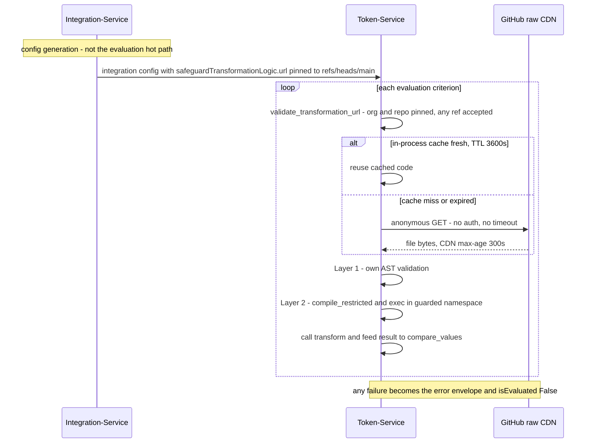
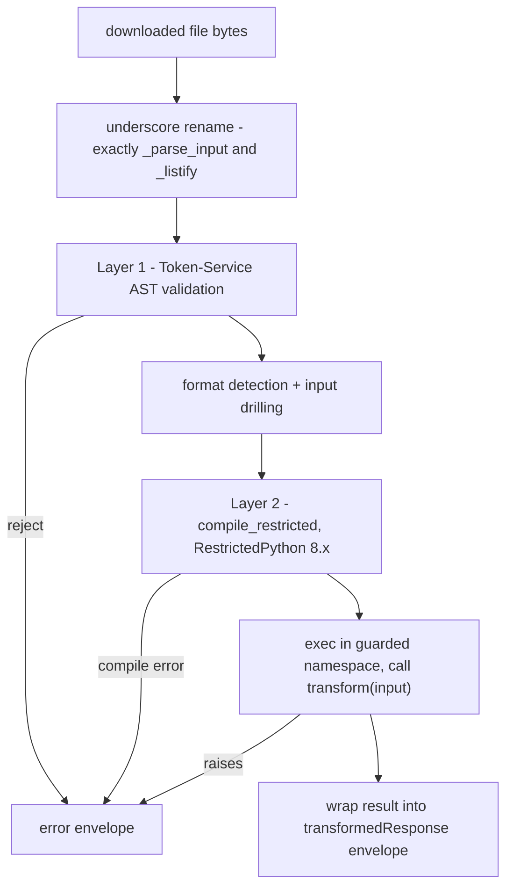
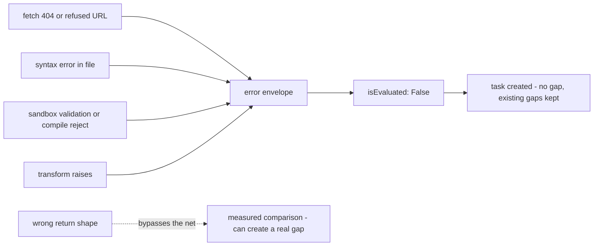

# How transforms run in production

> Part of the [Transformations onboarding docs](README.md). Verified against `develop @ 8bf278fb` and production `main @ 9d0262aa` (2026-09-04). Status: draft for engineer review.
>
> Cross-service receipts: `TS:` = Token-Service production `main @ b60e209d` (mechanics documented in the **token-service docs2** evaluate-engine doc), `IS:` = Integration-Service production `main @ c8aa9a4b` (mechanics in the **Integration-Service docs2** execution-lifecycle doc). `main:` = this repo's production branch.

**In one sentence:** Every passport evaluation makes Token-Service anonymously download a `.py` file from this repo's `main` branch on raw GitHub and execute it in a two-layer RestrictedPython sandbox with no timeout, and every possible failure collapses into one error envelope that yields `isEvaluated: False` — a task, never a gap.

## At a glance

- **This repo is fetched at runtime, not deployed.** Integration-Service mints raw-GitHub URLs pinned to `refs/heads/main` into every safeguard config; Token-Service downloads and executes those files during every evaluation. A merge to main is the deploy — see [13-release-and-branches.md](13-release-and-branches.md).
- **The fetch is anonymous and untimed** — a synchronous `requests.get` with no `Authorization` header and no timeout (`TS:src/utils/codeexecutor.py:308-309`). The repo being public is a production dependency.
- **Propagation is ≤300s + ≤3600s** — GitHub's raw CDN caches for 5 minutes and each Token-Service worker caches downloaded code in-process for an hour. Rollback has the same latency.
- **The sandbox has two layers**: Token-Service's own AST validator, then RestrictedPython (`>=8.0,<9.0`). The effective import allowlist is 8 stdlib modules; a long list of ordinary Python constructs is banned (table below).
- **There is no execution timeout or memory limit** — an infinite loop in a transform blocks an evaluation worker indefinitely.
- **Every failure becomes one envelope**: `{"error": True, "message": ..., "original_response": ...}` → `requirementSatisfied: False, isEvaluated: False` → a task is created, no gap is created, and **existing gaps for the criterion are kept** (LABS-3165, token-service docs2).
- **Minted URLs are lowercased but GitHub raw paths are case-sensitive** — 10 uppercase [SRN](GLOSSARY.md#srn-dir) dirs and 54 mixed-case filenames on main are unreachable by the default URL (live-verified 404s). See [the dead zone](#the-case-sensitivity-dead-zone).
- **A second, unsandboxed execution path exists** in Integration-Service — no allowlist, no sandbox, currently no known publisher. Dormant, not gone.

The full hot path, per evaluation criterion:



Walkthrough:

1. **Integration-Service mints the URL** into `safeguardTransformationLogic.url` when it generates the integration config. It never fetches transforms on the evaluation hot path (Integration-Service docs2, execution lifecycle).
2. **Token-Service validates the URL** against a repo allowlist, checks its per-process code cache, and only then hits `raw.githubusercontent.com` — anonymously.
3. **The file runs through two sandbox layers** (AST validation, then RestrictedPython compilation) and its `transform(input)` is called synchronously on the worker's event loop.
4. **The returned dict feeds `compare_values`**, which extracts `transformedResponse[criteriaKey]` and produces `requirementSatisfied` / `isEvaluated` (token-service docs2).

## Step 1 — Integration-Service mints the URL

`BaseIntegrator.generate_config` embeds a branch-pinned raw-GitHub URL for every runnable method, lowercasing **both** the SRN and the method key:

```python
"url": "https://raw.githubusercontent.com/spektrum-labs/Transformations/refs/heads/main/safeguards/" + str(self.SRN).lower() + "/" + str(key).lower() + ".py",
```

(`IS:src/models/integrator.py:2601`; same pattern at :2667 and :2733; identical on IS develop.)

- **The minted URL is only the default.** When the integration definition's `retrievalTransformationArray` carries an explicit `transformationLogic` URL, that URL is used **verbatim** instead (Integration-Service docs2, execution lifecycle). This is the only way category-path transforms (`safeguards/{category}/{vendor}/...`) are ever reached — the minted default has exactly two path segments.
- **The lowercasing is load-bearing and broken** — see [the case-sensitivity dead zone](#the-case-sensitivity-dead-zone) below.
- **The config is cached** in Redis for 900s on the Integration-Service side, so URL changes in definitions propagate within minutes (Integration-Service docs2).

## Step 2 — Token-Service fetches (allowlist, no auth, three caches)

During `process_single_requirement` → `transform_response`, Token-Service downloads the criterion's file (`TS:src/utils/evaluate/evaluate.py:2581-2721`; token-service docs2, evaluate engine).

- **Allowlist, fail closed**: `PyCodeExecutor.download_code` first calls `validate_transformation_url(url)` (`TS:src/utils/codeexecutor.py:284-290`). Only `raw.githubusercontent.com` URLs for `TRANSFORMATIONS_REPO` (default `spektrum-labs/Transformations`, `TS:src/schemas/aws_secret.py:132`) pass, in two ref shapes — `refs/heads/{branch}` or a 7-40 char commit SHA (`TS:src/utils/transformation_url.py:16-19`).
- **The fetch itself**: anonymous, synchronous, from an async function, with **no timeout**:

  ```python
  headers = {"Cache-Control": "no-cache"}
  response = requests.get(url, headers=headers)
  ```
  (`TS:src/utils/codeexecutor.py:308-309`) A hung GitHub response blocks that evaluation worker's event loop.
- **Schema sidecar**: a Pydantic schema is optionally fetched from `{same dir}/schemas/{same filename}` and validated **outside** the sandbox; the result is advisory — it rides into the transform input, it never blocks execution (`TS:src/utils/evaluate/evaluate.py:2669-2676`; details in [03-writing-a-transform.md](03-writing-a-transform.md)).

> [!IMPORTANT]
> **The allowlist pins the repo, not the ref.** Any branch (`refs/heads/{anything}`) or any commit SHA of `spektrum-labs/Transformations` validates — only the org/repo is checked, case-insensitively. Token-Service's own source says so: "a branch ref is mutable, so an allowlisted repo can still serve changed code under a branch URL; commit-pinned URLs are immutable. Fully pinning every ref to a SHA is a separate follow-up" (`TS:src/utils/transformation_url.py:13-15`). Anyone who can push a branch to this repo, or change a definition's `transformationLogic` URL, can point production at different code.

### How fast a merge propagates (and how long a bad file lingers)

Three layers sit between a merge to main and execution:

| Layer | TTL / behavior | Receipt |
|---|---|---|
| GitHub raw CDN | `cache-control: max-age=300` — up to 5 min per URL; Token-Service's `Cache-Control: no-cache` *request* header does not reliably bypass it | live `curl -sI`, 2026-09-03 |
| Token-Service in-process code cache | keyed by URL, TTL 3600s per worker process | `TS:src/utils/codeexecutor.py:54, :133` |
| Stale-cache fallback | on **any** fetch exception, the expired cached copy is executed anyway, with only a warning log | `TS:src/utils/codeexecutor.py:321-331` |

Net: worst-case propagation after a merge ≈ 300s + 3600s per worker; a cold-cache worker picks it up in seconds. There is no Redis or cross-instance code cache on the evaluation path.

> [!NOTE]
> **The in-process cache is unbounded on production Token-Service** — a regression. The cache-definition block is duplicated in `TS:src/utils/codeexecutor.py` (:30-122 and :124-185); Python's later definitions win, so the effective setter has no max-size eviction (the `_TRANSFORMATION_CACHE_MAX_SIZE = 200` constant at :55 is dead code) and the effective getter returns `None` on expiry but never deletes the entry. With ~772 transform URLs on main this is a slow per-worker leak, not an outage — but any "200 entries max" claim is false in effect. TS develop has the capped version.

> [!WARNING]
> **Fetch errors execute stale code silently.** The fallback at `TS:src/utils/codeexecutor.py:324-329` runs the *expired* cached copy on any fetch exception ("Using stale cached transformation code due to fetch error"). A file deleted from main — 43 main-only files exist today, so deletions happen — keeps evaluating from cache in long-lived workers until process restart. Conversely, a GitHub raw outage fails closed to `isEvaluated: False` only for URLs no worker has cached.

## Step 3 — the sandbox: two layers

The downloaded bytes pass through a fixed pipeline inside `execute_transformation` (`TS:src/utils/codeexecutor.py:619`):



**Layer 1 — Token-Service's own AST validation** (`_validate_transformation_code`, `TS:src/utils/codeexecutor.py:555-617`). The whole file is rejected on any hit:

- **Imports**: only `{'json', 'ast', 're', 'datetime', 'math', 'collections', 'itertools', 'functools'}` (:567). `os`/`sys`/`subprocess`/`importlib`/`builtins`/`types`/`inspect` are named dangerous; everything else is "Unknown import not allowed" (:584-598).
- **Calls, by bare name *or method name***: `__import__, eval, exec, compile, open, file, input, raw_input, execfile, reload, __builtins__, getattr, setattr, delattr, hasattr, globals, locals, vars, dir` (:574-579, :600-605). The method-name check is why `re.compile(...)` dies.
- **Any dunder attribute access** (`x.__class__`): rejected (:608-610). A `SyntaxError` from `ast.parse` is reported as "Syntax error in transformation code" (:614-615).

**Layer 2 — RestrictedPython** (`compile_restricted(code, '<transformation>', 'exec')`, :723; version pinned `RestrictedPython>=8.0,<9.0` in `TS:requirements.txt:66`). The exec namespace (:735-800):

- **Builtins** = RestrictedPython `safe_builtins` plus `dict, list, str, int, float, bool, tuple, set, len, range, enumerate, zip, sorted, min, max, sum, any, all, abs, round, isinstance, type` (:743-766). `map`, `filter`, `getattr`, `open`, `eval` are absent — calling them is a `NameError`.
- **`safe_import`** allows 10 modules including `typing` and `copy` (:241-264) — but Layer 1 already rejected those two, so the **effective allowlist is the 8-module Layer-1 set**.
- **Execution is bare**: `exec(compiled_code, exec_namespace, exec_namespace)` then `transform(transform_input)` (:798, :812-813) — synchronous, on the event loop, no resource limits.

> [!TIP]
> The 8 allowed modules (`json`, `ast`, `re`, `datetime`, `math`, `itertools`, `functools`, `collections`) are **pre-injected as globals** into the exec namespace (`TS:src/utils/codeexecutor.py:773-781`) — a transform can use them without importing them at all.

> [!CAUTION]
> **There is no timeout and no memory limit.** A transform that loops forever, or allocates unboundedly, holds an evaluation worker hostage — execution is synchronous on the worker's event loop (`TS:src/utils/codeexecutor.py:798`). Nothing in the sandbox layers addresses resource exhaustion; only code review does.

### Banned constructs

Each of these is a hard reject or a runtime failure in production — and **none of them fails under `local_tester.py`**, which runs unsandboxed ([12-local-development.md](12-local-development.md)):

| Construct | Killed by | Failure mode | Evidence |
|---|---|---|---|
| Import outside the 8 modules | Layer 1 | "Unknown import not allowed" / dangerous import | `TS:codeexecutor.py:567, :584-598` |
| `getattr` / `setattr` / `hasattr` / `delattr` | Layer 1 (bare or method name) | "Dangerous method call" | `TS:codeexecutor.py:574-579` |
| `eval` / `exec` / `compile` / `open` / `__import__` / `globals` / `locals` / `vars` / `dir` | Layer 1 | same | `TS:codeexecutor.py:574-579, :600-605` |
| `re.compile(...)` | Layer 1 — **method-name collision** with `compile` | "Dangerous method call: compile" — use `re.match` / `re.search` directly | `TS:codeexecutor.py:600-605` |
| Any dunder access (`x.__class__`) | Layer 1 | rejected | `TS:codeexecutor.py:608-610` |
| Underscore-prefixed names (`_helper`) | Layer 2 compile | RestrictedPython name error. **Exactly two are grandfathered**: a regex renames `_parse_input`→`parse_input` and `_listify`→`listify` before validation (`TS:codeexecutor.py:537-541`); the bare `_` loop variable is also exempt. Any *other* underscore helper fails — empirically re-verified | RestrictedPython 8.5 run |
| `map()` / `filter()` | Layer 2 runtime | `NameError` — absent from builtins | `TS:codeexecutor.py:743-766`; `main:CONTRIBUTING.md:318-338` |
| `str.format` / `format_map` | Layer 2 runtime | `NotImplementedError` from `safer_getattr` (f-strings work fine) | empirical; zero main transforms use it |
| Augmented assignment to subscript/attribute (`d["k"] += 1`) | Layer 2 compile | compile error | `main:CONTRIBUTING.md:331-332`; empirical |
| `nonlocal` | Layer 2 compile | "Nonlocal statements are not allowed" — bites one live main file ([14-known-issues.md](14-known-issues.md)) | empirical |
| `class` definitions | Layer 2 runtime | `NameError: __metaclass__` — no class support wired | empirical; zero main transforms define one |
| `datetime.strptime` | Layer 2 runtime | `ImportError: Import of '_strptime' is not allowed` — strptime lazily imports the private `_strptime` module through the sandbox's `safe_import` | empirical (RestrictedPython 8.5, exact TS namespace); `main:safeguards/networksecurity/cisco-umbrella/iscontinuousdiscoveryenabled.py:96-97` documents the mechanism |
| Network calls / file I/O | both layers | no `requests`, no `open` — a comment records `requests` was deliberately removed from the namespace | `TS:codeexecutor.py:790` |

What the sandbox **does allow** that you might not expect: running forever (no timeout), unbounded allocation, and reading the full drilled API response — including any secrets the vendor response happens to contain. `print()` compiles and runs but its output is **silently discarded** (see [Gotchas](#gotchas)).

<details><summary><b>Deep dive:</b> the strptime failure mechanism, and why the docs disagree with the code</summary>

CPython's `datetime.strptime` lazily runs `import _strptime` inside the *caller's* frame on first use. Inside the sandbox, the caller's `__import__` is `safe_import` (`TS:src/utils/codeexecutor.py:241-264`), and `_strptime` is not on its allowlist — so the call raises `ImportError: Import of '_strptime' is not allowed`. This was reproduced empirically with RestrictedPython 8.5 and the verbatim TS exec namespace; `datetime.fromisoformat` works fine, and the repo ships a hand-rolled ISO parser as the sanctioned replacement (`main:CONTRIBUTING.md:344-355`).

Every deployed `strptime` call sits inside `try/except`, so they degrade to a False/error result rather than the error envelope — a *silent but measured* wrong answer. Nine files on main still call it live (12 call sites); the ninjio pair's per-campaign fallback counts every unparseable campaign as active, so those two can falsely *pass*. Inventory and per-file exception flows in [14-known-issues.md](14-known-issues.md).

One library nuance: RestrictedPython 8.5 does not export `guarded_inplacevar` — Token-Service's own fallback shim (`TS:codeexecutor.py:195-226`) is what actually runs for `x += 1` on plain names.

</details>

## Step 4 — input and output

- **Input drilling (legacy format)**: unless the code textually reads `input["data"]` / `input.get("data"`, the API response is auto-unwrapped through the keys `['response', 'result', 'apiResponse', 'Output', 'data']` before the transform sees it (`_parse_api_response_for_transformer`, `TS:codeexecutor.py:874-925`; detection :932-957).
- **Enriched format**: transforms detected as new-format receive `{"data": <raw response>, "validation": <schema result>}` (:693-700). The detector deliberately does **not** treat an inlined `extract_input` helper as new-format (docstring :938-943) — but `local_tester.py` does (`main:local_tester.py:114-121`), so local runs can feed a different input shape than production.
- **Entry point**: a callable named `transform` (:812); if absent, Token-Service falls back to module-level variables `result` / `output` / `transformed_data` / `return_value` (:835), else errors.
- **Return shape**: legacy bare dicts are wrapped into `{"transformedResponse": ..., "additionalInfo": {...}}` by `_wrap_legacy_result` (:959-1020). Downstream, `compare_values` extracts `transformedResponse[criteriaKey]` with an **exact, case-sensitive** key match (`TS:evaluate.py:2339-2346`). The full authoring contract is [03-writing-a-transform.md](03-writing-a-transform.md).

> [!WARNING]
> **A wrong return shape is a *measured* failure, not an unevaluated one — with the strptime fallbacks above, the second class of bug that bypasses the safety net.** If the transform returns the wrong criteria key, extraction falls through ("transformedResponse exists but key not found") and comparison proceeds against the wrong shape (`TS:evaluate.py:2339-2360`). That can create a **real gap** from a transform bug. Return shape is never validated at execution time.

## The error matrix

`transform_response` normalizes every failure into one envelope: `{"error": True, "message": ..., "original_response": <api response>}` (`TS:evaluate.py:2657-2663, :2699-2705, :2713-2719`). `_transformation_failure_message` recognizes exactly that envelope — both `error is True` **and** `original_response` present, so a vendor body with its own `error` flag is never misread (`TS:evaluate.py:2556-2578`).

> [!IMPORTANT]
> **A broken transform never creates a gap.** The envelope converts to `requirementSatisfied: False, isEvaluated: False` — a task is created, no gap is created, and existing gaps for that `(requirementsUid, criteriaKey)` are **kept, not auto-resolved** (LABS-3165; token-service docs2, evaluate engine). This protects posture integrity — and it is why broken transforms are silent: a criterion can sit unmeasured for months with only tasks and alert-classifier signals. Main's longest-lived example is a syntax-error file broken for ~7 months ([14-known-issues.md](14-known-issues.md)).



The complete matrix:

| Failure | Where it dies | What production sees |
|---|---|---|
| URL not in allowlist | `validate_transformation_url` raises; `file_content = None` (`TS:codeexecutor.py:284-290`) | "Failed to download transformation code" envelope (`TS:evaluate.py:2657-2663`) → `isEvaluated: False` |
| Fetch 404 / network error | `raise_for_status` → `RequestException`; **stale cache used if present**, else `file_content = None` (`TS:codeexecutor.py:321-331`) | same envelope — or silently runs *old* code from stale cache |
| Syntax error in file | Layer-1 `ast.parse` (`TS:codeexecutor.py:614-615`) | "Code validation failed: Syntax error..." → envelope |
| Disallowed import / call / dunder | Layer-1 AST walk (:584-610) | "Code validation failed: ..." → envelope |
| RestrictedPython compile reject (underscore name, subscript aug-assign, `nonlocal`) | `compile_restricted` (:723-732, or raised → :851-865) | "Code compilation failed..." / "Execution failed..." → envelope |
| Transform raises at runtime | caught at :851-865, traceback included (`<transformation>` frames) | "Execution failed: ..." → envelope |
| No `transform()` and no result variable | :844-849 | "No transform function or result variable found" → envelope |
| **Wrong return shape** (missing criteria key) | **not caught** — flows to `compare_values` (`TS:evaluate.py:2339-2360`) | measured comparison against the wrong value; **can create a real gap** |
| API response already `{"error": True}` | short-circuit **before** any download (`TS:evaluate.py:2631-2633`) | passed through untransformed; classified as an API-stage failure |
| HTML string response | `TS:evaluate.py:2636-2642` | `{"error": True, "message": "Cannot transform HTML response", "html_response": ...}` — **no `original_response` key**, so it is *not* classified as a transformation failure (see Gotchas) |

## The case-sensitivity dead zone

> [!CAUTION]
> **The default minted URL lowercases both path segments, and raw GitHub paths are case-sensitive — so a whole population of files on main can never be fetched by the default URL.** `str(self.SRN).lower() + "/" + str(key).lower() + ".py"` (`IS:src/models/integrator.py:2601`) collides with: **(a)** the **10 of 22 uppercase UUID directories** on main (e.g. `4BC425FA-...`), and **(b)** the **54 mixed-case transform filenames** (e.g. `main:safeguards/epp/ninjaone-endpoint-management/isBitLockerRecoveryKeyEscrowed.py`, all 16 `encryption/microsoft/*.py`, all 14 `networksecurity/dnsfilter/*_transform.py`) — including **both files of the NinjaOne disk-encryption hotfix** (`5ae4693a`, PR #544) and **all 7 transforms of the Lookout fleet-count hotfix merged as main HEAD** (`9d0262aa`, PR #548, 2026-09-04). Live-verified 2026-09-04: the exact-case URL returns **200**, the as-minted lowercased URL returns **404**. A 404 does not alarm — it becomes `isEvaluated: False`, task only. **Renaming a file or directory's case, or adding a camelCase filename for a minted-default vendor, is a production incident that looks like nothing.**

| URL path (`safeguards/...`) | HTTP |
|---|---|
| `E454A862-2B86-43FF-8072-DB865E354E17/ismfaenforcedforusers.py` (exact case) | 200 |
| `e454a862-2b86-43ff-8072-db865e354e17/ismfaenforcedforusers.py` (as minted) | **404** |
| `encryption/microsoft/isAzureADAuthEnabled.py` (exact case) | 200 |
| `encryption/microsoft/isazureadauthenabled.py` (as minting would produce) | **404** |

- **The only rescue path is an explicit URL in the database.** Definition / `IntegrationCriteriaMapping` `transformationLogic` URLs are used **verbatim** (Integration-Service docs2), so exact-case URLs stored there work. Such URLs demonstrably circulate — Token-Service's own route docs embed an uppercase `1BC425FA-...` URL (`TS:src/schemas/documentation/route_configs.py:484`).
- **Category-path transforms are DB-URL-only by construction** — the minted default has exactly two path segments, so `{category}/{vendor}/{file}` paths are never minted at all. Their 54 camelCase filenames work *iff* the stored URL matches the committed casing byte-for-byte.
- **Your Mac will lie to you.** macOS checkouts are case-insensitive; `git ls-tree` is the only truth for committed casing. Full casing census in [04-catalog.md](04-catalog.md).

**Open question (stated, not settled):** whether every live method of every uppercase-dir integration has an exact-case DB URL — or whether some minted-default fetches have been quietly 404ing as `isEvaluated: False` — is a production Integration-DB question this repo cannot answer. The mixed-case set includes files added the week of the pinned tips, so someone presumably believes they run.

## The second path: Integration-Service's unsandboxed PyCodeExecutor

> [!CAUTION]
> **A second fetch-and-execute path exists with no allowlist and no sandbox.** Integration-Service's `handle_transform_request` (triggered only by an `integration.transform` SQS/EventBridge event) downloads any `transformation_url` that merely `startswith("http")` and runs its `transform` function with bare `exec` — after first importing **every module the downloaded file imports**. Its "unsafe AST node" check iterates over a one-element list containing the node it already matched, so it can never reject anything (Integration-Service docs2, execution lifecycle; receipts `IS:src/handlers/integration_handlers.py:229-233`, `IS:src/utils/integrations/codeexecutor.py:23-29, :52-97, :91-92`). **No publisher of that event exists in the Integration-Service repo today** — the path is dormant — but it is reachable by anything that can put a message on `SQS_INTEGRATION_SERVICE_QUEUE_URL`. Any statement that "transformations run sandboxed" is true only of the Token-Service path.

## The repo is public — and production depends on it

> [!CAUTION]
> **The entire production compliance-evaluation logic is world-readable, and the fetch path only works because it is.** Token-Service sends no `Authorization` header (`TS:src/utils/codeexecutor.py:308-309`), and an anonymous `curl` of a main transform URL returns HTTP 200 (live-verified 2026-09-04). The boundaries this sets: **reads = the whole world** (every vendor check, threshold, and workaround in 1,285+ files); **writes = repo write access plus Integration-definition contents** (because the allowlist pins only the repo, and definitions can point at any URL verbatim). Making the repo private without adding auth to the fetch would break every evaluation; treat repo visibility as production infrastructure, not a settings toggle.

## Gotchas

> [!CAUTION]
> **16 transform files on production main cannot run (or cannot date-parse) under the contract they deploy into** — 1 hard syntax error (broken since 2026-02-06), 7 RestrictedPython compile failures (`nonlocal`, underscore helpers, subscript `+=`), and 8 files whose only violation is a live `datetime.strptime` call (9 files call `strptime` in total — the 9th is already counted among the compile failures). All were re-verified by executing every main file through the exact Token-Service pipeline under RestrictedPython 8.5. Whether each is *referenced* by a live integration config is a DB question. Full inventory with receipts: [14-known-issues.md](14-known-issues.md).

> [!WARNING]
> **`local_tester.py` is not the production runtime.** It loads modules with plain `importlib` — full builtins, no AST validation, no RestrictedPython (`main:local_tester.py:49-57`) — and its new-format detector matches `extract_input(`, which production's does not. A transform can pass local testing and fail production compilation; that is the literal history of the Anthropic and BeyondTrust hotfixes. See [12-local-development.md](12-local-development.md).

> [!WARNING]
> **`print()` output is unrecoverable.** It compiles and runs, but RestrictedPython routes it to a PrintCollector local that Token-Service never reads; the `stdout` field in the execution result comes from `redirect_stdout`, which sandbox prints never reach (verified empirically — a printing transform returns `stdout: ""`). Print-debugging a production transform is impossible.

> [!WARNING]
> **Commit-pinned URLs never pick up fixes.** The onboarding pipeline emits SHA-pinned URLs (`TS:src/utils/transformation_url.py:9`); those criteria are frozen at that blob forever — a criterion pinned to a pre-hotfix SHA stays broken no matter what lands on main. Which tokens carry SHA URLs vs branch URLs is a data question.

> [!WARNING]
> **The underscore grandfathering is a trap disguised as a convention.** `main:CLAUDE.md:36-46` presents `_parse_input` as "the common input parsing pattern" — that name only survives because Token-Service regex-renames exactly `_parse_input` and `_listify` (`TS:codeexecutor.py:537-541`). Write `_parse_response` or `_as_list` by analogy and the file fails RestrictedPython compilation. Develop already has three such files ([13-release-and-branches.md](13-release-and-branches.md)).

> [!NOTE]
> **The HTML short-circuit envelope lacks `original_response`** (`TS:evaluate.py:2638-2642`), so `_transformation_failure_message` does not classify it as a transformation failure — an HTML vendor response flows into comparison as `{"error": True, ...}` and fails there instead. A minor asymmetry, visible in stage classification.

## Where the code lives

| Piece | Path | Notes |
|---|---|---|
| URL minting (default, lowercased) | `IS:src/models/integrator.py:2601, :2667, :2733` | `generate_config`; RTA/definition URLs override verbatim |
| URL allowlist | `TS:src/utils/transformation_url.py:16-19, :39-57` | repo pinned, any ref; mutable-branch caveat in-file at :13-15 |
| Download + caches + stale fallback | `TS:src/utils/codeexecutor.py:266-436` | fetch :308-309; stale fallback :321-331; duplicated cache block :30-185 |
| Layer-1 AST validation | `TS:src/utils/codeexecutor.py:555-617` | import allowlist :567; call bans :574-579; underscore rename :537-541 |
| Layer-2 RestrictedPython exec | `TS:src/utils/codeexecutor.py:619-865` | `compile_restricted` :723; namespace :735-800; `safe_import` :241-264 |
| Input drilling / format detection / result wrap | `TS:src/utils/codeexecutor.py:874-1020` | drilling keys :874-925; `_wrap_legacy_result` :959-1020 |
| Error envelope + classification | `TS:src/utils/evaluate/evaluate.py:2556-2721` | envelope :2657-2663; `_transformation_failure_message` :2556-2578 |
| Key extraction / comparison | `TS:src/utils/evaluate/evaluate.py:2339-2360` | exact case-sensitive `transformedResponse[key]` |
| Schema sidecar execution (outside sandbox) | `TS:src/utils/schema_validator.py:32-73, :141-169` | advisory only |
| Unsandboxed second path | `IS:src/handlers/integration_handlers.py:229-233`, `IS:src/utils/integrations/codeexecutor.py:23-97` | dormant; event-only |
| The transforms themselves | `main:safeguards/**` | layout in [04-catalog.md](04-catalog.md); authoring in [03-writing-a-transform.md](03-writing-a-transform.md) |
| Local harness (unsandboxed) | `main:local_tester.py` | [12-local-development.md](12-local-development.md) |

Pinned versions for every receipt above: Transformations `main @ 9d0262aa` / `develop @ 8bf278fb`; Token-Service `main @ b60e209d`; Integration-Service `main @ c8aa9a4b`. Verification methodology is in [README.md](README.md).
