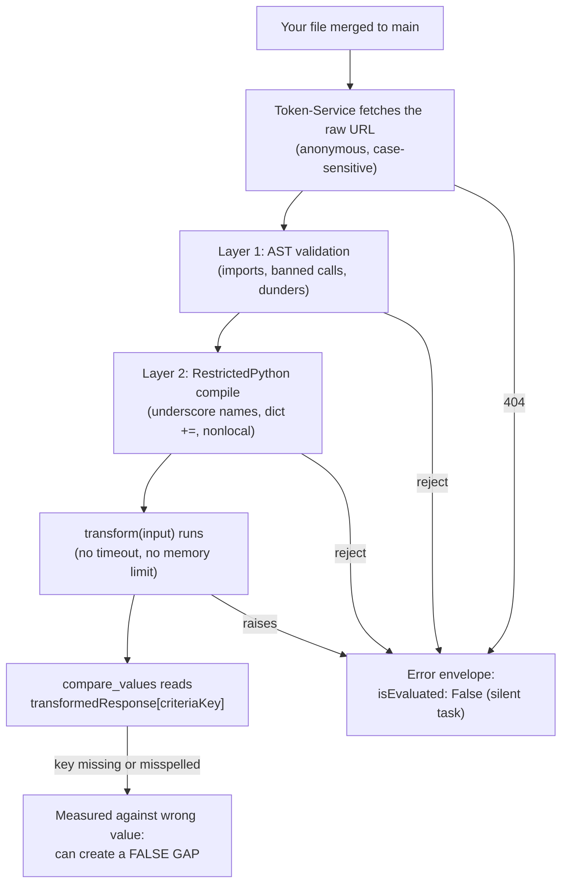
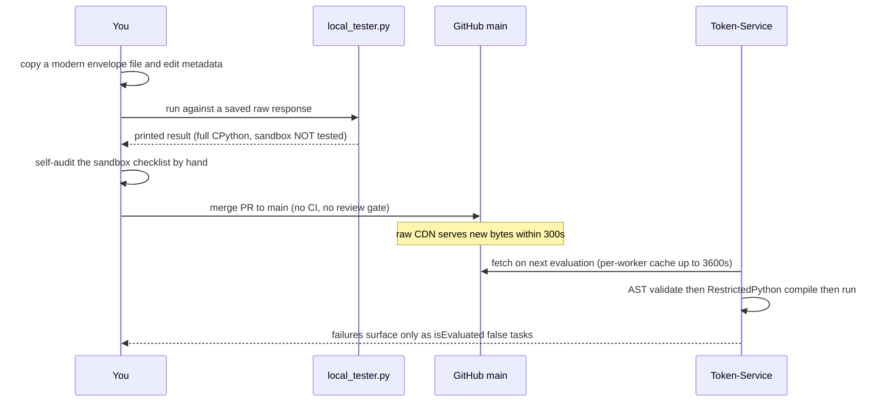

# Writing a transform

> Part of the [Transformations onboarding docs](README.md). Verified against `develop @ 5c5ccde5` and production `main @ c1d935da` (2026-09-03). Status: draft for engineer review.

**In one sentence:** Write a single self-contained file that defines `def transform(input):`, inlines its own helpers, returns the enriched `{"transformedResponse", "additionalInfo"}` envelope with fail-closed logic, uses a lowercase filename matching the criteria key — and survives a RestrictedPython sandbox that no local tool will test for you.

## At a glance

- **One function, one file** — 763 of main's 765 transform modules use the exact signature `def transform(input):` (the two outliers are `main:safeguards/emailsecurity/mimecast/isemailloggingenabled.py:71` and `main:safeguards/epp/crowdstrike/epp_transform.py:70`, cataloged in [14-known-issues.md](14-known-issues.md)). Match it.
- **Your file runs alone.** Token-Service fetches it as a single file from raw GitHub and executes it in a [RestrictedPython](GLOSSARY.md#restrictedpython) sandbox — imports of other repo files can never work, so every helper is copy-pasted in, by mandate (`main:CONTRIBUTING.md:201`).
- **Return the enriched envelope**, not the legacy bare dict. 496 of main's 765 transforms use the envelope; the other 269 are a frozen legacy generation you must never copy from.
- **The filename is the URL.** Integration-Service mints `.../{srn}.lower()/{criteriakey}.lower().py`; a camelCase or snake_case filename is unreachable via the default minted URL ([02 — execution contract](02-execution-contract.md), gotcha on case sensitivity).
- **Nothing checks your work before production.** No CI on any branch, `local_tester.py` runs full CPython (not the sandbox), and a merge to `main` is an instant deploy ([13 — release and branches](13-release-and-branches.md)). The sandbox checklist below is the only gate, and you are it.
- **Fail closed, with reasons.** The best files in the corpus return `False` plus a human-readable `failReasons` entry when data is missing — the worst return `True` because the API answered at all (anti-pattern gallery below).
- **A wrong criteria key is worse than a crash.** A crash becomes `isEvaluated: False` (a task, no gap); a misspelled key is *measured* against the wrong value and can create a false gap (`TS-main:src/utils/evaluate/evaluate.py:2339-2360`, via [02](02-execution-contract.md)).

The gauntlet your file must survive on every single evaluation:



Everything left of `compare_values` fails *silently* into a task; only the last step can lie to a customer. Both failure modes have shipped: a syntax error has sat on main since 2026-02-06 (stuck at the Layer-1 arrow), and rubber-stamp logic passes criteria on empty lists (the `compare_values` arrow) — see the [known-issues register](14-known-issues.md).

## The contract: `def transform(input)`

Your file must define a module-level callable named `transform` taking one argument. If it is absent, Token-Service falls back to hunting for module variables (`result`/`output`/`transformed_data`/`return_value`) and then errors — never rely on that (`TS-main:src/utils/codeexecutor.py:812, 835`, via [02](02-execution-contract.md)).

> [!IMPORTANT]
> The signature is `def transform(input):` — shadowing the `input` builtin is the established convention, present in 763 of 765 files. Uniformity matters more than style here: tooling, reviewers, and the AI generation pipeline all pattern-match on it.

### What arrives in `input`

`input` can be a **str**, **bytes**, or **dict**, and its shape depends on how Token-Service classified your file:

- **Legacy path (the default)**: Token-Service auto-drills the raw API response through the wrapper keys `['response', 'result', 'apiResponse', 'Output', 'data']` before your code sees it (`TS-main:src/utils/codeexecutor.py:874-925`).
- **Enriched path**: if your source text reads `input["data"]` or `input.get("data"`, the detector flags it "new format" and passes `{"data": <raw response>, "validation": <schema result>}` instead (`TS-main:src/utils/codeexecutor.py:693-700, 932-957`).

> [!WARNING]
> Production's format detector deliberately does **not** treat an inlined `extract_input` helper as new-format, but `local_tester.py` **does** (`main:local_tester.py:114-121` vs `TS-main:src/utils/codeexecutor.py:938-943`). The same file can receive a differently-shaped input locally vs in production. This is exactly why you inline the standard `extract_input` — it handles *both* shapes, so the disagreement becomes harmless.

<details><summary><b>Deep dive:</b> the standard parse-then-extract prologue</summary>

Every modern transform opens the same way (this is the dominant pattern, e.g. `main:safeguards/compliancemanagement/knowbe4/phishingclickrate.py`):

```python
def transform(input):
    try:
        # 1. Parse: input may arrive as JSON string or bytes
        if isinstance(input, str):
            input = json.loads(input)
        elif isinstance(input, bytes):
            input = json.loads(input.decode("utf-8"))

        # 2. Extract: handles BOTH enriched {"data","validation"} and legacy drilled dicts
        data, validation = extract_input(input)

        # 3. Business logic on `data`...
```

`extract_input` returns the enriched `(data, validation)` pair when it sees `{"data": ..., "validation": ...}`, and otherwise unwraps up to 3 levels of vendor wrapper keys (`api_response`, `response`, `result`, `apiResponse`, `Output`) and returns `validation = {"status": "unknown", ...}`. Do not write your own variant — copy the dominant one (see the copy-paste section below).

</details>

### What you must return: the enriched envelope

The **current standard** — mandated by `main:CONTRIBUTING.md:143` ("All transformations must return this standardized structure") and used by all but one of develop's 129 newest files — is:

```python
{
    "transformedResponse": {
        "isMFAEnforcedForUsers": True,   # the criteria key, camelCase, EXACT
        "totalUsers": 45                 # supporting metrics ride alongside
    },
    "additionalInfo": {
        "dataCollection":  {"status": "success", "errors": []},
        "validation":      {"status": "passed", "errors": [], "warnings": []},
        "transformation":  {"status": "success", "errors": [], "inputSummary": {...}},
        "evaluation":      {"passReasons": [...], "failReasons": [...],
                            "recommendations": [...], "additionalFindings": []},
        "metadata":        {"evaluatedAt": "...", "schemaVersion": "2.0",
                            "transformationId": "...", "vendor": "...", "category": "..."}
    }
}
```

You never build this by hand — the inlined `create_response(...)` helper does (`main:CONTRIBUTING.md`, "Helper Functions"). Token-Service extracts `transformedResponse[criteriaKey]` and hands it to `compare_values`; the `additionalInfo` sections carry your pass/fail reasons and recommendations into tasks and the UI.

> [!WARNING]
> **Never copy a legacy file.** 269 of main's 765 transforms are a frozen older generation that returns a bare dict and, on failure, `{"criteriaKey": False, "error": str(e)}` (469 files carry that literal error shape). Token-Service tolerates them only via a wrapper shim (`_wrap_legacy_result`, `TS-main:src/utils/codeexecutor.py:959-1020`), their flat `"error"` key is **not** recognized as a transformation failure (the classifier requires Token-Service's own envelope — `error is True` *and* `original_response`, `TS-main:src/utils/evaluate/evaluate.py:2556-2578`), and the legacy population is where the anti-pattern gallery below concentrates. Legacy files cluster in `dlp/`, `logging/`, `incidentmgmt/`, `encryption/microsoft/`, `siem/blumira/`, `emailsecurity/proofpoint|sublime`, and similar older dirs.

> [!CAUTION]
> The repo's own `CLAUDE.md` still documents the **legacy** contract — "Returns an error dict on failure: `{"criteriaKey": False, "error": str(e)}`" (`main:CLAUDE.md:33`) and an underscore-prefixed `_parse_input` helper (`main:CLAUDE.md:38`) that only compiles because Token-Service grandfathers exactly that one name. When `CLAUDE.md` and `CONTRIBUTING.md` disagree, **CONTRIBUTING.md wins** — it is the accurate contract document (with the caveats in the sandbox table below).

## Copy-paste is the architecture (do it right)

Sharing code between transforms is impossible by construction: production fetches one file at a time from raw GitHub with no package context, so a cross-file import can never resolve. `main:CONTRIBUTING.md:201` therefore orders: *"Copy these helper functions into your transformation file (required for RestrictedPython compatibility)"*.

- **The master copies** live in `safeguards/common/response_helper.py` and in CONTRIBUTING.md's "Helper Functions" section — `response_helper.py` is a template, imported by nothing but its own `__init__.py`.
- **The drift is real**: main has 489 inlined copies of `extract_input` in **25 variants** and 489 copies of `create_response` in **397 variants** (AST-hashed). A bug fixed in one copy stays broken in up to 488 others, with no CI to notice.
- **Metadata is baked into your copy**: `create_response` embeds the file's `transformationId`, `vendor`, and `category` — that per-file editing is why 397 variants exist. Edit those three values; change nothing else.

> [!NOTE]
> **Which variant to copy:** the dominant `extract_input` lineage — AST-identical in 352 of 489 files, e.g. `main:safeguards/compliancemanagement/knowbe4/phishingclickrate.py:10-25` — is functionally identical to the CONTRIBUTING.md master (verified by diff: only docstring/comments and one warning-string differ). Copy either that file's helpers or CONTRIBUTING.md's verbatim. Do **not** copy from a random neighboring transform: the other 24 lineages disagree about how many wrapper layers and which keys they unwrap, so identical vendor payloads can parse differently across criteria of the same integration.

**Positive examples to start from** (both on main = production):

| File | Why it's the model | Caveat |
|---|---|---|
| `main:safeguards/cloudsecurity/awssecurityhub/isguarddutyenabled.py` | Documented fail-closed policy in the docstring and honored in code (`:77-79` returns `False` + a fail reason naming the exact missing controls); module-level `CRITERIA_KEY`/`CONTROL_IDS`/`TRANSFORM_ID` constants (`:14-16`); type-guards every access; no bare except | Builds the envelope with a lighter hand-rolled `build_response` instead of the standard helpers |
| `main:safeguards/compliancemanagement/knowbe4/phishingclickrate.py` | The standard-helper structure: dominant `extract_input`, `create_response` with metadata, pure `evaluate()` separated from parsing, explicit pass/fail reasons, fail-closed defaults | Calls `datetime.strptime` (`:62`) — a sandbox violation; drop its date parsing, keep its structure |

## The sandbox survival checklist

Your file runs under two layers: Token-Service's own AST validation, then RestrictedPython compilation with curated builtins (`TS-main:src/utils/codeexecutor.py:555-617, 723-800` — full mechanics in [02 — execution contract](02-execution-contract.md)). Nothing you can run locally enforces any of this, so audit against this table by hand before every PR.

| Never use | What happens in production | Use instead | Receipt |
|---|---|---|---|
| Imports beyond `json, ast, re, datetime, math, collections, itertools, functools` | Layer-1 reject: "Unknown import not allowed" → error envelope | Those 8 modules — they are also **pre-injected as globals**, no `import` needed | `TS-main:codeexecutor.py:567, 773-781` |
| `datetime.strptime(...)` | `ImportError: Import of '_strptime' is not allowed` at first call (lazy import blocked by the sandbox — empirically reproduced) | Hand-rolled `parse_iso_date` (`main:CONTRIBUTING.md:344-355`) or `datetime.fromisoformat` (verified working) | 9 main files still call it — all degrade silently to *measured* wrong answers (the two ninjio training files count every unparseable campaign as active, so they can falsely pass) — e.g. `main:safeguards/backups/crashplan/isbackuptested.py`, `main:safeguards/mfa/pingfederate/confirmedlicensepurchased.py`; the mechanism is documented in-repo at `main:safeguards/networksecurity/cisco-umbrella/iscontinuousdiscoveryenabled.py:96-97` |
| Underscore-prefixed names (`_helper`, `_MISSING`) | RestrictedPython compile error. Only two names are grandfathered — Token-Service regex-renames `_parse_input`→`parse_input` and `_listify`→`listify` before compiling (`TS-main:codeexecutor.py:537-541`); the bare `_` loop variable is also exempt | Plain names: `helper`, `MISSING` | ENG-463 (`a51b8a1f`, 2026-08-25) renamed every underscore name in 24 Anthropic transforms after 5 days broken in production; the in-code receipt: *"object() is unavailable in the RestrictedPython sandbox"* (`main:safeguards/artificial-intelligence/anthropic/isdataretentioncompliant.py:84`) |
| `d["k"] += 1` (augmented assignment on dict items / subscripts) | RestrictedPython compile error | `d["k"] = d["k"] + 1` | 5 main files are broken by this today, incl. `main:safeguards/backups/datto/backup_transform.py` (9 sites, lines 163-251) |
| `map()` / `filter()` | `NameError` — absent from the sandbox builtins | List comprehensions | `TS-main:codeexecutor.py:743-766` |
| `getattr`/`setattr`/`hasattr`/`eval`/`exec`/`open`/`globals`/`locals`/`vars`/`dir` — by bare name **or method name** | Layer-1 reject: "Dangerous method call" | Dict access, `isinstance` checks | Note the collision: **`re.compile(...)` is rejected** because of the method name `compile` — call `re.match`/`re.search` directly |
| Dunder access (`x.__class__`) | Layer-1 reject | Nothing — you don't need it | `TS-main:codeexecutor.py:608-610` |
| `str.format(...)` | `NotImplementedError` at runtime | **f-strings work fine** | Zero main transforms use `.format(` — keep it that way |
| `class` definitions | `NameError: __metaclass__` | Dicts and functions | Zero main transforms define a class |
| `nonlocal` | RestrictedPython compile error | Pass state explicitly / use a mutable container with plain assignment | `main:safeguards/backups/commvault/isbackuptypesscheduled.py:68` has been broken by this since 2026-03-09 |
| `print()` | Compiles and runs, but output is **silently discarded** (PrintCollector never read) | Put diagnostics in `additionalInfo` — reasons, `inputSummary`, errors | Verified empirically; `stdout` comes back `""` |
| `object()` sentinels | `NameError` — `object` not in builtins | A list literal: `MISSING = ["__missing__"]` (never interned, identity checks stay valid) | `main:safeguards/artificial-intelligence/anthropic/isdataretentioncompliant.py:84-87` |
| Network calls, file I/O, `requests` | Impossible — nothing is provisioned | Transforms only reshape the response they're given | Zero occurrences corpus-wide, by construction |

> [!TIP]
> The 8 allowed modules (`json`, `ast`, `re`, `datetime`, `math`, `itertools`, `functools`, `collections`) are pre-injected into your namespace — your `import json` line is convention, not necessity. Keep the imports anyway: `local_tester.py` runs plain CPython and needs them.

> [!WARNING]
> `main:CONTRIBUTING.md:334` understates the allowlist as "except json, datetime" — the real set is the 8 modules above — and omits the underscore-name, `re.compile`, `getattr`/`hasattr`, `str.format`, `class`, and `nonlocal` bans entirely. The table above is verified against Token-Service's actual validator and RestrictedPython 8.5; treat it, not CONTRIBUTING's list, as the contract.

<details><summary><b>Deep dive:</b> why the corpus itself violates these rules and still "works"</summary>

Main today contains 16 files that cannot run or cannot date-parse under this contract: 1 syntax error, 7 RestrictedPython compile failures (underscore/aug-assign/nonlocal), and 8 files whose only violation is `strptime` — a 9th `strptime` caller, `main:safeguards/iam/keeper/isdormantaccountsdisabled.py`, is already counted among the compile failures ([14-known-issues.md](14-known-issues.md) carries the inventory). They persist because failures are *silent by design*: every sandbox rejection becomes `{"error": True, "message": ...}` → `isEvaluated: False` → a task, never a gap. A criterion can stay unmeasured for months — the 874a78ff syntax error has been in production since 2026-02-06 — with no alarm louder than a task.

Also note 403 main files use `for _ in range(...)` — that's fine: RestrictedPython exempts the bare `_` loop variable. The ban is on underscore-*prefixed* names (`_foo`), not `_` itself. ENG-463's rename of `for _ in range(3)` to `for attempt in range(3)` was an over-correction; don't cite it as evidence that `_` is banned.

</details>

## The anti-pattern gallery

These are real, on production main, each with its fix. They are what "the next broken transform" looks like — recognize them in whatever file you're copying from.

### 1. The rubber stamp: pass because the API answered

```python
security_events = input.get('securityEvents', input.get('responseData', []))
if isinstance(security_events, list):
    isURLRewriteEnabled = True  # Platform is monitoring
```
(`main:safeguards/emailsecurity/avanan/isurlrewriteenabled.py:27-29` — an **empty list** satisfies the criterion)

```python
default_value = True if input is not None else False
...
license_purchased = has_permissions or default_value
```
(`main:safeguards/epp/addigy/confirmedlicensepurchased.py:20,29` — any non-None input, **including an error body**, yields `True`)

The tradition continues in brand-new code: develop's check-point pack hardcodes `"isClickTimeURLRewriteEnabled": True` after any successful endpoint read (`develop:safeguards/emailsecurity/check-point-software-technologies-email-security/isClickTimeURLRewriteEnabled.py:116`).

**The fix**: assert the *specific setting*, not reachability. Check the field that proves the control is on; when it's absent, return `False` with a fail reason saying exactly what was missing (the isguarddutyenabled pattern: `:77-79`). A customer's compliance page should never be green because an endpoint returned `[]`.

### 2. Fail-open on unexpected payloads

```python
vulnerabilities = data.get("vulnerabilities", data.get("value", data.get("items", [])))
...
result = critical_open_count == 0
```
(`main:safeguards/vulnerabilitymgmt/tenable/iscriticalvulncount.py:80,105` — an error payload with none of those keys defaults to `[]`, counts **zero criticals**, and returns `isCriticalVulnCount: True`)

**The fix** — already written, stranded on develop: detect the absence of *every* expected field and fail with a reason. Develop's copy adds `has_error or not (has_total or has_vulns_key)` → `False` with "API response missing expected fields (likely error/invalid scope)".

Chained `.get(..., .get(..., []))` defaults are the signature of this bug: every default you write is a verdict you'll return when the payload surprises you. Default toward `False`.

### 3. Quote-swap JSON parsing under bare excepts

```python
input = input.replace("'", '"')
return json.loads(input)
```
(`main:safeguards/encryption/microsoft/isVNetIntegrationEnabled.py:30-31`, same in `main:safeguards/emailsecurity/avanan/isdnsconfigured.py:32` — corrupts any value containing an apostrophe; in both files the parse attempts sit under bare `except:` clauses, isVNet `:27-28`/`:32-33`, isdnsconfigured `:29-30`/`:34-35`)

**The fix**: parse with `json.loads` first, fall back to `ast.literal_eval` for Python-repr strings, and catch *typed* exceptions (`ValueError`, `SyntaxError`) — never string surgery, never `except: pass`. Both are in the allowed import set.

### 4. Bare `except:` everywhere

165 bare `except:` occurrences across 83 main files (clusters: `encryption/microsoft/*`, `siem/blumira/*`). Bare excepts swallow the evidence — a transform that ate a `TypeError` in parsing reports a confident `False` with no reason attached.

**The fix**: exactly one outer `except Exception as e:` returning `create_response(result={CRITERIA_KEY: False}, transformation_errors=[str(e)], fail_reasons=[...])`; inner handlers catch specific types only. That outer catch-all is universal in the corpus (977 occurrences) and correct — it's the *inner* bare excepts that destroy diagnosability.

## Filenames and keys: casing is load-bearing

Three casing rules, and they are not the same rule:

- **Filename = the criteria key, lowercased**: `isMFAEnforcedForUsers` → `ismfaenforcedforusers.py` (`main:CONTRIBUTING.md:60`). This is because Integration-Service mints the default fetch URL as `str(key).lower() + ".py"` (IS `integrator.py:2601` via [02](02-execution-contract.md)) and raw GitHub paths are case-sensitive (live-verified: exact-case 200, lowercased 404).
- **Keys inside `transformedResponse` = camelCase, exact**: `isMFAEnforcedForUsers`, `scoreInPercentage`, `totalUsers` (`main:CONTRIBUTING.md`, "Criteria Key Conventions"). `compare_values` extracts `transformedResponse[criteriaKey]` by exact string match.
- **Directory = `{category}/{vendor}`, all lowercase** — see [04 — the catalog](04-catalog.md) for reachability and the twin-tree traps.

> [!WARNING]
> **A mixed-case filename is unreachable via the minted default URL.** Main already carries 47 camelCase transform filenames (all 16 of `encryption/microsoft/`, `epp/ninjaone-endpoint-management/isBitLockerRecoveryKeyEscrowed.py`, ...) — including **both files of the NinjaOne hotfix merged as main HEAD** — that only work if the integration definition carries an explicit exact-case `transformationLogic` URL, and 404 silently (`isEvaluated: False`) otherwise. Snake_case is just as dead: lowercasing a camelCase key never produces underscores, so `is_backup_encrypted.py` can never be minted. On develop, 101 of the 119 newest transform modules are mixed-case. Name your file lowercase, no underscores, and never "normalize" an existing file's case — whichever URL variant currently works is a production dependency ([02](02-execution-contract.md), case-sensitivity gotcha).

> [!CAUTION]
> Get the *in-dict* key wrong — a typo, a rename, `isMfaEnforced` vs `isMFAEnforced` — and you don't get the safe `isEvaluated: False` path. Token-Service logs "transformedResponse exists but key not found" and the comparison proceeds against the wrong shape: a **measured** wrong answer that can open a genuine gap on a customer's passport (`TS-main:evaluate.py:2339-2360`). The criteria key string is the single most dispute-sensitive line in your file; copy it from the integration definition, character for character.

## Step by step: adding a vendor method

The numbered flow, then the same loop as a diagram. Assume the criteria key is `isMFAEnforcedForUsers` for vendor Acme in category `mfa`.

1. **Pick the directory**: `safeguards/mfa/acme/` — lowercase category, lowercase vendor. First check [04 — the catalog](04-catalog.md) for an existing dir (and for twins: `iam/` vs `identity-and-access-management/`, UUID dir vs category dir — adding to the twin production doesn't fetch is a silent no-op).
2. **Name the file** `ismfaenforcedforusers.py` — the criteria key, lowercased, no underscores.
3. **Start from a modern envelope file**: copy the structure of `main:safeguards/compliancemanagement/knowbe4/phishingclickrate.py` (standard helpers) and the logic discipline of `main:safeguards/cloudsecurity/awssecurityhub/isguarddutyenabled.py`. Strip phishingclickrate's `strptime` date parsing. Never start from a legacy bare-dict file.
4. **Inline the helpers**: `extract_input` (the dominant variant, verbatim) and `create_response`, editing only the embedded `transformationId`/`vendor`/`category` metadata. Add a module-level `CRITERIA_KEY = "isMFAEnforcedForUsers"` constant and use it everywhere the key appears.
5. **Write the logic fail-closed**: type-guard every access (`if not isinstance(x, dict): continue`), default every uncertain branch to `False`, and give every verdict a human-readable `passReasons`/`failReasons` entry plus a `recommendations` entry on failure.
6. **Hand-write the schema sidecar** at `safeguards/mfa/acme/schemas/ismfaenforcedforusers.py` — a `IsmfaenforcedforusersInput(BaseModel)` with `Optional` fields and `extra = "allow"` (template at `main:CONTRIBUTING.md`, "Schema Validation"). Don't rely on `generate_schemas.py`: its recursive discovery is dead code and its sweep hardcodes three 2025-era paths, so it will never see your new vendor dir (`main:generate_schemas.py:14-29, 271, 276`). Schemas may import `pydantic`/`typing` freely — they execute *outside* the sandbox.
7. **Test locally**: `pip install requests pydantic` (undocumented; `requests` is imported unconditionally even for local files), then `python local_tester.py safeguards/mfa/acme/ismfaenforcedforusers.py saved_response.json`. There is no stdin mode despite `main:CONTRIBUTING.md:413-414`. Cover CONTRIBUTING's six cases: happy path, failing, empty data, API error body, malformed JSON, legacy format. See [12 — local development](12-local-development.md).
8. **Self-audit against the sandbox table above** — nothing in the toolchain does this for you, and this step is where every historical production breakage (ENG-463, beyondtrust-pra, commvault) would have been caught.
9. **Open the PR knowing what the base branch means**: base `main` = production on merge, ungated (no CI, no branch protection, self-merge is the norm); base `develop` = invisible to production, possibly forever ([13 — release and branches](13-release-and-branches.md)).
10. **After the merge, verify what production will fetch**: `curl https://raw.githubusercontent.com/spektrum-labs/Transformations/refs/heads/main/safeguards/mfa/acme/ismfaenforcedforusers.py` — anonymous, exact case. New code is live within ≤300s (raw CDN) plus ≤3600s (Token-Service's per-worker code cache); a failure will surface only as `isEvaluated: False` tasks, so go look for them.



Walkthrough: the only human checkpoints are steps 2 and 4 of the diagram — the local run (which cannot see sandbox violations) and your manual checklist audit. Everything after the merge is automatic and silent; production tells you about a broken transform only if you go looking at tasks for that criterion.

> [!TIP]
> You can point `local_tester.py` at the exact production URL instead of a local path — `python local_tester.py https://raw.githubusercontent.com/.../refs/heads/main/safeguards/... response.json` — to test precisely the bytes production fetches. Note URL mode never finds the schema sidecar (it looks next to the temp file), so schema validation silently skips.

## Gotchas

> [!WARNING]
> **local_tester green ≠ production green.** It loads your file with plain `importlib` — full CPython, full builtins, no AST validation, no RestrictedPython (`main:local_tester.py:49-57`). All three constructs CONTRIBUTING bans (`map()`, `strptime()`, `d["k"] += 1`) run to green success through it — reproduced 2026-09-03. Every RestrictedPython production breakage in the repo's history passed local testing first.

> [!WARNING]
> **Your input shape differs between local and production.** local_tester's new-format detector matches `extract_input(` in your source; production's deliberately doesn't (`main:local_tester.py:119` vs `TS-main:codeexecutor.py:938-943`). The inlined standard `extract_input` absorbs the difference — a hand-rolled parser may not.

> [!CAUTION]
> **A merge to main is an unreviewed, ungated production deploy.** No CI on any branch, branch protection disabled, self-merges the norm. Your only pre-production gates are the local run and your own checklist audit — budget real time for both, because the failure mode is a silently unmeasured (or falsely measured) customer criterion.

> [!WARNING]
> **Don't trust the file you're copying from.** The corpus contradicts its own rules and survives: 9 files call banned `strptime`, 5 use banned dict `+=`, 1 has `nonlocal`, 269 are frozen-generation legacy, and one has been a syntax error in production for 7 months. "It's already on main" is not evidence that a pattern works — main is where broken patterns go to be silent. Start from the two named positive examples, nothing else.

> [!WARNING]
> **Every default is a verdict.** `data.get("items", [])` on an error payload means "zero findings" means *pass* (the tenable fail-open, above). Decide explicitly what an unexpected payload should score — the answer is almost always `False` with a fail reason naming what was missing.

> [!NOTE]
> **`print()` won't help you.** It runs in the sandbox but the output is discarded unread (PrintCollector; `stdout` returns empty — verified empirically). Route diagnostics through `additionalInfo` — `inputSummary`, reasons, and error lists are the only telemetry your transform has.

## Where the code lives

| What | Where | Notes |
|---|---|---|
| The contract spec (authoritative) | `main:CONTRIBUTING.md` — "Creating a Transformation" (:66), "Response Schema" (:141), "Helper Functions" (:199), "RestrictedPython Limitations" (:318-364) | Understates the import allowlist and omits several bans — use the sandbox table above |
| The contract spec (stale, legacy) | `main:CLAUDE.md:28-46` — "Transformation Pattern" | Documents the legacy error dict and `_parse_input`; do not follow |
| Helper master copies | `main:safeguards/common/response_helper.py` (template, zero runtime importers) + CONTRIBUTING.md "Helper Functions" | Copy into your file, never import |
| Dominant `extract_input` variant | `main:safeguards/compliancemanagement/knowbe4/phishingclickrate.py:10-25` (AST-identical in 352 files) | Functionally identical to the master; the safe one to copy |
| Positive examples | `main:safeguards/cloudsecurity/awssecurityhub/isguarddutyenabled.py`, `main:safeguards/compliancemanagement/knowbe4/phishingclickrate.py` | Caveats in the copy-paste section |
| The anti-patterns (real files) | `main:safeguards/emailsecurity/avanan/isurlrewriteenabled.py:27-29`, `main:safeguards/epp/addigy/confirmedlicensepurchased.py:20,29`, `main:safeguards/vulnerabilitymgmt/tenable/iscriticalvulncount.py:80,105`, `main:safeguards/encryption/microsoft/isVNetIntegrationEnabled.py:27-33` | Recognize before copying |
| Sandbox enforcement (Token-Service) | `TS-main:src/utils/codeexecutor.py:555-617` (AST layer), `:723-800` (RestrictedPython namespace), `:537-541` (grandfathered underscore renames) | See token-service docs2 / [02 — execution contract](02-execution-contract.md) |
| URL minting (Integration-Service) | IS `src/models/integrator.py:2601` — lowercases SRN and key | See Integration-Service docs2 |
| Local test runner | `main:local_tester.py` | [12 — local development](12-local-development.md) |
| Schema generator (mostly inert) | `main:generate_schemas.py:14-29, 271, 276` | Hand-write sidecars instead |
