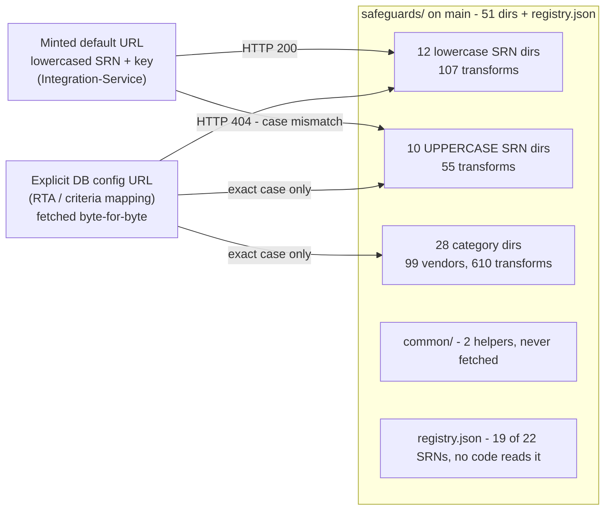
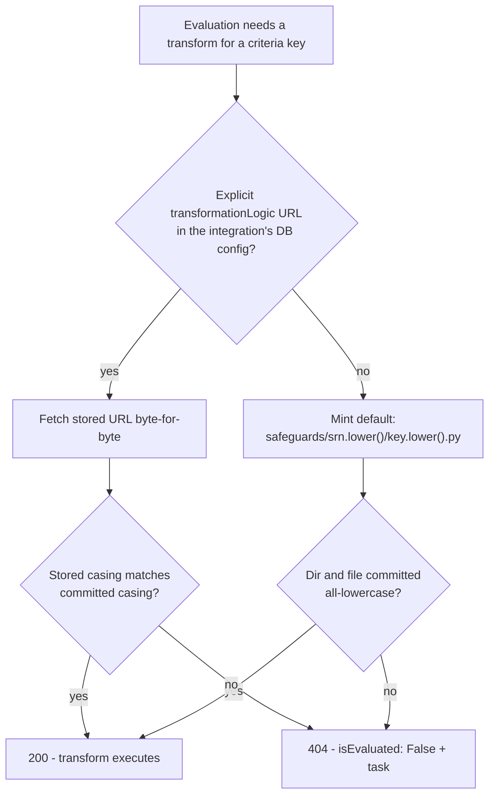

# The catalog

> Part of the [Transformations onboarding docs](README.md). Verified against `develop @ 8bf278fb` and production `main @ 9d0262aa` (2026-09-04). Status: draft for engineer review.

**In one sentence:** This is the full inventory of `safeguards/` — 22 UUID-named SRN directories and 28 category directories holding 772 production transform modules and 511 schema files — plus the honest answer to which of those files production URLs can actually reach, and the 269-file develop-side delta that has not shipped.

## At a glance

- **51 top-level directories** in `safeguards/` on main: 22 [SRN](GLOSSARY.md#srn-dir) (UUID) dirs + 28 category dirs + `common/`, plus one file, `registry.json`.
- **772 transform modules** on main: 610 in category dirs (across 99 vendor subdirs), 162 in SRN dirs. Plus 511 generated Pydantic schema files and 2 `common/` helpers — 1,285 `.py` in total.
- **Two addressing schemes coexist**: SRN dirs are the targets of Integration-Service's [minted default URLs](GLOSSARY.md#minted-url) (`safeguards/{srn.lower()}/{key.lower()}.py`); category/vendor paths are reached only by explicit [`retrievalTransformationArray` ("RTA")](GLOSSARY.md#exact-case-db-url)/criteria-mapping URLs stored in the DB and fetched byte-for-byte.
- **Reachability is a casing question**: raw.githubusercontent.com paths are case-sensitive, 10 of the 22 SRN dirs are committed UPPERCASE, and 54 main method files are camelCase — every one of those paths 404s under the lowercased minted default (curl-verified 2026-09-04, including the Lookout files new on main).
- **The registry is incomplete and dead weight**: `safeguards/registry.json` names 19 of 22 SRN dirs (last touched 2026-02-06) and nothing machine-reads it.
- **Develop stages 269 more files** — 128 new transform modules, 123 schemas, 10 test files, 8 JSON fixtures — including three whole new category dirs (`firewalls/`, sic, `devsecops/`, and `threat-vulnerability-management/`) and a URL-breaking `cloudsecurity/redcanary` → `mdr/red-canary` rename. (`mobile-security/` left this list on 2026-09-04: main's Lookout hotfix PR #548 made it a production category — with copies develop now lags; see [13-release-and-branches.md](13-release-and-branches.md).)
- **Main also has 43 files develop lacks** (the whole `artificial-intelligence/anthropic/` set among them) — the skew is bidirectional; see [13-release-and-branches.md](13-release-and-branches.md).

Two URL sources feed Token-Service's fetch, and they see different halves of the tree:



Walkthrough: the minted default can only land in an SRN dir (its path has exactly two segments), and only resolves when the committed dir and filename are all-lowercase. Everything else — all 10 uppercase SRN dirs, all camelCase and snake_case filenames, and the entire category/vendor tree — is reachable solely through explicit URLs stored in Integration-Service's DB, which Token-Service fetches without any normalization. `common/` and `registry.json` are fetched by nothing.

> [!IMPORTANT]
> Because Token-Service fetches this repo's files from GitHub raw at evaluation time ([02-execution-contract.md](02-execution-contract.md)), **directory and file names in this catalog are production API surface**. Renaming, moving, or re-casing anything on `main` severs every URL that pointed at the old path, instantly.

## Headline totals

| Metric | main (production) `9d0262aa` | develop (staging ground) `8bf278fb` |
|---|---|---|
| Top-level entries in `safeguards/` | 51 dirs + `registry.json` | 54 dirs + `registry.json` (adds `firewalls/`, `devsecops/`, `threat-vulnerability-management/`) |
| SRN (UUID) directories | 22 (10 UPPERCASE, 12 lowercase) | 22 (same set) |
| Category directories | 28 (+ `common/`) | 31 (+ `common/`) |
| Vendor subdirectories | 99 | 106 — 13 new, and 6 of main's absent (see [staged inventory](#staged-on-develop-the-delta)) |
| Transform modules (non-schema, non-test, excl. `common/`) | **772** — 610 category-side, 162 SRN-side | 859 |
| Schema files (`*/schemas/*.py`, incl. `__init__.py`) | **511** (69 `schemas/` dirs) | 632 |
| Test files inside `safeguards/` | 0 | 10 (`test_*.py` + `conftest.py`) |
| Total `.py` under `safeguards/` | 1,285 | 1,503 |
| Non-Python files under `safeguards/` | 2 (`registry.json`, `backups/datto/README.md`) | +8 `firewall/sonicwall/fixtures/*.json` |

All counts computed from the pinned tips via `git ls-tree` (findings corpus, re-verified 2026-09-04). "Schemas" per directory below include that directory's `schemas/__init__.py`, which is why a schema count is typically methods + 1.

> [!NOTE]
> The only root-level difference between the branches is develop's `customer_requirements_ef1397e7.json`, a production passport requirements snapshot (identified here by location only). Root tooling (`generate_schemas.py`, `local_tester.py`, README, CONTRIBUTING, CLAUDE.md, `.gitignore`) is byte-identical on both tips.

## SRN (UUID) directories

One directory per integration Safeguard Reference Number — the territory of minted default URLs. `main:CLAUDE.md:24-26`:

```
- `safeguards/` - Contains all transformation logic organized by Safeguard Reference Number (SRN)
- Each SRN directory (UUID format) contains transformation files for a specific vendor/integration
```

Directory names below are **verbatim** — casing is load-bearing. "Transforms" = non-schema `.py` files. Vendor/category from `main:safeguards/registry.json`; the three unregistered dirs are identified only by their own docstrings.

| SRN directory (verbatim) | Maps to (evidence) | Transforms | Schemas | Minted default URL | In registry.json |
|---|---|---|---|---|---|
| `0450D686-D997-4E20-B82F-827F61CB8371` | Fortinet / Firewall | 2 | 3 | **404** — uppercase dir | yes |
| `0C281CE9-8024-4D70-AC85-D923A6B9635C` | Trend Micro / Email Security | 3 | 4 | **404** — uppercase dir | yes |
| `182a41f5-ba7f-42c9-a3cd-7aa8399f5037` | Cisco / Network Security | 2 | 3 | resolves | yes |
| `1BC425FA-0638-4BF1-8194-19E7E4F2F43C` | Sophos / MDR | 7 | 8 | **404** — uppercase dir | yes |
| `2B2849D8-2FEA-4CAE-9A3C-8B315280752A` | Cloudflare, Inc. / Firewall | 2 | 3 | **404** — uppercase dir | yes |
| `2BC425FA-0638-4BF1-8194-19E7E4F2F43C` | SentinelOne / Endpoint Security | 3 | 4 | **404** — uppercase dir | yes |
| `4BC425FA-0638-4BF1-8194-19E7E4F2F43C` | AWS / Backups | 15 | 17 | **404** — uppercase dir | yes |
| `52beaa98-6ced-4a84-b6d5-faea40e0ffef` | KnowBe4, Inc. / Compliance Management | 2 | 3 | resolves | yes |
| `729cebc6-8abd-4511-ac85-1455a690eebe` | Azure / Backups | 10 | 11 | resolves¹ (6 snake_case files RTA-only) | yes |
| `7BC425FA-0638-4BF1-8194-19E7E4F2F43C` | Microsoft / Endpoint Security | 13 | 14 | **404** — uppercase dir | yes |
| `86ded564-522a-4c9b-9106-365e4cbdec7d` | **unregistered** — "Vendor: Generic IDP" (`main:safeguards/86ded564-522a-4c9b-9106-365e4cbdec7d/isauditloggingenabled.py:3`) | 17 | 18 | resolves¹ (2 snake_case files RTA-only) | **no** |
| `874a78ff-2ca3-4c0e-ab86-19277536ac87` | Microsoft / Email Security | 32 | 33 | resolves (curl-verified 200) | yes |
| `8f2e8f1f-005e-4254-b400-58b1dabe055e` | Bitsight / Cyber Risk Quantification | 2 | 3 | resolves | yes |
| `9B5D9E9C-A713-451C-826C-A57BB4322576` | Cato Networks / Firewall | 2 | 3 | **404** — uppercase dir | yes |
| `9b380a34-6933-48e0-8b35-fe30f3bc3db3` | **unregistered** — "Vendor: Cloud Security" (`main:safeguards/9b380a34-6933-48e0-8b35-fe30f3bc3db3/compliancepercentage.py:3`) | 1 | 2 | resolves | **no** |
| `BBC425FA-0638-4BF1-8194-19E7E4F2F43C` | Halcyon / Endpoint Security | 6 | 7 | **404** — uppercase dir | yes |
| `E454A862-2B86-43FF-8072-DB865E354E17` | **unregistered** — "Vendor: Identity Provider" (`main:safeguards/E454A862-2B86-43FF-8072-DB865E354E17/mfa_transform.py:3`) | 2 | 3 | **404** — uppercase dir (curl-verified) | **no** |
| `a2abbcf5-6693-4b14-8329-8721302a4ef7` | Duo / Multifactor Authentication | 1 | 2 | resolves | yes |
| `a6b871e6-de13-41fa-8636-81a3b6f315f4` | Qualys, Inc. / Attack Surface Management | 4 | 5 | resolves¹ (2 snake_case files RTA-only) | yes |
| `cac4b80f-a930-415e-b1e3-de285fe78452` | NinjaOne / Endpoint Security | 6 | 7 | resolves | yes |
| `d9b6f27a-2e67-4b55-a09e-0784c5de9abd` | Azure / Multifactor Authentication | 22 | 23 | resolves¹ (2 snake_case files RTA-only) | yes |
| `dbc425fa-0638-4bf1-8194-19e7e4f2f43c` | Google / Email Security | 8 | 9 | resolves | yes |

**Totals: 162 transforms, 185 schema files across 22 dirs — 10 uppercase (55 transforms), 12 lowercase (107 transforms).**

¹ "Resolves" applies per file: [criteria keys](GLOSSARY.md#criteria-key) are camelCase, and lowercasing camelCase never produces underscores, so snake_case criteria files (`729cebc6-…/is_backup_encrypted.py`, `86ded564-…/auth_types_allowed.py`, `a6b871e6-…/is_patch_management_enabled.py`, `d9b6f27a-…/auth_types_allowed.py`, …) can never be minted and are reachable only via explicit DB URLs — even inside a lowercase dir. Rollup `*_transform.py` names survive lowercasing, but the references observed in the wild are explicit exact-case URLs (e.g. `Token-Service main:src/schemas/documentation/route_configs.py:484` embeds `…/safeguards/1BC425FA-0638-4BF1-8194-19E7E4F2F43C/epp_transform.py`).

> [!NOTE]
> The three unregistered SRN dirs appear nowhere in the four service documentation corpora (grep over integration-service, token-service, flux, fusion-api findings: zero hits), so their platform identity rests on docstrings alone. `86ded564-…` contains exactly the five criteria of the Okta MFA bundle in develop's production-requirements snapshot (plus twelve more), consistent with a vendor-agnostic IDP fallback — Okta has **no** directory anywhere on main.

> [!WARNING]
> `86ded564-…` contains both `confirmedlicensepurchased.py` **and** `confirmlicensepurchased.py`. A config typo silently picks one — or 404s.

<details><summary><b>Deep dive:</b> per-SRN method inventories</summary>

Full basename lists (non-schema `.py`, from the verified findings corpus, re-derived via `git ls-tree`, unchanged at `9d0262aa`):

- `0450D686-…` (Fortinet): `confirmedlicensepurchased`, `firewall_transform`
- `0C281CE9-…` (Trend Micro): `confirmedlicensepurchased`, `epp_transform`, `isidpenabled` — note: EPP-shaped files in an "Email Security" SRN
- `182a41f5-…` (Cisco): `confirmedlicensepurchased`, `network_transform`
- `1BC425FA-…` (Sophos MDR): `confirmedlicensepurchased`, `epp_transform`, `isbehavioralmonitoringvalid`, `isidpenabled`, `ispatchmanagementenabled`, `isremovablemediacontrolled`, `mdr_transform`
- `2B2849D8-…` (Cloudflare): `confirmedlicensepurchased`, `firewall_transform`
- `2BC425FA-…` (SentinelOne): `confirmedlicensepurchased`, `epp_transform`, `isidpenabled`
- `4BC425FA-…` (AWS Backups): `backup_transform`, `backupfrequency`, `confirmedlicensepurchased`, `is_backup_enabled_for_critical_systems`, `is_backup_encrypted`, `is_backup_immutable`, `is_backup_logging_enabled`, `is_backup_tested`, `is_backup_types_scheduled`, `isbackupenabled`, `isbackupencrypted`, `isgeoredundant`, `issamlenforced`, `lastsuccessfulbackupage`, `recoverytestcompleted` — carries **both spellings** of the encryption criterion (`isbackupencrypted` and `is_backup_encrypted`)
- `52beaa98-…` (KnowBe4): `compliance`, `confirmedlicensepurchased`
- `729cebc6-…` (Azure Backups): `backup_transform`, `confirmedlicensepurchased`, `is_backup_enabled_for_critical_systems`, `is_backup_encrypted`, `is_backup_immutable`, `is_backup_logging_enabled`, `is_backup_tested`, `is_backup_types_scheduled`, `isbackupenabled`, `issamlenforced`
- `7BC425FA-…` (Microsoft EPP): `confirmedlicensepurchased`, `epp_transform`, `hardenedbaselinecompliance`, `isbehavioralmonitoringvalid`, `isidpenabled`, `ispatchmanagementenabled`, `isrealtimeprotectionenabled`, `isremovablemediacontrolled`, `istamperprotectionenabled`, `requiredcoveragepercentage`, `servercoveragepercentage`, `totalendpointcount`, `totalservercount`
- `86ded564-…` (Generic IDP): `auth_types_allowed`, `conditionalaccesspoliciesactive`, `confirmedlicensepurchased`, `confirmlicensepurchased`, `confirmpasswordpolicyenforced`, `is_mfa_logging_enabled`, `isauditloggingenabled`, `islifecyclemanagementenabled`, `ismfaenforcedforusers`, `ismfarequiredforcloudapps`, `ismfarequiredforremoteaccess`, `ispamenabled`, `isrbacimplemented`, `isrdpprotected`, `isstrongauthrequired`, `legacyauthblocked`, `mfa_transform`
- `874a78ff-…` (Microsoft Email): 32 files, `areadminaccountsseparate` … `isurlrewriteenabled` — the largest SRN dir
- `8f2e8f1f-…` (Bitsight): `calculaterisks`, `confirmedlicensepurchased`
- `9B5D9E9C-…` (Cato Networks): `confirmedlicensepurchased`, `firewall_transform`
- `9b380a34-…` (Cloud Security generic): `compliancepercentage`
- `BBC425FA-…` (Halcyon): `confirmedlicensepurchased`, `epp_transform`, `isbehavioralmonitoringvalid`, `isidpenabled`, `ispatchmanagementenabled`, `isremovablemediacontrolled`
- `E454A862-…` (Identity Provider generic): `ismfaenforcedforusers`, `mfa_transform`
- `a2abbcf5-…` (Duo): `ismfaenforcedforusers`
- `a6b871e6-…` (Qualys): `asm_transform`, `confirmedlicensepurchased`, `is_patch_management_enabled`, `is_patch_management_logging_enabled`
- `cac4b80f-…` (NinjaOne): `confirmedlicensepurchased`, `epp_transform`, `isbehavioralmonitoringvalid`, `isidpenabled`, `ispatchmanagementenabled`, `isremovablemediacontrolled`
- `d9b6f27a-…` (Azure MFA): 22 files, `areaccessreviewsconfigured` … `mfa_transform`
- `dbc425fa-…` (Google Email): `confirmedlicensepurchased`, `isantiphishingenabled`, `isdnsconfigured`, `isemailsecurityloggingenabled`, `ismfaenforcedforusers`, `isssoenabled`, `isurlrewriteenabled`, `mfa_transform`

</details>

## Reachability — the honest story

Every file in this repo falls into one of three reachability classes. The mechanics live in Token-Service and Integration-Service ([02-execution-contract.md](02-execution-contract.md) has the full pipeline); the receipts:

Integration-Service mints the default URL with **both** path segments lowercased (Integration-Service docs2, execution-lifecycle; `src/models/integrator.py:2601` on IS main):

```python
"url": "https://raw.githubusercontent.com/spektrum-labs/Transformations/refs/heads/main/safeguards/" + str(self.SRN).lower() + "/" + str(key).lower() + ".py",
```

Token-Service validates only the repo (case-insensitively) and fetches the URL **byte-for-byte** — no path normalization, no auth header (token-service docs2, evaluate-engine; `Token-Service main:src/utils/transformation_url.py:39`, `src/utils/codeexecutor.py:308-309`). raw.githubusercontent.com paths are case-sensitive — verified live against this public repo on 2026-09-04:

| URL path (`safeguards/…`) | HTTP |
|---|---|
| `E454A862-2B86-43FF-8072-DB865E354E17/ismfaenforcedforusers.py` (exact case) | 200 |
| `e454a862-2b86-43ff-8072-db865e354e17/ismfaenforcedforusers.py` (as minted) | **404** |
| `874a78ff-2ca3-4c0e-ab86-19277536ac87/isdkimconfigured.py` (lowercase dir, as minted) | 200 |
| `encryption/microsoft/isAzureADAuthEnabled.py` (exact case) | 200 |
| `encryption/microsoft/isazureadauthenabled.py` (as minting would produce) | **404** |
| `mobile-security/lookout/isDeviceEncrypted.py` (exact case — the 2026-09-04 hotfix) | 200 |
| `mobile-security/lookout/isdeviceencrypted.py` (as minting would produce) | **404** |

The three classes:

1. **Minted-URL-reachable** — lowercase SRN dir + lowercase filename. The default URL resolves with no DB row needed. 12 SRN dirs (107 transforms, minus their snake_case files) qualify.
2. **Exact-case-DB-only** — the file exists and serves traffic **iff** a DB-stored `transformationLogic` URL matches the committed path byte-for-byte. This class covers: all 10 uppercase SRN dirs (55 transforms), all 54 camelCase category-side method files, all snake_case criteria files, and — by construction — the **entire category/vendor tree** (610 transforms), because the minted URL has exactly two path segments and category paths have three or four. Exact-case URLs demonstrably circulate (`Token-Service main:src/schemas/documentation/route_configs.py:484`; Integration-Service docs2 config-registry shows `safeguards/epp/sophos/isepploggingenabled.py` in a production reference config).
3. **Verified-dead as-minted** — the lowercased minted form of every uppercase-dir and camelCase path returns 404 (curl receipts above). Whether any live integration actually falls through to a minted default for these — and has therefore been silently `isEvaluated: False` in production — is a DB question this repo cannot answer (open question in the findings corpus; the DB rows are authoritative, `integration_configs/` are reference copies).



Walkthrough: an explicit DB URL wins and is used verbatim; otherwise the lowercased default is minted. Either way the fetch is literal — a casing mismatch is a 404, and a 404 never raises an alarm: Token-Service converts it to the failure envelope and the criterion becomes `isEvaluated: False` with a task, **not** a coverage gap (token-service docs2, evaluate-engine).

> [!CAUTION]
> A transform can be broken-in-production and look merely "not evaluated". Deleting, renaming, or re-casing a file on main does not fail loudly anywhere — it silently converts evaluations to `isEvaluated: False`. This is also why a well-intentioned "normalize all filenames to lowercase" cleanup would sever every live exact-case DB URL at once.

> [!TIP]
> Never trust `ls` for casing on macOS — the checkout is case-insensitive and shows one casing where git may store another. `git ls-tree -r origin/main --name-only` is the only truth. (At the 2026-04-22 merge-base, `emailsecurity/mimecast/` held both `isDNSConfigured.py` and `isdnsconfigured.py` — a state a Mac cannot even check out correctly. Both branches later deleted the camelCase twin.)

## Category directories

28 categories, 99 vendor subdirs, 610 transforms, 326 schema files. No category dir contains top-level `.py` — every transform sits under a vendor subdir, with exactly two deeper nests (`firewall/cisco/fmc/`, `epp/kaseya/vsa/`). All of these paths are **exact-case-DB-only** (class 2 above). The 54 camelCase method files that additionally demand exact-case URLs: `encryption/microsoft/` (16), `networksecurity/dnsfilter/` (14), `identity-and-access-management/beyondtrust/` (8), `mobile-security/lookout/` (7), `epp/halcyon/` (3), `iam/duo/` (3), `epp/ninjaone-endpoint-management/` (2), `firewall/cato-networks/` (1).

| Category | Vendors | Transforms | Schemas | Notes |
|---|---|---|---|---|
| `artificial-intelligence` | 1 | 24 | 0 | its sole vendor `anthropic/` is main-only; develop instead holds `anthropic-claude-developer-platform-claude-api/` |
| `asm` | 3 | 19 | 9 | |
| `assetmgmt` | 2 | 11 | 13 | |
| `backups` | 6 | 61 | 37 | `azure/` is a divergent twin of SRN `729cebc6-…` |
| `cloudsecurity` | 5 | 26 | 22 | `redcanary/` renamed away on develop — see [staged inventory](#staged-on-develop-the-delta) |
| `compliancemanagement` | 1 | 6 | 7 | |
| `conditionalaccess` | 1 | 1 | 0 | |
| `crq` | 1 | 9 | 10 | |
| `datagovernance` | 1 | 1 | 0 | |
| `dlp` | 2 | 8 | 0 | |
| `emailsecurity` | 10 | 50 | 29 | three proofpoint variants coexist |
| `encryption` | 1 | 16 | 0 | all 16 filenames camelCase |
| `epp` | 11 | 58 | 26 | `kaseya/vsa/` nest; two ninjaone dirs |
| `firewall` | 7 | 30 | 17 | `cisco/fmc/` nest; develop adds a **separate** `firewalls/` |
| `grc` | 1 | 7 | 8 | |
| `iam` | 19 | 123 | 27 | largest category; `beyondtrust` twins `identity-and-access-management/` |
| `identity-and-access-management` | 1 | 8 | 9 | camelCase twin of `iam/beyondtrust/` — divergent |
| `incidentmgmt` | 1 | 3 | 0 | |
| `logging` | 1 | 3 | 0 | |
| `mdr` | 3 | 9 | 10 | |
| `mfa` | 3 | 29 | 27 | `azure/` is a divergent twin of SRN `d9b6f27a-…` |
| `mobile-security` | 1 | 7 | 2 | all 7 filenames camelCase; landed via hotfix PR #548 (2026-09-04) after staging on develop — develop's copies now lag main's fleet-count fix |
| `networksecurity` | 4 | 33 | 18 | `dnsfilter/` breaks both filename rules |
| `sase` | 3 | 16 | 9 | |
| `siem` | 3 | 20 | 6 | `blumira/` uses 10 snake_case `*_transform.py` names |
| `threatintelligence` | 1 | 1 | 3 | |
| `training` | 3 | 15 | 18 | |
| `vulnerabilitymgmt` | 3 | 16 | 19 | |
| **Total** | **99** | **610** | **326** | |

Per-vendor matrices (transform / schema counts per vendor dir, main @ `9d0262aa`):

<details><summary><b>Deep dive:</b> artificial-intelligence, asm, assetmgmt, backups</summary>

**artificial-intelligence**

| Vendor dir | Transforms | Schemas | Notes |
|---|---|---|---|
| `anthropic` | 24 | 0 | Claude admin-API governance set; landed direct-to-main 2026-08 (ENG-463), absent from develop |

**asm**

| Vendor dir | Transforms | Schemas | Notes |
|---|---|---|---|
| `projectdiscovery` | 6 | 0 | incl. `nuclei_transform.py` |
| `qualys` | 8 | 9 | |
| `rapid7insightvm` | 5 | 0 | |

**assetmgmt**

| Vendor dir | Transforms | Schemas | Notes |
|---|---|---|---|
| `axonius` | 3 | 4 | |
| `microsoft-intune` | 8 | 9 | |

**backups**

| Vendor dir | Transforms | Schemas | Notes |
|---|---|---|---|
| `azure` | 13 | 14 | divergent twin of SRN `729cebc6-…` — production config repointed to the SRN copy (Integration-Service docs2, config-registry) |
| `commvault` | 11 | 12 | |
| `crashplan` | 8 | 0 | |
| `datto` | 10 | 11 | dir also holds the repo's only stray README (`main:safeguards/backups/datto/README.md`) |
| `rubrik` | 10 | 0 | |
| `veeam` | 9 | 0 | |

</details>

<details><summary><b>Deep dive:</b> cloudsecurity, compliancemanagement, conditionalaccess, crq, datagovernance, dlp</summary>

**cloudsecurity**

| Vendor dir | Transforms | Schemas | Notes |
|---|---|---|---|
| `appomni` | 6 | 7 | |
| `awssecurityhub` | 8 | 0 | 7 of 8 methods are main-only additions develop lacks |
| `cloudflare` | 4 | 5 | |
| `netskope` | 4 | 5 | hotfixed on both branches since the merge-base |
| `redcanary` | 4 | 5 | develop renames this whole dir to `mdr/red-canary/` |

**compliancemanagement**

| Vendor dir | Transforms | Schemas | Notes |
|---|---|---|---|
| `knowbe4` | 6 | 7 | returns string-typed numbers (`"100"`) — survives only via Token-Service coercion |

**conditionalaccess** — `microsoft` 1 / 0. **crq** — `safesecurity` 9 / 10. **datagovernance** — `microsoft` 1 / 0.

**dlp**

| Vendor dir | Transforms | Schemas |
|---|---|---|
| `cato` | 4 | 0 |
| `microsoft` | 4 | 0 |

</details>

<details><summary><b>Deep dive:</b> emailsecurity, encryption, epp, firewall</summary>

**emailsecurity**

| Vendor dir | Transforms | Schemas | Notes |
|---|---|---|---|
| `abnormal` | 5 | 6 | |
| `avanan` | 7 | 0 | |
| `checkpoint` | 4 | 0 | distinct from develop's new `check-point-software-technologies-email-security/` |
| `cloudflare` | 5 | 6 | |
| `mimecast` | 5 | 6 | the case-twin deletion site (`isDNSConfigured.py` removed on both branches) |
| `proofpoint` | 4 | 0 | |
| `proofpoint-threat-protection` | 4 | 0 | main-only (ENG-469, 2026-08-28) |
| `proofpoint-v2` | 10 | 11 | |
| `sophos` | 2 | 0 | main-only (ENG-309) |
| `sublime` | 4 | 0 | |

**encryption**

| Vendor dir | Transforms | Schemas | Notes |
|---|---|---|---|
| `microsoft` | 16 | 0 | **all 16 camelCase** (`isDataAtRestEncrypted.py`, …) — exact-case DB URLs only; lowercased form curl-404s |

**epp**

| Vendor dir | Transforms | Schemas | Notes |
|---|---|---|---|
| `addigy` | 7 | 0 | |
| `crowdstrike` | 8 | 2 | holds one of main's two non-standard signatures (`def transform(endpoints_response, debug=False)`) |
| `halcyon` | 3 | 0 | camelCase filenames |
| `kaseya` | 5 | 0 | all under `vsa/` — 4-level path |
| `liongard` | 7 | 0 | |
| `manageengine` | 8 | 9 | |
| `ninjaone` | 1 | 1 | |
| `ninjaone-endpoint-management` | 2 | 3 | camelCase (PR #544, merged direct to main 2026-09-03) |
| `sophos` | 2 | 2 | main-only (ENG-279) — named by a production reference config |
| `synqly` | 7 | 0 | |
| `threatdown` | 8 | 9 | |

**firewall**

| Vendor dir | Transforms | Schemas | Notes |
|---|---|---|---|
| `azurefirewall` | 3 | 0 | |
| `cato-networks` | 1 | 0 | single camelCase file (`isFirewallEnabled.py`) |
| `cisco` | 9 | 3 | all under `fmc/` — 4-level path |
| `dope-security` | 6 | 7 | |
| `fortinet` | 3 | 0 | |
| `meraki` | 6 | 7 | |
| `sophos` | 2 | 0 | main-only (ENG-309) |

</details>

<details><summary><b>Deep dive:</b> grc, iam, identity-and-access-management, incidentmgmt</summary>

**grc** — `zengrc` 7 / 8.

**iam** (19 vendors, 123 transforms — the sprawl category)

| Vendor dir | Transforms | Schemas | Notes |
|---|---|---|---|
| `aquera` | 6 | 0 | |
| `beyondtrust` | 8 | 9 | lowercase names; untouched on main since the 2026-04-22 merge-base — the divergent camelCase twin lives in `identity-and-access-management/` |
| `beyondtrust-pra` | 8 | 9 | |
| `britive` | 8 | 9 | |
| `cognito` | 5 | 0 | |
| `cyberark` | 5 | 0 | |
| `dashlane` | 4 | 0 | |
| `duo` | 8 | 0 | 3 camelCase files |
| `google` | 5 | 0 | |
| `hypr` | 5 | 0 | |
| `keeper` | 14 | 0 | |
| `microsoft` | 3 | 0 | |
| `microsoftentra` | 5 | 0 | same 5 filenames as `msentra/`, **different content** |
| `msentra` | 5 | 0 | |
| `oracleidp` | 5 | 0 | |
| `ping_identity` | 5 | 0 | |
| `saviynt` | 14 | 0 | |
| `strata` | 5 | 0 | |
| `yubico` | 5 | 0 | |

**identity-and-access-management**

| Vendor dir | Transforms | Schemas | Notes |
|---|---|---|---|
| `beyondtrust` | 8 | 9 | camelCase twin of `iam/beyondtrust/` — same 8 criteria, **all 8 pairs content-divergent**; `isPAMEnabled` counts ManagedSystems here vs ManagedAccounts in `iam/` |

**incidentmgmt** — `microsoft` 3 / 0.

</details>

<details><summary><b>Deep dive:</b> logging, mdr, mfa, mobile-security, networksecurity</summary>

**logging** — `microsoft` 3 / 0.

**mdr**

| Vendor dir | Transforms | Schemas | Notes |
|---|---|---|---|
| `darktrace` | 1 | 2 | |
| `expel` | 1 | 0 | |
| `zerofox` | 7 | 8 | |

**mfa**

| Vendor dir | Transforms | Schemas | Notes |
|---|---|---|---|
| `azure` | 19 | 19 | divergent twin of SRN `d9b6f27a-…` (`mfa_transform.py` differs by direct diff) |
| `microsoftauthenticator` | 3 | 0 | |
| `pingfederate` | 7 | 8 | |

**mobile-security**

| Vendor dir | Transforms | Schemas | Notes |
|---|---|---|---|
| `lookout` | 7 | 2 | all camelCase; main's copies carry the fleet-count fix (`382dc385`, PR #548) that develop's staged copies lack |

**networksecurity**

| Vendor dir | Transforms | Schemas | Notes |
|---|---|---|---|
| `cisco-umbrella` | 5 | 6 | |
| `dnsfilter` | 18 | 5 | 14 camelCase `*_transform.py` files break **both** naming rules at once; its `schemas/` covers only the 4 lowercase files, so schema validation silently never runs for the other 14 |
| `markmonitor` | 4 | 0 | |
| `meraki` | 6 | 7 | |

</details>

<details><summary><b>Deep dive:</b> sase, siem, threatintelligence, training, vulnerabilitymgmt</summary>

**sase**

| Vendor dir | Transforms | Schemas |
|---|---|---|
| `cato` | 4 | 0 |
| `microsoft` | 4 | 0 |
| `zscaler` | 8 | 9 |

**siem**

| Vendor dir | Transforms | Schemas | Notes |
|---|---|---|---|
| `blumira` | 10 | 0 | all snake_case `*_transform.py` (`retention_transform`, `alerting_transform`, …) |
| `microsoftsentinel` | 5 | 0 | |
| `netwrix` | 5 | 6 | |

**threatintelligence** — `horizon3` 1 / 3.

**training**

| Vendor dir | Transforms | Schemas |
|---|---|---|
| `huntress` | 4 | 5 |
| `ninjio` | 7 | 8 |
| `proofpoint-sat` | 4 | 5 |

**vulnerabilitymgmt**

| Vendor dir | Transforms | Schemas |
|---|---|---|
| `kaseya` | 4 | 5 |
| `ninjaone` | 5 | 6 |
| `tenable` | 7 | 8 |

</details>

## Staged on develop (the delta)

Tip-to-tip (`git diff -M origin/main origin/develop -- safeguards/`, re-measured 2026-09-04): 370 files changed — **269 added, 49 modified, 9 renamed, 43 "deleted"** (the 43 D-status files are main-only additions develop never received, not develop-side deletions — none existed at the merge-base; the 49 modified now include develop's 6 stale `mobile-security/lookout` copies, which lag main's fleet-count hotfix). The 269 adds split into **128 new transform modules + 123 schemas + 10 test files + 8 JSON fixtures**. Verified per-directory:

| Directory (develop) | Files added | Transforms / schemas / tests / fixtures | New-transform casing |
|---|---|---|---|
| `emailsecurity/check-point-software-technologies-email-security` | 49 | 24 / 25 / – / – | all camelCase |
| `epp/ninjaone-endpoint-management` | 40 | 20 / 20 / – / – | all camelCase |
| `threat-vulnerability-management/horizon3-nodezero` | 29 | 14 / 15 / – / – | all camelCase — **new category** (main's live `threatintelligence/horizon3` is a different, older vendor dir) |
| `firewall/sonicwall` | 25 | 5 / 6 / 6 / 8 | lowercase |
| `epp/crowdstrike-falcon` | 24 | 12 / 12 / – / – | all camelCase |
| `firewalls/cisco-meraki-mx` | 21 | 10 / 11 / – / – | all camelCase — **new plural category** |
| `epp/sentinelone` | 15 | 9 / 6 / – / – | all camelCase |
| `threatintelligence/wordfence-intelligence` | 11 | 5 / 6 / – / – | all camelCase |
| `mfa/azure` | 8 | 8 / 0 / – / – | lowercase (3 of 8 broken — see note) |
| `iam/okta` | 7 | 3 / 4 / – / – | camelCase |
| `incidentmgmt/sumo-logic-continuous-intelligence-service` | 7 | 3 / 4 / – / – | camelCase |
| `emailsecurity/abnormal-security-inbound-email` | 7 | 3 / 4 / – / – | camelCase |
| `mdr/red-canary` | 6 (+9 renamed in) | 3 / 3 / – / – | camelCase |
| `devsecops/github` | 5 | 2 / 3 / – / – | all camelCase — **new category**; landed as a `make-live:` direct push to develop (`8bf278fb`, 2026-09-04) |
| `7BC425FA-0638-4BF1-8194-19E7E4F2F43C` | 4 | 2 / 0 / 2 / – | lowercase (incl. `microsoft_endpoint_oneclick`) |
| `backups/crashplan` | 3 | 1 / 2 / – / – | camelCase (`isSAMLEnforced`) |
| `artificial-intelligence/anthropic-claude-developer-platform-claude-api` | 3 | 1 / 2 / – / – | camelCase (`isComplianceAPIEnabled`) |
| `874a78ff-2ca3-4c0e-ab86-19277536ac87` | 2 | 1 / 0 / 1 / – | lowercase (`isantiphishingenabled_oneclick`) |
| `1BC425FA-0638-4BF1-8194-19E7E4F2F43C` | 2 | 2 / 0 / – / – | lowercase |
| `emailsecurity/cloudflare` | 1 | 0 / 0 / 1 / – | test only |
| **Total** | **269** | **128 / 123 / 10 / 8** | 110 of 128 camelCase |

> [!WARNING]
> Develop's `firewalls/cisco-meraki-mx/` creates a **plural** `firewalls/` category next to main's singular `firewall/`. It mirrors Integration-Service's own config path `firewalls/cisco-meraki-mx.json`, so it may be deliberate — but anyone hunting for Meraki MX transforms under `firewall/` will find only main's older `firewall/meraki/`, a different vendor dir. Two spellings of the same category are now both load-bearing.

> [!CAUTION]
> The `cloudsecurity/redcanary` → `mdr/red-canary` rename (9 files) is **URL-breaking on merge**: the instant develop merges to main, every DB-stored URL still pointing at `cloudsecurity/redcanary/…` 404s — silently, as `isEvaluated: False`. Coordinating the merge with the DB-side URL updates is mandatory. See [13-release-and-branches.md](13-release-and-branches.md).

> [!WARNING]
> "Staged" overstates the isolation. On Integration-Service's **main** branch, 16 reference configs pin `refs/heads/develop` — and four of them name develop-only directories (`epp/crowdstrike-falcon`, `mdr/red-canary`, `iam/okta`, `firewalls/cisco-meraki-mx`). Wherever the live DB rows match those reference copies, a push to develop is already a production deploy (Integration-Service docs2, config-registry). Develop is invisible to production **only** for minted-default URLs.

> [!NOTE]
> Three of the eight new `mfa/azure` files (`areadminaccountsseparate.py`, `isadminmfaphishingresistant.py`, `ismfaenforced.py`) define top-level `_`-prefixed helpers, which RestrictedPython rejects — they would deploy as always-`isEvaluated: False`. Main's tree has zero top-level `_`-prefixed defs. See [14-known-issues.md](14-known-issues.md).

110 of the 128 new transform modules have camelCase basenames (whole check-point, crowdstrike-falcon, sentinelone, cisco-meraki-mx, horizon3-nodezero, github, wordfence sets) — every one lands in the exact-case-DB-only reachability class the moment it merges, contradicting `main:CONTRIBUTING.md:60` ("Criteria file — Lowercase criteria key"). Develop also introduces pytest scaffolding (`test_*.py`, `conftest.py`, `fixtures/*.json`) inside fetchable `safeguards/` paths — a convention main does not have.

For the other side of the skew — the 43 main-only files develop lacks (all 24 `artificial-intelligence/anthropic/` methods, 7 of `cloudsecurity/awssecurityhub/`, `emailsecurity/proofpoint-threat-protection/`, and the ENG-279/ENG-309 sophos additions, one of which a production config names) — see [13-release-and-branches.md](13-release-and-branches.md).

## registry.json disposition

`main:safeguards/registry.json` — 2,090 bytes, 19 entries, maps SRN → `{vendor, category}`. First entry (`main:safeguards/registry.json:2-5`):

```json
"A6B871E6-DE13-41FA-8636-81A3B6F315F4": { "vendor": "Qualys, Inc.", "category": "Attack Surface Management" }
```

- **Coverage**: 19 of 22 SRN dirs. Missing: `86ded564-…`, `9b380a34-…`, `E454A862-…` (the three generic dirs).
- **Consumers**: `main:README.md:91` links it, and README's "Safeguard Registry" tables (`main:README.md:28-91`) mirror it. **No code reads it** — grep over this repo and over Integration-Service and Token-Service `src/` found no programmatic consumer.
- **Freshness**: last commit `3f55acd8`, 2026-02-06 ("resolveconflicts") — it predates every 2026 vendor build-out and drifts silently.
- **Disposition**: treat it as documentation with known staleness, never as an authority. The authoritative SRN → integration mapping lives in Integration-Service's DB (`Integration.SRN`); this catalog's table above is the current code-verified snapshot.

> [!NOTE]
> Registry categories do not constrain directory content: `0C281CE9-…` is "Email Security" per the registry but ships `epp_transform.py` and `isidpenabled.py`, and `1BC425FA-…` is "MDR" in the registry, holds `epp_transform.py`, and appears under Attack Surface Management in one README table — three category stories for one SRN.

## Gotchas

> [!CAUTION]
> **Every rename is a production incident waiting on a fetch.** GitHub paths are the public API of this repo; a moved, deleted, or re-cased file on main 404s for every URL that referenced it, and the failure surfaces only as `isEvaluated: False` — no alert, no gap. The redcanary rename staged on develop and the mimecast case-twin cleanup are both live examples of path changes with production blast radius.

> [!WARNING]
> **Twin trees are divergent, not copies.** `mfa/azure/` vs SRN `d9b6f27a-…`, `backups/azure/` vs SRN `729cebc6-…` (production's config was repointed to the SRN copy, stranding the category copy), `iam/microsoftentra/` vs `iam/msentra/` (same filenames, different content), and sharpest of all `iam/beyondtrust/` vs `identity-and-access-management/beyondtrust/`: same 8 criteria, all 8 file pairs differ, and `isPAMEnabled` counts ManagedAccounts on one side and ManagedSystems on the other (`main:safeguards/iam/beyondtrust/ispamenabled.py` vs `main:safeguards/identity-and-access-management/beyondtrust/isPAMEnabled.py`). Which verdict a customer gets depends on which path their DB URL targets. Fix the twin the DB actually fetches — a fix to the other one is a silent no-op.

> [!WARNING]
> **Nothing shared is actually shared.** `common/response_helper.py` is imported by nothing but its own `common/__init__.py` — no transform can import it, because Token-Service fetches and executes each file standalone — so the `extract_input`/`create_response` pattern is inlined in 496 of 772 main transforms, and `confirmedlicensepurchased.py` exists as **79 independent copies** with drifted logic. A bug fixed in one place is fixed in one place.

> [!WARNING]
> **Two directories break the `{category}/{vendor}/{file}` shape**: `firewall/cisco/fmc/` and `epp/kaseya/vsa/` add a product level. Tooling or greps assuming three path segments will miss them — as will anyone assuming `networksecurity/dnsfilter/`'s 14 camelCase `*_transform.py` files follow either naming rule.

> [!CAUTION]
> **The repo is public and fetched anonymously.** Token-Service's download carries no auth header (`Token-Service main:src/utils/codeexecutor.py:308-309`), so repo visibility is a production dependency — and everything in this catalog, including develop's staged work and test fixtures, is world-readable. Do not commit anything secret-shaped anywhere under `safeguards/` on any branch.

## Where the code lives

| Path | What it is |
|---|---|
| `main:safeguards/{UUID}/` | 22 SRN dirs — minted-URL territory (table above; 10 uppercase are exact-case-DB-only) |
| `main:safeguards/{category}/{vendor}/` | 28 categories × 99 vendor dirs — exact-case-DB-only, never minted |
| `main:safeguards/{dir}/schemas/` | 69 optional Pydantic sidecar dirs (511 files); fetched as `{base}/schemas/{filename}` verbatim, so casing must mirror the transform |
| `main:safeguards/common/` | `response_helper.py` + `__init__.py` — inline-me template; never fetched, imported by no transform |
| `main:safeguards/registry.json` | 19-entry SRN → vendor/category map; documentation-only, stale since 2026-02-06 |
| `main:generate_schemas.py` | schema scaffolder (expects uncommitted `api_responses/` samples — see [12-local-development.md](12-local-development.md)) |
| `main:local_tester.py` | local replica of the Token-Service pipeline, unsandboxed ([12-local-development.md](12-local-development.md)) |
| `main:README.md:28-91`, `main:CONTRIBUTING.md:56-62`, `main:CLAUDE.md:24-26` | the in-repo registry tables and naming/layout rules (and their violations, per this doc) |
| Integration-Service `src/models/integrator.py:2601` | mints the lowercased default URL (Integration-Service docs2, execution-lifecycle) |
| `Token-Service main:src/utils/transformation_url.py`, `src/utils/codeexecutor.py` | allowlist + byte-for-byte fetch + sandbox (token-service docs2, evaluate-engine; [02-execution-contract.md](02-execution-contract.md)) |
| `customer_requirements_ef1397e7.json` (develop root) | production passport requirements snapshot; its `summary` block (6/6/34) contradicts its body (5 groupings / 5 bundles / 22 criteria) |

Related reading: [01-transformations-overview.md](01-transformations-overview.md) for why the repo is the deployment, [03-writing-a-transform.md](03-writing-a-transform.md) for the file contract these counts obey, [13-release-and-branches.md](13-release-and-branches.md) for the merge mechanics of the develop delta, [14-known-issues.md](14-known-issues.md) for the files in this catalog that are broken in production today, and [GLOSSARY.md](GLOSSARY.md) for terms.
