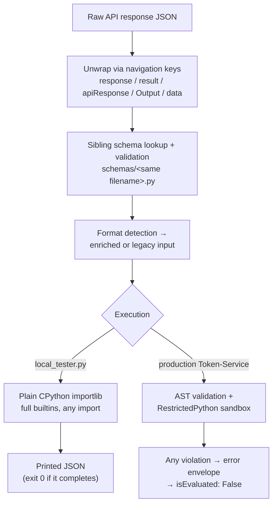

# Local testing and its limits

> Part of the [Transformations onboarding docs](README.md). Verified against `develop @ 5c5ccde5` and production `main @ c1d935da` (2026-09-03). Status: draft for engineer review.

**In one sentence:** `local_tester.py` faithfully replays Token-Service's *data* pipeline (unwrap → schema → enriched input → `transform()`) against a saved API response, but it executes your code in plain, unrestricted CPython — so a green local run proves your logic and proves nothing about surviving the production [RestrictedPython](GLOSSARY.md#restrictedpython) sandbox.

## At a glance

- **One command, two files**: `python local_tester.py <transform.py-or-URL> <response.json>` — that is the entire local test harness (`local_tester.py:274-275`).
- **It replicates the data plumbing** production applies before your code runs: response unwrapping, sibling-schema validation, and new-format detection with enriched-input wrapping (`local_tester.py:1-7`).
- **It does NOT replicate the sandbox.** It loads your transform with plain `importlib` — full builtins, all imports, no AST validation (`local_tester.py:56`). Every construct the sandbox bans runs green locally (reproduced 2026-09-03).
- **It is a runner, not a test framework** — no assertions, no expected-output comparison, exit code 0 for any transform that completes (`local_tester.py:371-372`).
- **You bring your own fixture.** `**/api_responses/` is gitignored as potentially sensitive (`.gitignore:177-178`); main ships zero sample responses. Develop alone carries 8 SonicWall fixture JSONs plus the repo's only pytest suites.
- **Dependencies are undocumented**: `requests` is required even for fully-local runs, `pydantic` is optional, and there is no `requirements.txt` on either branch.
- **`generate_schemas.py` scaffolds Pydantic input stubs** into `schemas/` dirs — but its recursive discovery is dead code, its live sweep mostly no-ops today, and it drops an uncommitted `safeguards/unmatched_api_responses.log` as a side effect.
- **There is no pre-merge sandbox check anywhere** — not in this tool, not in the develop pytest suites, not in CI (no CI runs any test — the only workflows on any branch are this doc set's own docs-drift checks; see [13-release-and-branches.md](13-release-and-branches.md)). The first RestrictedPython execution of your code is production.

The diagram shows where the local path and the production path share steps, and where they split:



Everything above the split is a genuine replica (steps 1-4 of `local_tester.py`'s own header comment, mirroring Token-Service `codeexecutor` — see [02-execution-contract.md](02-execution-contract.md)). Everything below the split on the left is *more permissive* than production, which is exactly the wrong direction for a pre-merge check.

## What local_tester.py actually does

The file is byte-identical on `origin/main` and `origin/develop` (root-tooling diff is empty; verified 2026-09-03), so one description covers both.

Invocation is two positional arguments — a transform (local path or URL) and a saved response JSON:

```bash
python local_tester.py safeguards/<dir>/<criteriakey>.py response.json
# or test exactly the bytes production fetches:
python local_tester.py "https://raw.githubusercontent.com/spektrum-labs/Transformations/refs/heads/main/safeguards/<dir>/<criteriakey>.py" response.json
```

What happens, in order (all inside `main()`, `local_tester.py:273-380`):

1. **URL download** (optional): if arg 1 is a URL, it is fetched to a temp file (`local_tester.py:282-291`, `download_transformation` at `:37-46`). Pointing it at the `refs/heads/main` raw URL tests the exact production artifact.
2. **Module load**: the transform is imported as a normal Python module — `spec.loader.exec_module(module)` (`local_tester.py:56`). This is the step that diverges from production (next section).
3. **Unwrap**: the response is drilled through the navigation keys `['response', 'result', 'apiResponse', 'Output', 'data']` (`local_tester.py:101`), mirroring Token-Service `_parse_api_response_for_transformer`.
4. **Schema validation**: it looks for a sibling schema at `<dir>/schemas/<same filename>` (`derive_schema_path`, `local_tester.py:265-270`), strips its imports, and validates the parsed data against the `*Input` Pydantic class (`local_tester.py:187-211`, `model_validate` at `:237`). List inputs skip validation with a warning (`:230-235`).
5. **Format detection**: a source-text search for `input["data"]` / `extract_input(` and friends decides "new format" (`transformation_uses_new_format`, `local_tester.py:112-121`); if matched, input is wrapped as `{"data": parsed_data, "validation": validation_result}` (`:359-361`), else passed bare (`:363`).
6. **Execution**: `transformation_module.transform(transform_input)` and pretty-print (`local_tester.py:371-372`). No assertions; you eyeball the JSON.

> [!NOTE]
> **CONTRIBUTING.md documents a stdin mode that does not exist.** `CONTRIBUTING.md:413-414` shows `echo '{...}' | python local_tester.py safeguards/.../transform.py -` — but `load_data_json` opens the literal path (`local_tester.py:60-63`), so `-` fails with `Error loading data: [Errno 2] No such file or directory: '-'` (reproduced 2026-09-03). Always pass a real JSON file path.

<details><summary><b>Deep dive:</b> where local_tester's replica quietly diverges from production</summary>

- **URL mode never finds a schema.** `derive_schema_path` looks for `schemas/<file>` next to the *temp file in the OS temp dir* — never present — so URL mode always prints "No schema found" (`local_tester.py:265-270`, `:333-338`), whereas production fetches the sibling schema from GitHub at `{base}/schemas/{filename}` (token-service docs2, evaluate-engine.md).
- **The new-format detector is broader than production's.** local_tester treats `"extract_input("` in the source as new-format (`local_tester.py:114-121`); production's detector deliberately does **not** (Token-Service `codeexecutor.py:938-956` — its docstring says an inlined helper alone doesn't imply new format). A transform that inlines `extract_input` but reads the bare payload can receive a *differently shaped input* locally vs production.
- **Drift risk is real but unaudited.** The tester was last touched 2026-04-22; its claimed line-fidelity to Token-Service `codeexecutor` has not been re-verified side-by-side since (tooling-workflow findings, open question 6).

</details>

## What it CANNOT catch — the sandbox gap

> [!CAUTION]
> **Sandbox breakage ships silently.** Nothing a contributor touches — local_tester, the develop pytest suites, CI (none exists) — executes a transform under RestrictedPython before merge. And a merge to `main` is an ungated instant production deploy ([13-release-and-branches.md](13-release-and-branches.md)). A sandbox-incompatible transform passes every local check, deploys, and then every evaluation of that criterion returns the error envelope → `isEvaluated: False` — a task, not an alarm ([02-execution-contract.md](02-execution-contract.md)).

The gap is proven, not theoretical:

- **Direct reproduction (2026-09-03):** a transform using all three constructs `CONTRIBUTING.md` bans — `map()`, `datetime.strptime()`, and `d["k"] += 1` — ran to green success through local_tester. The identical code fails Token-Service's AST validation / RestrictedPython compilation (token-service docs2, evaluate-engine.md; AST validation at TS `src/utils/codeexecutor.py:555-617`, `compile_restricted` at `:723` — re-verified against the TS-main worktree 2026-09-03).
- **Production history:** the Anthropic pack was direct-pushed to main 2026-08-20 and needed `a51b8a1f` "ENG-463 Fix Anthropic transforms to run under RestrictedPython" five days later; `hotfix/beyondtrust-pra-restrictedpython` (PR #533) repeated the pattern 2026-09-02. On develop, PR #480 fixed sandbox-broken SentinelOne code the generation pipeline had merged.
- **Main today** still carries 16 transform files that cannot run or cannot date-parse under the sandbox — inventoried in [14-known-issues.md](14-known-issues.md).

What passes locally but dies in production:

| Construct | local_tester | Production (Token-Service) |
|---|---|---|
| `map()` / `filter()` | runs | `NameError` — absent from sandbox builtins |
| `datetime.strptime()` | runs | `ImportError` — lazy `_strptime` import blocked (empirically confirmed) |
| `d["k"] += 1` (subscript aug-assign) | runs | RestrictedPython compile error |
| `_my_helper()` (underscore-prefixed name) | runs | compile error (only `_parse_input`/`_listify` are regex-grandfathered) |
| `import` beyond the 8 allowed modules | runs | AST validation reject |
| `re.compile`, `getattr`, `hasattr`, dunder access | runs | AST validation reject |
| Infinite loop / huge allocation | hangs *your* laptop | hangs a production evaluation worker — no timeout there either |

(Sandbox rules and receipts: [02-execution-contract.md](02-execution-contract.md); how to write within them: [03-writing-a-transform.md](03-writing-a-transform.md).)

## What you need to run it

- **No credentials, no env vars.** The tool talks to nothing except (optionally) raw GitHub for URL mode.
- **`pip install requests pydantic`** — undocumented; there is no `requirements.txt` on either branch. `requests` is imported unconditionally at module top (`local_tester.py:16`), so even a fully-local run dies with `ModuleNotFoundError: No module named 'requests'` on a clean interpreter (reproduced 2026-09-03). `pydantic` is optional — without it, schema validation reports "skipped" (`local_tester.py:21-25`, `:132-137`).
- **A saved raw API response JSON.** Main commits none: `**/api_responses/` is gitignored ("API response samples (may contain sensitive infrastructure data)", `.gitignore:177-178`). Get one from a live tenant, from Token-Service's S3 uploads, or hand-craft it. The one committed exception: develop's 8 SonicWall fixtures at `safeguards/firewall/sonicwall/fixtures/*.json` (LABS-3319).

## generate_schemas.py

**What it generates.** Per-transform Pydantic input schemas written to `<safeguard_dir>/schemas/<transform>.py`, each defining a `<Name>Input(BaseModel)` class (`generate_schemas.py:116`, `:137-147`), plus a `schemas/__init__.py` (`:249-253`). The production consumer is Token-Service, which optionally fetches the sibling schema at `{base}/schemas/{filename}` at evaluation time (token-service docs2, evaluate-engine.md); local_tester consumes the same files locally. Existing schemas are never overwritten (`:219-221`).

**Two modes.** With a matching `api_responses/{Category}_{Vendor}_{CriteriaKey}_{SRN}.json` sample it infers per-key `Optional[...]` fields (`generate_schemas.py:41-52`, `:109-148`); with no sample it emits an empty stub — docstring `Note: No API response sample available.`, `class Config: extra = "allow"` (`:151-173`). Since samples are gitignored, a fresh clone can only ever produce the permissive stub.

> [!WARNING]
> **The recursion is dead code, and the live sweep mostly no-ops.** `get_safeguard_dirs()` — the only recursive discovery — is never called by `main()`, which instead does a non-recursive scan that name-excludes `common`, `backups`, `epp`, `firewall` and hardcodes exactly three nested paths: `['backups/datto', 'epp/crowdstrike', 'firewall/cisco/fmc']` (`generate_schemas.py:270-276`). Every other category/vendor dir is silently skipped — 27 of main's 28 non-UUID top-level trees have no top-level `.py` for the scan to notice. Running it today mostly no-ops outside [SRN](GLOSSARY.md#srn-dir) UUID dirs.

**Side effect:** it always writes `safeguards/unmatched_api_responses.log` (`generate_schemas.py:298-303`) — an artifact that is committed nowhere; delete it or leave it untracked, but don't commit it.

**What the schemas are worth:** on main, 765 transform modules vs 442 substantive schema files (the 509 total in [04-catalog.md](04-catalog.md) minus 67 `schemas/__init__.py` re-exports); 120 schemas declare zero fields, 87 more exactly one, 431/442 set `extra = "allow"`, and every generated field is `Optional[...] = None` (AST-measured 2026-09-03). Validation passes almost anything — the `validation.status` your transform receives in enriched input is correspondingly weak.

## The pre-merge checklist that exists today

Honestly, this is the whole of it:

1. **Save a raw API response** as JSON (S3, live tenant, or hand-crafted — nothing is committed).
2. **`pip install requests pydantic`** into a venv.
3. **Run `python local_tester.py <transform> <response.json>`** — ideally also in URL mode against the raw `refs/heads/main` URL when fixing a live file.
4. **Eyeball the printed parse / validation / format / result sections.** There are no assertions; CONTRIBUTING's six "test cases to cover" (happy path, failure, empty, API error, malformed JSON, legacy format — `CONTRIBUTING.md:417-424`) are a manual checklist with no harness behind it.
5. **Manually lint against the sandbox rules** in [03-writing-a-transform.md](03-writing-a-transform.md) — no `map`/`filter`, no `strptime`, no subscript `+=`, no underscore-prefixed helpers, imports from the 8-module allowlist only. Today this step is human grep, nothing more.

> [!IMPORTANT]
> The gap between step 5 and reality is the repo's defining tooling hole: **no sandbox-replica test exists, and no CI exists to run one** — `CONTRIBUTING.md:485`'s "Tested with local_tester.py" checkbox is unenforced and, per the table above, insufficient even when honored. [14-known-issues.md](14-known-issues.md) carries the concrete recommendation (a `compile_restricted`-based pre-merge check; the verification scripts that produced the 16-file breakage inventory already prove the approach works).

## Running the develop-only pytest suites

Develop (not main) carries 10 committed pytest files — the closest thing to real tests in the repo, merged between 2026-07-14 (LABS-3196) and 2026-08-12 (LABS-3319, the newest and largest; dates re-verified via `git log` 2026-09-03):

- `safeguards/firewall/sonicwall/` — 5 `test_*.py` + `conftest.py` + 8 fixture JSONs (the flagship suite)
- `safeguards/7BC425FA-0638-4BF1-8194-19E7E4F2F43C/` — 2 test files
- `safeguards/874a78ff-2ca3-4c0e-ab86-19277536ac87/test_isantiphishingenabled_oneclick.py`
- `safeguards/emailsecurity/cloudflare/test_isdnsconfigured.py`

Run them from a develop checkout:

```bash
pip install pytest pydantic requests
python -m pytest safeguards/firewall/sonicwall/ -v      # or any of the paths above
```

Three honest caveats:

- **They live beside the transforms**, not under `tests/`, because root `.gitignore:182` ignores any `tests/` directory — so bulk scans of safeguard dirs pick them up as noise.
- **They also run unrestricted CPython**: the SonicWall `conftest.py` loads transforms via `importlib.util.spec_from_file_location(...).loader.exec_module(...)` (`safeguards/firewall/sonicwall/conftest.py:10-15`) — same non-sandbox execution as local_tester, so they assert *logic*, never sandbox compatibility.
- **No CI ever runs them** — they pass or fail only on a contributor's laptop, and they exist only on develop, which production never fetches ([13-release-and-branches.md](13-release-and-branches.md)).

## Gotchas

> [!CAUTION]
> **local_tester green ≠ production green.** Execution is plain `spec.loader.exec_module` (`local_tester.py:56`) — all three documented-banned constructs ran to green output in a direct reproduction (2026-09-03), and three separate RestrictedPython hotfix cycles (Anthropic ENG-463 and beyondtrust-pra #533 on main; s1-coverage #480 on develop) show shipped code failing in the sandbox that local testing blessed. Treat a local pass as "logic looks right", never "safe to merge".

> [!WARNING]
> **The documented inline-JSON mode is fiction.** `CONTRIBUTING.md:413-414`'s `... local_tester.py safeguards/.../transform.py -` fails with `[Errno 2] No such file or directory: '-'` — there is no stdin support anywhere in the file (`load_data_json`, `local_tester.py:60-63`).

> [!WARNING]
> **URL mode skips schema validation entirely** — the sibling-schema lookup is filesystem-relative to the downloaded temp file (`local_tester.py:265-270`), so testing "exactly what production fetches" silently drops the schema step production performs.

> [!WARNING]
> **Input shape can differ locally vs production for `extract_input` transforms.** local_tester's new-format detector matches `extract_input(` (`local_tester.py:119`); production's deliberately doesn't (TS `codeexecutor.py:938-956`). A legacy-style transform that merely inlines the helper gets the enriched `{"data": ..., "validation": ...}` wrapper locally and the bare payload in production.

> [!NOTE]
> **`import requests` is mandatory even offline** (`local_tester.py:16`), and no requirements file says so — the first run on a clean machine always fails once.

## Where the code lives

| What | Where | Notes |
|---|---|---|
| The local runner | `local_tester.py` (repo root) | byte-identical on main and develop; last touched 2026-04-22 |
| Usage / arg parsing | `local_tester.py:273-291` | two positional args; URL mode at `:282-291` |
| Non-sandboxed module load | `local_tester.py:49-57` | the fidelity gap in one line: `:56` |
| Unwrap replica | `local_tester.py:67-108` | navigation keys at `:101` |
| Schema lookup + validation | `local_tester.py:127-270` | sibling `schemas/<file>` at `:265-270` |
| Format detection | `local_tester.py:112-121` | broader than production's detector |
| Schema generator | `generate_schemas.py` (repo root) | live sweep at `:270-276`; dead recursion at `:14-29`; log side effect at `:298-303` |
| Fixture/gitignore policy | `.gitignore:177-182` | `**/api_responses/` and `tests/` both ignored |
| The (aspirational) testing docs | `CONTRIBUTING.md:405-424`, `:485` | includes the broken stdin example |
| develop-only pytest suites | `safeguards/firewall/sonicwall/`, `7BC425FA-…/`, `874a78ff-…/`, `emailsecurity/cloudflare/` | develop @ `5c5ccde5` only; never on main, never in CI |
| Production pipeline this replicates | Token-Service `src/utils/codeexecutor.py`, `evaluate.py` | see [02-execution-contract.md](02-execution-contract.md) and token-service docs2 |
