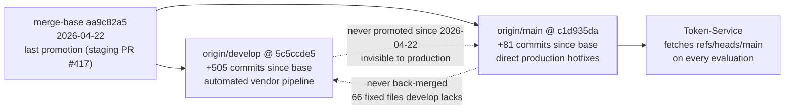
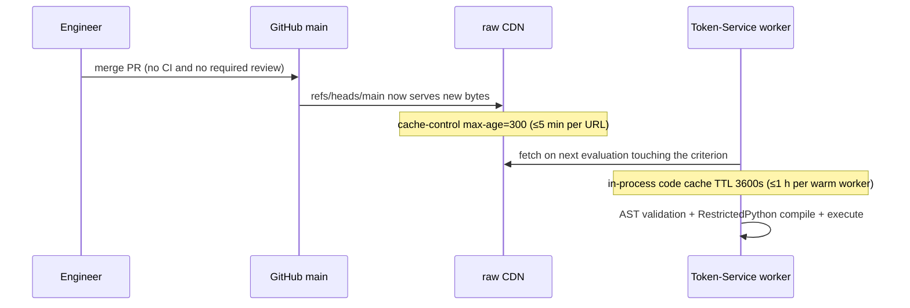
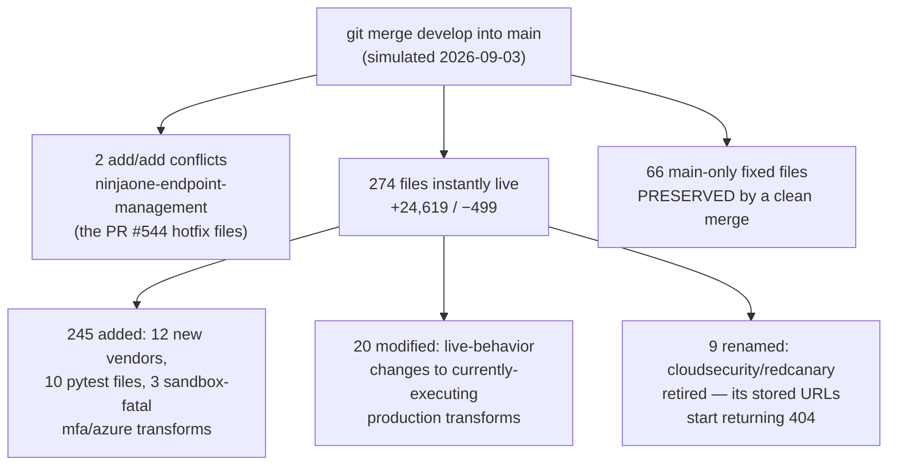

# Merge = deploy

> Part of the [Transformations onboarding docs](README.md). Verified against `develop @ 5c5ccde5` and production `main @ c1d935da` (2026-09-03). Status: draft for engineer review.

**In one sentence:** There is no release process — a merge (or push) to `main` changes production behavior within minutes with no CI and no required review, while five months of work on `develop` is invisible to production, and promoting it would be a 274-file instant deploy with known, specific landmines.

## At a glance

- **A merge to `main` IS the deploy.** [Token-Service](00-platform-overview.md) fetches every transform from `refs/heads/main` at evaluation time; the repo is the artifact store and `git merge` is the deploy tool (see [02-execution-contract.md](02-execution-contract.md)).
- **Propagation: ≤ ~300 s + up to 1 h.** GitHub's raw CDN caches each URL for 300 s (`cache-control: max-age=300`, verified live), and each Token-Service worker holds a 3600 s in-process code cache. Typical cache-miss propagation is seconds.
- **There is no gate.** No `.github/`, no CI, no CODEOWNERS on either branch; GitHub branch protection on `main` is **disabled** (queried live 2026-09-03); sampled PRs to both branches show 0 reviews and author == merger; direct pushes to `main` have happened.
- **The branches split on 2026-04-22** (merge-base `aa9c82a5`, inside the last `staging` promotion train, PRs #287–#417). Nothing has promoted develop to main since.
- **`develop` is +505 commits** — overwhelmingly an automated vendor-onboarding pipeline (29 `feat/transformations-<vendor>-<timestamp>` merges plus 12 auto-generated revert merges; 460 of 505 commits under a single author identity). None of it is reachable by minted production URLs (the branch-pinning caveat is in [Gotchas](#gotchas)).
- **`main` is +81 commits** — almost entirely direct production hotfixes (the remainder is the tail of the April `staging` train), including a 2026-09-01→03 burst (Azure backups PR #531, BeyondTrust PRA PR #533, NinjaOne disk encryption PR #544).
- **Develop is NOT a superset of main**: 66 files on main carry fixes develop lacks, and nobody back-merges (zero main→develop merges since the base).
- **A promotion today = 274 files instantly live** (+24,619/−499), with 2 real merge conflicts, 9 path retirements that 404 minted URLs, and 3 added transforms that are sandbox-fatal on arrival.

The two branches, as they actually stand:

Walkthrough: everything on `prod`'s line is live at fetch time; everything on `dev`'s line might as well not exist — a minted URL for a develop-only file returns 404. The two dotted edges are the two missing flows, and both directions matter: develop can't reach production, and production's fixes don't reach develop.

## The operating fact: merging to main is deploying

Integration-Service embeds this URL template into every safeguard config it hands Token-Service — pinned to the branch, not a SHA:

> `"url": "https://raw.githubusercontent.com/spektrum-labs/Transformations/refs/heads/main/safeguards/" + str(self.SRN).lower() + "/" + str(key).lower() + ".py"`
> — Integration-Service `src/models/integrator.py:2601` (Integration-Service docs2, execution lifecycle)

Token-Service downloads that URL anonymously during every evaluation and executes the bytes in a [RestrictedPython](GLOSSARY.md#restrictedpython) sandbox ([02-execution-contract.md](02-execution-contract.md)). So the moment `refs/heads/main` moves, production behavior moves with it.

- **No CI on any branch**: `git ls-tree -r` on both tips shows no `.github/` directory at all — no workflows, no CI config, no CODEOWNERS.
- **No branch protection**: `gh api repos/spektrum-labs/Transformations/branches/main` returned `{"protected":false,"protection":{"enabled":false,...}}` on 2026-09-03. The only automated check on main's tip is GitHub default-setup CodeQL — not repo-defined, not required, not a test.
- **No review in practice**: sampled PRs #544/#533/#529 (base main) and #530/#528/#511 (base develop) all show 0 reviews, author == merger.
- **Direct pushes happen**: two non-merge commits sit on main's first-parent line (`43fdf34a`, `faccedc7`, 2026-08-20) — followed five days later by `a51b8a1f` "ENG-463 Fix Anthropic transforms to run under RestrictedPython". An unreviewed push shipped sandbox-incompatible code to production and it stayed broken ~5 days.

How a merge propagates:

1. A PR merges (or a commit is pushed) to `main`. Nothing runs before the merge — no test, no sandbox check.
2. The raw CDN serves the new bytes for a given URL within ≤300 s.
3. Each warm Token-Service worker keeps executing its cached copy until its per-URL cache entry expires (≤3600 s), then fetches fresh on the next evaluation (Token-Service `src/utils/codeexecutor.py:54`; token-service docs2).
4. The new code meets the sandbox for the first time *in production*. A violation becomes `isEvaluated: False` — silent from a posture perspective ([02-execution-contract.md](02-execution-contract.md)).

> [!CAUTION]
> **Rollback has the same latency and the same blast radius.** There is no canary and no versioned artifact — reverting a bad merge is another merge, subject to the same ≤300 s + ≤1 h propagation. On `main`, a revert is itself a production deploy.

> [!NOTE]
> Commit-pinned URLs (emitted by the onboarding pipeline, allowed by Token-Service's URL validator alongside `refs/heads/*`) skip this flow entirely — they never pick up main changes, including fixes (Token-Service `src/utils/transformation_url.py:16-19`; token-service docs2).

## The branch reality

**The divergence point.** `git merge-base origin/main origin/develop` = `aa9c82a5` ("Active alerting check across numerous objects", 2026-04-22). That commit reached main inside a burst of `staging` promotions (PRs #287–#417, 2026-04-14→22) — the last full develop→main promotion. The promotion flow then stopped; whether by policy or drift is an open question.

**Raw counts** (measured 2026-09-03 on the two tips):

| Measure | `main..develop` (develop-only) | `develop..main` (main-only) |
|---|---|---|
| Commits | 505 (55 merges, 450 non-merges) | 81 (53 merges, 28 non-merges) |
| Commit dates | 2026-04-22 → 2026-09-01 | 2026-04-14 → 2026-09-03 |
| Files changed since base | 324 (+28,774/−1,680) | 113 (+13,638/−1,496) |
| Character | 382 `add:` commits; 29 timestamped `feat/transformations-*` vendor merges + 12 auto-generated revert merges; 460 of 505 commits by one author identity | 28 direct fixes; 2 direct pushes; after the 04-22 promotion train (14 `staging` merges), first-parent merges are all `hotfix/`, `fix/`, `hf/`, `ENG-*`, `LABS-*` |

- **develop is the automated staging ground.** New vendors land as timestamped `feat/transformations-<vendor>-<YYYYMMDD-HHMMSS>` branches with per-file `add:` commits, self-merged, and reverted via GitHub's revert button when broken (SentinelOne was added and reverted six times in one week; NinjaOne-EM twice in one morning). None of it deploys — see [Lane 2 below](#lane-2-the-vendor-pipeline-into-develop-never-deploys).
- **main is a hotfix-only production trunk.** Recent examples, all straight to main: Qualys zero-vuln pass fix (`93a929fd`, 2026-07-07), Britive IAM fixes ×3 (2026-07-14), Anthropic RestrictedPython hardening (`a51b8a1f`, ENG-463, 2026-08-25), Azure `isBackupTested` (PR #531, 2026-09-01), BeyondTrust PRA sandbox fix (PR #533, 2026-09-02), NinjaOne disk-encryption rewrite (PR #544, 2026-09-03 — main's current HEAD).
- **Same vendor, two directory names.** main has `artificial-intelligence/anthropic` (24 transforms) and `cloudsecurity/redcanary`; develop has `artificial-intelligence/anthropic-claude-developer-platform-claude-api` (1 transform) and `mdr/red-canary` (a rename of main's dir). This matters enormously at promotion time (below).

<b>Deep dive:</b> the dated divergence timeline

| Date | Side | Event | Evidence |
|---|---|---|---|
| 2026-04-14→22 | main | Staging promotion train PRs #287–#417 — **last develop→main promotion** | `b64f0781`…`752762a1` |
| 2026-04-22 | both | Merge-base `aa9c82a5`; never reconciled after | `git merge-base` |
| 2026-04-23→29 | develop | Add pipeline starts; SentinelOne added/reverted ×6 | `895d05f7`…`3559dbc5` |
| 2026-05-07/08 | both | AWS `isBackupTested` fix dual-lands as twin patches | main `fe661ddd` ≡ dev `9ae4378e` |
| 2026-06-01→12 | both | Netskope dual-lands (dev 06-01, main 06-12) | main `1a0e1bb6` ≡ dev `fc0fda7b` |
| 2026-07-07 | main only | Qualys `knownExploitedVulnCount` zero-pass fix — never back-ported | `93a929fd` |
| 2026-07-14 | main only | Britive IAM fixes ×3 — never back-ported (8 files differ at tips) | `3d5dccb5`, `b36ba755`, `b1e359f4` |
| 2026-08-20 | main only | Direct pushes to main, no PR (Anthropic transforms) | `43fdf34a`, `faccedc7` |
| 2026-08-25 | main only | ENG-463: main's `anthropic/` hardened for RestrictedPython; develop's variant untouched | `a51b8a1f` |
| 2026-08-25→28 | develop | Lookout, Sumo Logic, NinjaOne-EM, Wordfence added (with revert cycles) | PRs #509–#528 |
| 2026-09-01→03 | main only | Hotfix burst: Azure backups (#531), BeyondTrust PRA (#533), NinjaOne-EM rewrite (#544) | `e7be0780`, `b2e6e623`, `5ae4693a` |

> [!WARNING]
> **The worktrees' local branches are weeks stale.** In `/Users/marshallhayes/Apps/.worktrees/*`, local `main` and `develop` lag the remotes by weeks (local `main` = 2026-08-10; local `develop` = 2026-07-28); `git diff main develop` gives wrong answers. Always diff `origin/main origin/develop` after a fetch — every number in this doc was measured that way.

## How changes ship today: two lanes

### Lane 1: hotfix straight to main (the only lane that deploys)

1. A transform misbehaves in production. Someone cuts a branch **against main** — conventionally named for it: `fix/ninjaone-em-disk-encryption-main` (PR #544), `hotfix/qualys-vuln-count` (PR #469), `ENG-NNN-*`.
2. Testing = `local_tester.py` against a saved API response — full CPython, no sandbox, so RestrictedPython violations pass silently ([12-local-development.md](12-local-development.md)).
3. The PR self-merges with 0 reviews → **the fix is live at the next Token-Service fetch**.
4. *Sometimes* a twin PR lands the same content on develop as a separate patch (the `…-main` / `…-develop` branch-suffix convention). This hand discipline is what keeps 47 of the 50 both-sides-touched files byte-identical.
5. *Sometimes it doesn't* — and nothing detects the gap (see [Who back-merges hotfixes?](#who-back-merges-hotfixes-nobody-discoverably)).

### Lane 2: the vendor pipeline into develop (never deploys)

1. Token-Service's onboarding pipeline generates a timestamped `feat/transformations-<vendor>-<YYYYMMDD-HHMMSS>` branch — per-file `add:` commits, base branch `develop` (token-service docs2, onboarding journeys).
2. It self-merges with 0 reviews. Failure mode is merge-then-revert: 20 revert merges across develop's history (12 since the April base), some opened and merged within ~10 seconds.
3. **None of it deploys.** The vendor exists only on develop; a production evaluation minting `refs/heads/main/safeguards/<srn>/<method>.py` for it gets a 404 → `isEvaluated: False`.

> [!IMPORTANT]
> **"Merged" usually means develop, and develop is not production.** Twelve vendor directories exist only on develop today (okta, crowdstrike-falcon, sentinelone, red-canary, sonicwall, and seven more — [04-catalog.md](04-catalog.md)) and are invisible to every minted default URL. The one caveat: 16 Integration-Service reference configs pin `refs/heads/develop`, four of them naming develop-only dirs — wherever live DB rows match those copies, a develop push is already production ([04-catalog.md](04-catalog.md)). The reverse also holds: six vendor dirs (anthropic, redcanary, proofpoint, sophos ×3) exist only on main, so develop-based work cannot even see them.

> [!NOTE]
> The pipeline's merge-then-revert churn has never endangered production through minted URLs — but only because the promotion flow is frozen, and only for vendors with no develop-pinned DB URL. That safety is an accident of the stopped flow, not a designed gate.

## The promotion risk: what `git merge develop` into main would do

A promotion was simulated on 2026-09-03 (`git merge --no-ff` of `5c5ccde5` into `c1d935da`). Everything in this section is from that simulation, not extrapolation.

Walkthrough: the merge itself is mostly mechanical — git auto-resolves 272 of 274 files correctly — but every one of those files is production the moment the merge commit lands on `refs/heads/main`, with no canary and rollback only by another merge.

### The 2 real conflicts — resolve toward main or re-break production

Both branches added `safeguards/epp/ninjaone-endpoint-management/{isBitLockerRecoveryKeyEscrowed,isEncryptionEnabled}.py` with different content (add/add conflict). Develop grew the vendor through the add pipeline in August; main's PR #544 (2026-09-03) created the directory independently with **rewritten** transforms, because develop's logic is wrong against the real NinjaOne API. Main's file documents why:

> `# * The fields this transform used to look for (recoveryKey, recoveryPassword, recoveryKeyId, … recoveryKeyEscrowed) do not exist. "recover" and "escrow" have ZERO matches across the entire API surface.`
> — `main:safeguards/epp/ninjaone-endpoint-management/isBitLockerRecoveryKeyEscrowed.py:72-75`

Develop's tip stringifies the `bitLockerStatus` **object** and compares it to status words — it can never match, so every volume reads as unencrypted:

> `bl = v.get("bitLockerStatus")` … `s = str(status).strip().lower()` / `if s in ("enabled", "on", "encrypted", "protected", "fullyencrypted"):`
> — `develop:safeguards/epp/ninjaone-endpoint-management/isEncryptionEnabled.py:99,104-105`

> [!CAUTION]
> Resolving these two conflicts toward develop — or any `-X theirs` merge, or resetting/force-pushing main to develop — replaces the 2026-09-03 production hotfix with develop's broken versions: an instant regression for every tenant evaluating those safeguards. A squash merge is *not* a silent bypass (it raises the same 2 conflicts); the silent paths are `-X theirs`, reset/force-push, and bad hand-resolution.

### What ships broken on arrival

- **3 sandbox-fatal transforms**: `develop:safeguards/mfa/azure/{areadminaccountsseparate,isadminmfaphishingresistant,ismfaenforced}.py` define top-level underscore-prefixed helpers (`def _as_list` at `develop:safeguards/mfa/azure/ismfaenforced.py:69`, and at `areadminaccountsseparate.py:102`, `isadminmfaphishingresistant.py:117`) — the exact pattern three separate fix cycles — two of them production hotfixes (ENG-463 anthropic, BeyondTrust PRA) — already removed because RestrictedPython rejects underscore-leading names ([03-writing-a-transform.md](03-writing-a-transform.md)). Main's safeguards tree has **zero** such defs; these three would deploy as permanent `isEvaluated: False`.
- **10 colocated pytest files** (9 `test_*.py` + 1 `conftest.py`, mostly under `firewall/sonicwall/`): harmless unless a URL is ever minted to them (they fail the sandbox's AST validation), but they ship into production paths and no CI ever runs them.
- **`customer_requirements_ef1397e7.json`** (root, develop-only): an orphaned, self-inconsistent snapshot nothing reads — it would land on main as noise.

### What breaks silently: the redcanary rename

Develop renamed `safeguards/cloudsecurity/redcanary/` → `safeguards/mdr/red-canary/` (git detects 8 of 9 files at 99–100% similarity). The merge carries the rename, so the promotion **retires 9 production file paths**. Any Integration-Service config whose stored `transformationLogic` URL points into `cloudsecurity/redcanary/` starts 404ing at its next fetch — and a 404 is *silent*: Token-Service converts it to `isEvaluated: False`, a task, never an alert (token-service docs2, evaluate engine; [02-execution-contract.md](02-execution-contract.md)).

The anthropic near-duplicate is the mirror problem: after a merge, `artificial-intelligence/anthropic` (main's, 24 transforms, sandbox-hardened) and `artificial-intelligence/anthropic-claude-developer-platform-claude-api` (develop's, 1 transform) would **both** exist on main; which one runs for a tenant depends entirely on the SRN its integration was configured with.

### What a merge PRESERVES — correct your intuition

The scary-sounding half — "promoting develop would revert main's 81 hotfixes" — is **false for a clean merge**, and it's worth being precise about why.

> [!IMPORTANT]
> `git merge` keeps main's hotfixes automatically. For 63 of the 66 main-side files, develop never touched them after the base — its copies are byte-identical to the merge-base (or don't exist at all) — so three-way merge takes main's side with no conflict; the other 3 are the qualys collision and the 2 NinjaOne conflicts. Verified in the simulation: the Qualys, Britive, Azure, BeyondTrust, and Anthropic fixes all survive; the qualys collision auto-resolves to main's fixed version because develop's change is a strict subset of main's.

The regression risk is real only for three specific moves: a snapshot/overwrite promotion (copying develop's tree over main), `-X theirs` / force-push, or hand-mis-resolving a conflict. The last one has precedent — a past conflict resolution shipped a file to production main that does not parse:

> `def parse_api_error(raw_error: str, source: str = None) -> tuple:` — sits directly after a `try:` block with no `except`; `ast.parse` fails with `SyntaxError: expected 'except' or 'finally' block`
> — `main:safeguards/874a78ff-2ca3-4c0e-ab86-19277536ac87/areantiphishingpoliciesconfigured.py:101`

That blob was authored in `7b8962e9` (2026-01-26), survived a conflict-resolution commit (`3f55acd8` "resolveconflicts", 2026-02-06), and landed on main via the `29716136` staging-to-main merge the same day. It has been a syntax error on production main for ~7 months — every evaluation of it returns `isEvaluated: False` ([14-known-issues.md](14-known-issues.md)). Develop's copy of the same file is syntactically valid, so this is also one file where a promotion would *fix* production.

<b>Deep dive:</b> the full collision analysis (50 both-sides files)

Files changed on BOTH branches since the merge-base — the honest superset test — number exactly 50:

- **47 are byte-identical at the two tips**: the same fix landed on both branches as separate patches (the twin-PR pattern). 7 pairs are patch-equivalent by `git log --cherry-mark`: Cisco Umbrella, Qualys counts-as-numbers, Sophos epp/mdr, NinjaOne epp feat, NinjaOne patch fix, Netskope, AWS `isBackupTested`.
- **1 file is one fix behind on develop**: `safeguards/asm/qualys/knownexploitedvulncount.py`. Both branches got the counts-as-numbers fix (2026-07-07), but only main got the same-day follow-up `93a929fd`:

  > `# Zero-tolerance count metric: 0 known-exploited vulns is the PASS state.`
  > `` # Do NOT use `if count_value:` here -- a count of 0 is falsy, which wrongly ``
  > — `main:safeguards/asm/qualys/knownexploitedvulncount.py:71-72`

  Develop's copy still emits "check failed" reasons for the perfect score of 0 and "check passed" for any nonzero count (`develop:safeguards/asm/qualys/knownexploitedvulncount.py:71`). Scope note: both branches emit the identical numeric `transformedResponse.knownExploitedVulnCount`, and Token-Service's `compare_values` decides `requirementSatisfied` from that value — so the divergence pollutes the emitted *reasons and recommendations*, not provably the verdict. On a merge this auto-resolves to main's fixed version.
- **2 files truly conflict**: the NinjaOne pair above.

Separately, develop's 5 stale `iam/beyondtrust-pra` copies still carry the underscore-prefixed helpers main removed in `b2e6e623` (2026-09-02). They equal the merge-base, so a merge auto-resolves them to main's fixed side — but any develop-based *edit* to those files starts from sandbox-fatal code.

## Who back-merges hotfixes? (nobody, discoverably)

This is a stated open question, not a finding with an owner. What the history shows:

- **Zero back-merges** of main into develop exist anywhere after the 2026-04-22 base; 74 of main's 81 commits have no develop equivalent by patch-id.
- **The twin-PR discipline is best-effort and already slipping**: the develop twin of PR #544 (`fix/ninjaone-em-disk-encryption`, without the `-main` suffix) exists as a branch but was never merged to develop.
- **The gap is invisible from inside either branch.** Fix branches carry the target in the name (`…-main`, `…-develop`), so a *missing* twin leaves no trace in either branch's own log — the 66 orphaned main fixes only show up by diffing tips.
- Five never-ported fixes are known concretely: Qualys zero-pass (`93a929fd`), Britive ×3, Azure restore-history (`e7be0780`), BeyondTrust PRA (`b2e6e623`), NinjaOne-EM (`5ae4693a`).

No document in the repo assigns this responsibility (`CONTRIBUTING.md` describes no branch, merge, or deploy process at all), and no in-repo evidence identifies who, if anyone, owns it.

## What a safe develop→main promotion would require

Derived directly from the simulation and the failure modes above — this is the checklist, in order:

1. **Back-merge main into develop first.** Close the 66-file gap so the promotion diff is honest and the twin-PR debt is settled before anything moves toward production. This also converts the 2 add/add conflicts into a develop-side decision made *off* the production branch.
2. **Resolve the NinjaOne conflict toward main.** `safeguards/epp/ninjaone-endpoint-management/{isBitLockerRecoveryKeyEscrowed,isEncryptionEnabled}.py` — main's versions are the ones verified against the live NinjaOne API (PR #544). Delete or rewrite develop's copies.
3. **Run a sandbox compile scan over the candidate merged tree.** Replicate Token-Service's pipeline — the AST validation plus a real `compile_restricted` — over every non-schema `.py` file. Today that scan flags develop's 3 `mfa/azure` transforms and the 10 pytest files; it also catches the underscore-helper pattern generally ([12-local-development.md](12-local-development.md) explains why `local_tester.py` cannot do this).
4. **Audit filename and directory casing.** Minted default URLs lowercase both path segments while raw GitHub is case-sensitive; develop adds ~100 new mixed-case filenames (148 vs main's 47). Any new mixed-case file for a minted-default vendor is born unreachable ([02-execution-contract.md](02-execution-contract.md), [04-catalog.md](04-catalog.md)).
5. **Review the collision set explicitly.** Diff the 50 both-sides files at the two tips; confirm the 47 byte-identical, and confirm the qualys file resolves to main's version.
6. **Trace the 9 retired paths before merging.** Check whether any live tenant config references SRN `cloudsecurity/redcanary` (an Integration-Service/tenant-data question — not answerable from this repo). If yes, the rename is a silent outage; keep the old paths or migrate the configs first.
7. **Decide the anthropic duplication.** Post-merge, both anthropic directories exist; pick one SRN story before tenants can be configured against either.
8. **Strip the non-transform files.** The 10 pytest files, the fixtures, and `customer_requirements_ef1397e7.json` don't belong on the branch that is production.
9. **Plan the timing like a deploy, because it is one.** 274 files go live within ≤300 s + ≤1 h of the merge; the 20 modified files change the behavior of currently-executing production transforms (Microsoft 365 anti-phishing, Cloudflare DNS, ThreatDown ×4, Huntress ×8, Tenable ×2, Darktrace, DNSFilter schema). Rollback is another merge with the same latency.

> [!TIP]
> Until a promotion happens, treat the branches by their real roles: **read main for what production does; use develop only to stage new vendors.** Diffing your change against develop tells you nothing about production behavior.

## Gotchas

> [!CAUTION]
> **Any branch of this public repo is executable in production.** Token-Service's URL allowlist pins only the org/repo — `refs/heads/{anything}` validates (Token-Service `src/utils/transformation_url.py:16-19`; token-service docs2). Pushing a branch creates fetchable, sandbox-executable code for any integration definition whose `transformationLogic` URL points at it. "Not merged to main" is not the same as "not runnable".

> [!CAUTION]
> **Deleting a file from main doesn't reliably stop it running.** On any fetch error, Token-Service falls back to its *expired* cached copy ("Using stale cached transformation code due to fetch error", Token-Service `src/utils/codeexecutor.py:324-329`; [02-execution-contract.md](02-execution-contract.md)) — a deleted or renamed-away file can keep executing its last-known content inside long-lived workers until process restart.

> [!WARNING]
> **"I merged it, why is it still failing"** has a boring answer: the per-worker 3600 s code cache. A fix (or a revert) can lag up to an hour per warm worker on top of the ≤300 s CDN window.

> [!WARNING]
> **A missing twin PR is undetectable from either branch alone.** The `…-main`/`…-develop` naming convention means each branch's history looks complete on its own; the 66-file back-port debt accumulated precisely because only a tip-to-tip diff reveals it. If you fix something on main, port it to develop in the same sitting or file the debt somewhere visible.

> [!WARNING]
> **Develop-based edits can start from broken code.** Develop still carries pre-fix copies of files production has since fixed (beyondtrust-pra's 5 underscore-helper files, qualys' zero-pass reasons, NinjaOne's rewritten pair). Branching from develop to "improve" one of these re-introduces the bug your diff won't show — diff against `origin/main` before touching any file that exists on both branches.

> [!CAUTION]
> **Renaming for tidiness is an outage vector.** The redcanary directory rename and any casing "normalization" retire URLs that live tenant configs may reference; the failure is a silent 404 → `isEvaluated: False`, not an error anyone is paged for ([14-known-issues.md](14-known-issues.md)).

## Where the code lives

Nothing in this repo configures branching — the release machinery is GitHub itself plus the consuming services:

| What | Where | Why it matters here |
|---|---|---|
| The production pin (`refs/heads/main` URL template) | Integration-Service `src/models/integrator.py:2601` (Integration-Service docs2) | Makes a merge to main a deploy; lowercases both path segments |
| Download allowlist (org/repo only, any ref) | Token-Service `src/utils/transformation_url.py:16-19`; default repo `src/schemas/aws_secret.py:132` (token-service docs2) | Any branch or SHA of this repo validates |
| Propagation delays | GitHub raw CDN `cache-control: max-age=300` (verified live); Token-Service `src/utils/codeexecutor.py:54` (TTL 3600 s) | The ≤5 min + ≤1 h deploy/rollback window |
| Merge-base / skew measurements | `git merge-base origin/main origin/develop` → `aa9c82a5`; counts via `git rev-list --count` on fresh `origin/*` refs | 505 vs 81; all numbers in this doc |
| The armed add/add conflict | `main:safeguards/epp/ninjaone-endpoint-management/isBitLockerRecoveryKeyEscrowed.py` + `isEncryptionEnabled.py` vs develop's same paths | The 2 files any promotion must resolve toward main |
| Sandbox-fatal develop adds | `develop:safeguards/mfa/azure/{areadminaccountsseparate,isadminmfaphishingresistant,ismfaenforced}.py` | Underscore helpers; ship as `isEvaluated: False` |
| The mis-resolution precedent | `main:safeguards/874a78ff-2ca3-4c0e-ab86-19277536ac87/areantiphishingpoliciesconfigured.py:101` | SyntaxError shipped via `3f55acd8`/`29716136` (2026-02-06), live ~7 months |
| The rename retirement | develop `safeguards/mdr/red-canary/` (was main's `safeguards/cloudsecurity/redcanary/`) | 9 production paths 404 on promotion |
| Branch protection state | GitHub server-side (`gh api repos/spektrum-labs/Transformations/branches/main`) — **not in the repo** | Disabled as of 2026-09-03; the entire "gate" |
| Process documentation | none — `CONTRIBUTING.md` (transform template only); no `.github/`, no CODEOWNERS on either branch | There is no documented release process to follow |

**Siblings:** [02-execution-contract.md](02-execution-contract.md) for the fetch/sandbox mechanics this doc leans on · [12-local-development.md](12-local-development.md) for why nothing pre-merge catches sandbox violations · [14-known-issues.md](14-known-issues.md) for the broken-in-production inventory · [04-catalog.md](04-catalog.md) for which vendors live on which branch.
