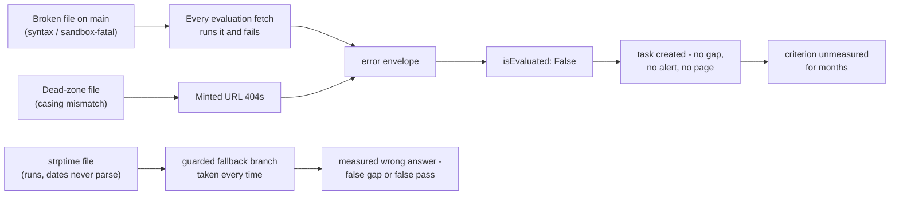

# Known issues

> Part of the [Transformations onboarding docs](README.md). Verified against `develop @ 8bf278fb` and production `main @ 9d0262aa` (2026-09-04). Status: draft for engineer review.
>
> Cross-service receipts: `TS:` = Token-Service production `main @ b60e209d`; `IS:` = Integration-Service production `main @ c8aa9a4b`. `main:` / `develop:` = this repo's branches.

**In one sentence:** This is the register of what is broken, unreachable, or booby-trapped in this repo today — 16 production files that cannot run (or cannot date-parse) under the sandbox they deploy into, a 102-file case-sensitivity dead zone, a develop branch staging more of both, and the corrections to the repo's own frozen docs — each with receipts, because every one of these failures is silent by design.

## At a glance

- **16 transform files on production `main` cannot run (or cannot date-parse) under the production sandbox** — 1 hard syntax error (live since 2026-02-06), 7 RestrictedPython compile failures, and 8 files whose only violation is a live `datetime.strptime` call (9 files call `strptime` in total; the 9th is already among the compile failures). Inventory below, re-verified by executing every main file through the exact Token-Service pipeline under RestrictedPython 8.5.
- **Every one of these failures is silent — in two different ways.** The syntax/sandbox failures and dead-zone 404s become the error envelope — `requirementSatisfied: False, isEvaluated: False`, a task, never a gap ([02-execution-contract.md](02-execution-contract.md)) — which is why a syntax error survived ~7 months on production. The strptime files never even error: every call site is guarded, so they return **measured wrong answers** — two can never pass, two can falsely *pass* (inventory below).
- **109 of 774 non-schema files (~14%) are unreachable by the minted default URL** — the [case-sensitivity dead zone](GLOSSARY.md#case-sensitivity-dead-zone): 55 files in the 10 UPPERCASE SRN dirs + 54 mixed-case filenames (the 2026-09-04 Lookout hotfix shipped its 7 transforms entirely inside the dead zone). On develop it grows to 225 of 871 (26%).
- **Whether any of this bites a live tenant is a DB question this repo cannot answer** — reachability lives in Integration-Service's definitions and criteria mappings, not in the tree.
- **Develop stages more breakage**: 3 new `mfa/azure` transforms that are sandbox-fatal on arrival, 5 stale pre-hotfix `beyondtrust-pra` copies, 6 stale pre-hotfix `mobile-security/lookout` copies (armed as add/add conflicts), 10 colocated pytest files, and the URL-breaking redcanary rename ([13-release-and-branches.md](13-release-and-branches.md)).
- **The repo's own docs need corrections**: `CLAUDE.md`'s flagship `_parse_input` pattern is sandbox-fatal if generalized, `CONTRIBUTING.md` understates the sandbox, and both have been frozen since 2026-02-06. Corrections table below.
- **The concrete fix that would catch most of this** — a `compile_restricted`-based pre-merge check — already exists in prototype: the verification scripts that produced this inventory are exactly that check.

How a broken file hides in production:

Walkthrough: the two fetch-and-fail classes — files that fail when run and files that are never fetched at all — funnel into the same `isEvaluated: False` outcome, which protects posture integrity but raises no alarm. Two classes *escape* the funnel and are **measured anyway**: the strptime files, whose guarded fallbacks return wrong answers (inventory below), and a wrong return shape, which can open a genuine gap (below).

## Broken on production main: the 16-file inventory

Re-verified 2026-09-04 (at `main @ 9d0262aa` — the 2 commits main gained since the last verification only added the 9 clean Lookout files; none of the 16 broken files changed) by running every one of main's 774 non-schema `.py` files through a verbatim replica of Token-Service's pipeline — the underscore rename, `_validate_transformation_code`, and a real `compile_restricted` under RestrictedPython 8.5 (`TS:src/utils/codeexecutor.py:537-541, :555-617, :723`). Whether each file is *referenced* by a live integration config is an Integration-DB question — but if referenced, classes (a) and (b) yield permanent `isEvaluated: False`.

### (a) Hard syntax error — 1 file

| File | Defect | Since |
|---|---|---|
| `main:safeguards/874a78ff-2ca3-4c0e-ab86-19277536ac87/areantiphishingpoliciesconfigured.py:101` | `def parse_api_error(...)` sits directly after a `try:` with no `except`/`finally` — `ast.parse` fails (re-verified) | 2026-02-06 (~7 months) |

The broken blob was authored in `7b8962e9` (2026-01-26), survived the conflict-resolution commit `3f55acd8` ("resolveconflicts"), and landed on main via the `29716136` staging-to-main merge — the mis-resolution precedent [13-release-and-branches.md](13-release-and-branches.md) warns about. **The fix already exists on develop** (`36052124`, LABS-3080) and was never promoted; this is the one file a develop→main merge would *fix*.

### (b) RestrictedPython compile failures — 7 files

| File | Killer | Receipt |
|---|---|---|
| `main:safeguards/mfa/pingfederate/ismfaenforced.py` | underscore name — calls `_walk_node` (`:73`), which is *also never defined in the file* | doubly broken |
| `main:safeguards/backups/commvault/isbackuptypesscheduled.py` | `nonlocal` (`:68`) — "Nonlocal statements are not allowed" | on main since 2026-03-09; ironically last touched by `0b7a3225` "Remove _ from method names for safwe python code execution", itself a sandbox-fix commit |
| `main:safeguards/backups/datto/backup_transform.py` | subscript `+=` — 9 sites (`:163-251`) | `safeguard_counters["Backup Enabled"] += 1` etc. |
| `main:safeguards/iam/keeper/isdormantaccountsdisabled.py` | subscript `+=` — 11 sites (`:77-143`) — **also calls `strptime`** (`:60`), the 9th caller | double-counted here, not in (c) |
| `main:safeguards/iam/keeper/ispasswordreusedetected.py` | subscript `+=` (`:112`) | |
| `main:safeguards/iam/keeper/ispasswordstrengthadequate.py` | subscript `+=` — 4 sites (`:139-145`) | |
| `main:safeguards/siem/netwrix/isincidentworkflowconfigured.py` | subscript `+=` (`:89`) | |

### (c) Live `datetime.strptime` callers — 8 files (strptime-only)

`strptime` fails in the sandbox with `ImportError: Import of '_strptime' is not allowed` — empirically reproduced; mechanism in [02-execution-contract.md](02-execution-contract.md). Every live call site sits inside a `try` whose handler chain ends in an in-transform catch-all (`except Exception` or a bare `except`), so **none of these eight files ever produces the error envelope — each returns a *measured* result with its date logic dead** (re-verified 2026-09-04 against every file's handler chain; receipts folded below). Date logic **silently always fails** and the code takes a fallback branch — a wrong answer that evaluation trusts. The sharpest four: two files guard the call with `ValueError`-family handlers that miss `ImportError` and fall to an outer always-False return, so those criteria **can never pass in production**; the two ninjio files count every unparseable campaign as active, so those criteria **pass whenever any campaign exists** — no date ever checked.

| File | Sites | Degrades to |
|---|---|---|
| `main:safeguards/assetmgmt/microsoft-intune/isdeviceinventorycurrent.py` (`:145`) | 1 | **measured always-False** — the inner `except (ValueError, TypeError)` (`:150`) misses `ImportError`; the transform-wide handler returns `{criteriaKey: False}` (`:205-211`). Can never pass |
| `main:safeguards/backups/crashplan/isbackuptested.py` (`:76`) | 1 | silent fallback — restores are never counted |
| `main:safeguards/compliancemanagement/knowbe4/phishingclickrate.py` (`:62, :65`) | 2 | silent fallback — "most recent campaign" selection is dead; falls back to the first completed campaign |
| `main:safeguards/compliancemanagement/knowbe4/phishingsimulationactive.py` (`:71`) | 1 | silent fallback — the 90-day staleness check is dead |
| `main:safeguards/epp/kaseya/vsa/ispatchmanagementenabled.py` (`:128`) | 1 | silent fallback — no device ever counts as patched |
| `main:safeguards/mfa/pingfederate/confirmedlicensepurchased.py` (`:60`) | 1 | **measured always-False** — `except ValueError` (`:61`) misses `ImportError`; `evaluate`'s handler returns False + error (`:72-73`). Can never pass |
| `main:safeguards/training/ninjio/isphishingsimulationenabled.py` (`:81, :87`) | 2 | **false-active fallback** — the per-campaign `except` counts every campaign as active (`:90-92`); **passes if any campaign exists** |
| `main:safeguards/training/ninjio/istrainingenabled.py` (`:82, :88`) | 2 | **false-active fallback** — same shape (`:91-93`) |

Exception-flow receipts: why none of the eight reaches the envelope

- The sandbox failure is `ImportError`, raised by `safe_import` (`TS:src/utils/codeexecutor.py:262`) — an ordinary `Exception` subclass. In all eight files it is caught before it can escape `transform()`, so Token-Service sees a successful execution and evaluates the returned dict as a normal result.
- `microsoft-intune/isdeviceinventorycurrent.py`: the site-level guard (`:150`) is `except (ValueError, TypeError)` — `ImportError` skips it and lands in the transform-wide `except Exception` (`:205-211`), which returns `{criteriaKey: False}` plus `transformation_errors`. Any device list with a sync timestamp yields a whole-transform False.
- `pingfederate/confirmedlicensepurchased.py`: the site-level guard (`:61`) is `except ValueError`; `evaluate()`'s `except Exception` (`:72-73`) returns `{"confirmedLicensePurchased": False, "error": ...}` — always False whenever the license carries an `expirationDate`.
- `ninjio/isphishingsimulationenabled.py` (`:90-92`) and `ninjio/istrainingenabled.py` (`:91-93`): the per-campaign handler reads "If parsing fails, be conservative and include as active" — under the sandbox that is *every* dated campaign (and undated ones count active by design), so `active_count > 0` whenever any campaign exists.
- The remaining four take skip-the-date-logic paths: crashplan's bare `except` means no restore is ever counted recent; kaseya's outer bare `except: pass` means no device ever counts as patched; knowbe4's clickrate `except Exception` falls back from "most recent" to the first completed campaign; knowbe4's simulation-active `except Exception: continue` leaves its 90-day staleness rule unreachable.

Five more files grep for `strptime` but only in comments/docstrings warning against it (the cisco-umbrella pair among them, which documents the `_strptime` mechanism at `main:safeguards/networksecurity/cisco-umbrella/iscontinuousdiscoveryenabled.py:96-97`).

> [!NOTE]
> **Two signature outliers (not broken, just non-standard).** 770 of main's 772 transform modules define exactly `def transform(input):`. The two deviations still execute — Token-Service passes one positional argument — but violate the uniform contract: `main:safeguards/emailsecurity/mimecast/isemailloggingenabled.py:71` (`def transform(input_data):`) and `main:safeguards/epp/crowdstrike/epp_transform.py:70` (`def transform(endpoints_response, debug=False):`). Don't imitate either ([03-writing-a-transform.md](03-writing-a-transform.md)).

## The case-sensitivity dead zone

> [!CAUTION]
> **109 of main's 774 non-schema files (~14%) can never be fetched by the default minted URL**, because Integration-Service lowercases both path segments (`IS:src/models/integrator.py:2601`) while raw GitHub paths are case-sensitive (live-verified 2026-09-04: exact-case 200, as-minted 404). The population: **55 files** in the 10 UPPERCASE SRN dirs + **54 mixed-case filenames** (all 16 `encryption/microsoft/`, 14 `networksecurity/dnsfilter/`, 8 `identity-and-access-management/beyondtrust/`, **7 `mobile-security/lookout/` — the entire PR #548 hotfix merged as main HEAD** — 3 `epp/halcyon/`, 3 `iam/duo/`, 2 `epp/ninjaone-endpoint-management/` (both files of the PR #544 hotfix), and 1 `firewall/cato-networks/`). These run only via exact-case DB URLs, or not at all — silently, as `isEvaluated: False`. Renaming a file or directory's case, or adding a camelCase filename for a minted-default vendor, is a production incident that looks like nothing. On develop the dead zone grows to 225 of 871 (26%): 110 of the 128 newest transform modules are mixed-case.

Mechanics and the live curl table: [02-execution-contract.md](02-execution-contract.md#the-case-sensitivity-dead-zone). Per-directory census: [04-catalog.md](04-catalog.md). **Open question (stated, not settled):** whether every live method of every dead-zone file has an exact-case DB URL — or whether some minted-default fetches have been quietly 404ing — requires the Integration DB or Token-Service fetch logs.

## The other bug class that bypasses the safety net

> [!CAUTION]
> **A wrong criteria key in the returned dict is a *measured* failure, not an unevaluated one.** The compile-failure and dead-zone classes degrade to `isEvaluated: False`; a misspelled or re-cased in-dict key — like the strptime fallbacks above — does not: it falls through extraction ("transformedResponse exists but key not found") and the comparison proceeds against the wrong shape (`TS:src/utils/evaluate/evaluate.py:2339-2360`) — which can open a **genuine gap** on a customer's passport. Return shape is never validated at execution time. Copy the criteria key from the integration definition character-for-character ([03-writing-a-transform.md](03-writing-a-transform.md)).

## Staged on develop: broken or breaking on arrival

Everything here ships to production the moment develop is promoted ([13-release-and-branches.md](13-release-and-branches.md) has the full merge simulation).

| Issue | Detail | Receipt |
|---|---|---|
| **3 sandbox-fatal new transforms** | `develop:safeguards/mfa/azure/{areadminaccountsseparate,isadminmfaphishingresistant,ismfaenforced}.py` define top-level underscore helpers (`def _as_list` at `ismfaenforced.py:69`, `areadminaccountsseparate.py:102`, `isadminmfaphishingresistant.py:117`) — the exact pattern three fix cycles (ENG-463, BeyondTrust PRA, develop's own PR #480) already removed. They would deploy as permanent `isEvaluated: False`. Main's tree has **zero** top-level `_`-prefixed defs | re-verified empirically under RestrictedPython 8.5 |
| **8 armed add/add conflicts** | `epp/ninjaone-endpoint-management/{isBitLockerRecoveryKeyEscrowed,isEncryptionEnabled}.py` — develop's copies are broken against the real NinjaOne API; main's PR #544 rewrite is production-correct — plus the 6 stale lookout copies below. **Resolving toward develop (or `-X theirs`, or reset/force-push) re-breaks production** | `main:...isBitLockerRecoveryKeyEscrowed.py:72-75`; `develop:...isEncryptionEnabled.py:99,104-105` |
| **6 stale lookout copies** | develop's `mobile-security/lookout/*` predate main's fleet-count hotfix `382dc385` (PR #548, 2026-09-04): they report the API page length as the fleet size (`develop:safeguards/mobile-security/lookout/isDeviceEncrypted.py:158` emits `"totalDevicesInPage"`; main's copy reads `data.get("count")`, `main:...isDeviceEncrypted.py:123-124`). Files absent at the merge-base → add/add conflicts on promotion, and any develop-based lookout edit starts from the wrong counting logic | [13-release-and-branches.md](13-release-and-branches.md) |
| **5 stale beyondtrust-pra copies** | develop's `iam/beyondtrust-pra/*` still carry the underscore helpers main removed in `b2e6e623` (2026-09-02). A clean merge keeps main's fix (develop's copies equal the merge-base) — but any develop-based *edit* starts from sandbox-fatal code | [13-release-and-branches.md](13-release-and-branches.md) |
| **The redcanary rename retires 9 production paths** | `cloudsecurity/redcanary/` → `mdr/red-canary/` — on merge, every DB-stored URL into the old path 404s silently. Coordinate with DB-side URL updates or keep the old paths | [04-catalog.md](04-catalog.md) |
| **qualys reasons divergence** | `develop:safeguards/asm/qualys/knownexploitedvulncount.py:71` still emits "check failed" for the perfect score of 0 (main fixed it in `93a929fd`) — pollutes reasons/recommendations, not provably the verdict; auto-resolves to main's version on a clean merge | [13-release-and-branches.md](13-release-and-branches.md) |
| **10 colocated pytest files** | 9 `test_*.py` + 1 `conftest.py` inside fetchable `safeguards/` paths; all 10 fail the sandbox's AST validation if ever fetched, and no CI ever runs them | [12-local-development.md](12-local-development.md) |
| **A production data snapshot in the tree** | `develop:customer_requirements_ef1397e7.json` (root) — a production passport requirements snapshot, orphaned and self-inconsistent (identified by location only); would land on the world-readable main on promotion | [04-catalog.md](04-catalog.md) |
| **A plural twin category** | develop's `firewalls/cisco-meraki-mx/` sits next to main's singular `firewall/` — two spellings of one category, both load-bearing | [04-catalog.md](04-catalog.md) |

## Platform-side issues that shape this repo's risk

Owned and receipted in [02-execution-contract.md](02-execution-contract.md); registered here because each changes what "broken" means for this repo.

| Issue | Consequence | Receipt |
|---|---|---|
| **No execution timeout or memory limit** | an infinite loop or unbounded allocation in a transform holds a production evaluation worker hostage — only code review prevents it | `TS:src/utils/codeexecutor.py:798` |
| **Stale-cache fallback runs deleted code** | on any fetch error the *expired* cached copy executes anyway — deleting or renaming a file on main does not reliably stop it running in long-lived workers until process restart | `TS:src/utils/codeexecutor.py:321-331` |
| **The in-process code cache never evicts** (production TS) | duplicate-definition shadowing makes the 200-entry cap dead code; slow per-worker leak, and any "200 entries max" claim is false in effect | `TS:src/utils/codeexecutor.py:30-185` |
| **The allowlist pins the repo, not the ref** | any branch or SHA of this public repo validates — anyone who can push a branch, or change a definition's `transformationLogic` URL, can point production at different code. Reads = the world; writes = repo write access + Integration-definition contents | `TS:src/utils/transformation_url.py:16-19` |
| **The repo is public, and production depends on it** | the fetch is anonymous (`TS:src/utils/codeexecutor.py:308-309`; live curl 200); making the repo private without adding auth breaks every evaluation. Treat visibility as production infrastructure | [02-execution-contract.md](02-execution-contract.md) |
| **A second, unsandboxed execution path exists** | Integration-Service's event-triggered `PyCodeExecutor` fetches any `http*` URL with no allowlist and a tautological "unsafe AST" check; dormant (no known publisher) but reachable via `SQS_INTEGRATION_SERVICE_QUEUE_URL` | `IS:src/handlers/integration_handlers.py:229-233`, `IS:src/utils/integrations/codeexecutor.py:23-97` |
| **Commit-pinned URLs never pick up fixes** | onboarding-emitted SHA URLs are frozen at that blob forever — a criterion pinned to a pre-hotfix SHA stays broken regardless of main | `TS:src/utils/transformation_url.py:9` |
| **HTML short-circuit envelope asymmetry** | the "Cannot transform HTML response" envelope lacks `original_response`, so it is not classified as a transformation failure | `TS:src/utils/evaluate/evaluate.py:2638-2642` |
| **Merge = ungated deploy; rollback rides the same windows** | no CI on any branch, branch protection **disabled** (queried live 2026-09-04), 0-review self-merges the norm; a revert is itself a production deploy behind the same ≤300 s CDN + ≤3600 s per-worker cache | [13-release-and-branches.md](13-release-and-branches.md) |

## Corrections to the repo's own docs

`README.md`, `CLAUDE.md`, and `CONTRIBUTING.md` are byte-identical on both branches and frozen since `3f55acd8` (2026-02-06). The audited corrections, priority-ordered — this table is also the running register for future corrections (see [README.md](README.md), "Proposing corrections"):

| Priority | Doc:line | What it says | What is true |
|---|---|---|---|
| P0 | `main:CLAUDE.md:36-46` | `def _parse_input(input):` presented as "the common input parsing pattern" | Zero files define `_parse_input`; the name only compiles because Token-Service grandfathers exactly `_parse_input`/`_listify` (`TS:src/utils/codeexecutor.py:537-541`). Any *other* underscore helper is sandbox-fatal — generalizing this doc's pattern broke shipped files twice (ENG-463, BeyondTrust PRA) |
| P0 | `main:CLAUDE.md:33` | error dict `{"criteriaKey": False, "error": str(e)}` as the contract | that is the frozen legacy generation (269 files); the standard is the enriched envelope (`main:CONTRIBUTING.md:141-187`); [03-writing-a-transform.md](03-writing-a-transform.md) |
| P0 | `main:CONTRIBUTING.md:318-361` | four sandbox prohibitions | all four are true, but at least five more fatal restrictions are missing (underscore names, `nonlocal`, `filter()`, the `getattr`/`eval`/`open` call family, dunder access) — two of the missing ones have already broken shipped files |
| P1 | `main:CONTRIBUTING.md:334` | imports banned "except json, datetime" | the effective allowlist is 8 modules: `json, ast, re, datetime, math, collections, itertools, functools` ([02-execution-contract.md](02-execution-contract.md)) |
| P1 | `main:CONTRIBUTING.md:413-414` | stdin mode `... local_tester.py transform.py -` | no stdin support exists; `-` fails with `[Errno 2]` (`main:local_tester.py:60-63`); [12-local-development.md](12-local-development.md) |
| P1 | `main:README.md:91` + `main:safeguards/registry.json` | "the full registry" | 19 entries vs 22 SRN dirs and 27 category trees; nothing machine-reads it; stale since 2026-02-06 ([04-catalog.md](04-catalog.md)) |
| P2 | `main:README.md:13-26` | SRN-only directory layout | the category/vendor layout is now the majority (610 of 772 transforms) |
| P2 | `main:README.md:115` | — | the file ends mid-code-fence (the fence opened at `:113` is never closed); cosmetic but real |

> [!CAUTION]
> **When `CLAUDE.md` and `CONTRIBUTING.md` disagree, CONTRIBUTING.md wins** — but audit both against the verified sandbox table in [03-writing-a-transform.md](03-writing-a-transform.md) before trusting either. An AI assistant following `CLAUDE.md` verbatim ships code that deploys instantly (merge = deploy) and then cannot compile at evaluation time.

## The recommendation: a pre-merge sandbox scan

The single highest-leverage fix for this register: **replicate Token-Service's pipeline — the underscore rename, the Layer-1 AST validation, and a real `compile_restricted` — over every non-schema `.py` in a pre-merge check.** The approach is proven: the verification scripts behind this doc set ran exactly that scan over both branches (re-run 2026-09-04: main 9 of 774 non-schema files fail — the 8 broken transforms above plus never-fetched `common/__init__.py`; develop: 21 of 871) and every finding reproduced against the live Token-Service source. It would have caught the Anthropic, BeyondTrust PRA, commvault, and mfa/azure breakages before they shipped — everything except the `strptime` class (runtime-only) and wrong-shape bugs. `local_tester.py` cannot do this ([12-local-development.md](12-local-development.md)); no CI exists to run it yet ([13-release-and-branches.md](13-release-and-branches.md)).

A casing lint belongs in the same check: flag any new mixed-case filename or uppercase directory as born-unreachable-by-default ([04-catalog.md](04-catalog.md)).

## Where the code lives

| What | Where |
|---|---|
| The 16 broken files | paths in the inventory above, all `main:safeguards/**` |
| The sandbox that rejects them | `TS:src/utils/codeexecutor.py:537-541, :555-617, :723-800` — [02-execution-contract.md](02-execution-contract.md) |
| The minted URL that misses the dead zone | `IS:src/models/integrator.py:2601` — [02-execution-contract.md](02-execution-contract.md) |
| The develop-staged issues | `develop:safeguards/mfa/azure/`, `develop:safeguards/iam/beyondtrust-pra/`, `develop:safeguards/epp/ninjaone-endpoint-management/`, `develop:safeguards/mdr/red-canary/` — [13-release-and-branches.md](13-release-and-branches.md) |
| The frozen in-repo docs | `main:README.md`, `main:CLAUDE.md`, `main:CONTRIBUTING.md` (all last touched `3f55acd8`, 2026-02-06) |
| The wrong-shape bypass | `TS:src/utils/evaluate/evaluate.py:2339-2360` — [02-execution-contract.md](02-execution-contract.md) |

Pinned versions for every receipt above: Transformations `main @ 9d0262aa` / `develop @ 8bf278fb`; Token-Service `main @ b60e209d`; Integration-Service `main @ c8aa9a4b`. Verification methodology is in [README.md](README.md).
