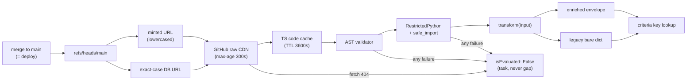

# Glossary

> Part of the [Transformations onboarding docs](README.md). Verified against `develop @ 5c5ccde5` and production `main @ c1d935da` (2026-09-03). Status: draft for engineer review.

**In one sentence:** The terms you will hear in week one on the Transformations repo, each defined in a sentence or two against the actual code, with a pointer to the doc that owns the full story.

## At a glance

- **Every entry is code-verified** — definitions come from the pinned trees (`main @ c1d935da`, `develop @ 5c5ccde5`) and the Token-Service / Integration-Service sources, not from the repo's own README.
- **`main` is production** — Token-Service fetches transform files from `refs/heads/main` at evaluation time, so half these terms are really deployment terms ([Merge = deploy](#merge-equals-deploy), [Propagation window](#propagation-window)).
- **Two addressing schemes** — [SRN dirs](#srn-dir) are what the lowercased [minted URL](#minted-url) targets (it misses the 10 uppercase ones — see [dead zone](#case-sensitivity-dead-zone)); [category dirs](#category-dir) are reachable only by an [exact-case DB URL](#exact-case-db-url).
- **Two return generations coexist** — the [enriched envelope](#enriched-envelope) (496 of 765 main transforms) and the frozen [legacy bare dict](#legacy-bare-dict-return) (the other 269).
- **The sandbox is layered** — the [AST validator](#ast-validator) first, then [RestrictedPython](#restrictedpython) with the [safe_import allowlist](#safe_import-allowlist); [local_tester](#local_tester) replicates neither layer.
- **Failure is silent by design** — everything from a 404 to a syntax error collapses into [isEvaluated: False](#isevaluated-false): a task, never a gap.
- **Each entry names its owning doc** — follow the *Owning doc* link for mechanisms, receipts, and edge cases.

How the terms fit together on the production hot path:



Walkthrough: a merge to `main` is the deploy; Integration-Service mints a lowercased default URL (or a definition supplies an exact-case one); Token-Service fetches through two cache layers, gates the code through its AST validator, executes it under RestrictedPython, and looks the criteria key up in whichever return shape the transform uses. Every failure along the way lands in the same `isEvaluated: False` bucket.

> [!IMPORTANT]
> The casing rule that trips everyone: the **filename** is the lowercased criteria key (forced by the minted URL's `str(key).lower()`), while the **key inside the returned dict** stays camelCase (Token-Service's lookup is exact and case-sensitive). Get the first wrong → 404 → `isEvaluated: False`; get the second wrong → a *measured* comparison against the wrong value.

---

## AST validator

Token-Service's pre-compilation gate (`_validate_transformation_code`): it parses the fetched file and rejects the whole thing on any disallowed import, any dangerous call by bare *or method* name (`eval`, `compile` — so `re.compile(...)` is banned; use `re.match`/`re.search`), any dunder attribute access, or a syntax error (token-service docs2; `src/utils/codeexecutor.py:555-617`). It runs before [RestrictedPython](#restrictedpython), and a reject becomes the error envelope and [isEvaluated: False](#isevaluated-false).

*Owning doc: [02-execution-contract.md](02-execution-contract.md).*

## Back-merge

Porting `main`'s hotfixes back into `develop` so the staging ground does not regress production fixes at the next promotion. It has effectively stopped: since the 2026-04-22 merge-base, `main` carries 81 commits `develop` lacks and 66 files on `main` hold changes `develop` is missing (`git rev-list --count origin/develop..origin/main` = 81, verified 2026-09-03) — the twin-PR habit dual-lands *some* fixes, but nobody owns the rest.

*Owning doc: [13-release-and-branches.md](13-release-and-branches.md).*

## Case-sensitivity dead zone

The 102 of 767 non-schema files on `main` (~13%) that the [minted URL](#minted-url) can never fetch, because minting lowercases both path segments while `raw.githubusercontent.com` paths are case-sensitive (curl-verified 2026-09-03: exact-case 200, lowercased 404). It comprises the 55 files inside the 10 uppercase [SRN dirs](#srn-dir) plus 47 mixed-case filenames (e.g. `main:safeguards/encryption/microsoft/isAzureADAuthEnabled.py`) — these run only via an [exact-case DB URL](#exact-case-db-url), or not at all, silently.

<details><summary><b>Receipt:</b> live curl results</summary>

| URL path (`safeguards/…`) | HTTP |
|---|---|
| `E454A862-2B86-43FF-8072-DB865E354E17/ismfaenforcedforusers.py` (exact case) | 200 |
| `e454a862-2b86-43ff-8072-db865e354e17/ismfaenforcedforusers.py` (as minted) | **404** |
| `encryption/microsoft/isAzureADAuthEnabled.py` (exact case) | 200 |
| `encryption/microsoft/isazureadauthenabled.py` (as minting would produce) | **404** |

Counts re-derived from `git ls-tree -r origin/main` (never `ls` — see Gotchas): 47 mixed-case non-schema transform basenames, 55 non-schema files under the 10 uppercase UUID dirs.
</details>

*Owning docs: [04-catalog.md](04-catalog.md), [14-known-issues.md](14-known-issues.md).*

## Category dir

One of the 27 category directories at `safeguards/`'s top level — every non-UUID dir except `common/` (`epp/`, `iam/`, `emailsecurity/`, …) — each holding vendor subdirectories (98 on `main`) and never a top-level `.py` file. Category paths have three or four segments, so the two-segment [minted URL](#minted-url) never targets them — they are reachable exclusively through [exact-case DB URLs](#exact-case-db-url).

*Owning doc: [04-catalog.md](04-catalog.md).*

## Copy-paste by design

The repo's shared-code model: helpers are pasted into every transform because production fetches each file standalone and the sandbox rejects cross-file imports — `main:CONTRIBUTING.md:201`: "Copy these helper functions into your transformation file (required for RestrictedPython compatibility)". The result on `main` is 489 copies of `extract_input` (25 drifted variants) and 489 of `create_response` (397 variants); fixing the master copy in `safeguards/common/response_helper.py` deploys nothing.

*Owning doc: [03-writing-a-transform.md](03-writing-a-transform.md).*

## Criteria key

The camelCase key a transform returns (e.g. `isMFAEnforcedForUsers`) and Token-Service compares against the requirement — the lookup is exact and case-sensitive (`key in transformed_response`, token-service docs2; `src/utils/evaluate/evaluate.py:2340-2343`). The *filename* is the lowercased key while the *in-dict key* stays camelCase: opposite casing rules, both mandatory (see the callout above).

*Owning doc: [03-writing-a-transform.md](03-writing-a-transform.md).*

## Enriched envelope

The current return contract: `{"transformedResponse": {criteriaKey: value, …}, "additionalInfo": {…}}` — used by 496 of 765 `main` transforms (65%), 100% of SRN-dir files, and all new work (spec at `main:CONTRIBUTING.md:141-187`). Its input-side counterpart is the enriched input `{"data": <api response>, "validation": <schema result>}`, which Token-Service supplies when it detects a new-format transform.

*Owning doc: [03-writing-a-transform.md](03-writing-a-transform.md).*

## Exact-case DB URL

A `transformationLogic` URL stored in an integration definition's `retrievalTransformationArray` / criteria-mapping row, which Integration-Service uses **verbatim** instead of the minted default (Integration-Service docs2; `src/models/integrator.py:2623-2637`). It is the only route to anything in the [dead zone](#case-sensitivity-dead-zone), and it works iff the stored URL matches the committed casing byte-for-byte.

*Owning docs: [02-execution-contract.md](02-execution-contract.md), [04-catalog.md](04-catalog.md).*

## generate_schemas and schemas

`main:generate_schemas.py` scaffolds optional Pydantic input schemas at `schemas/{same filename}.py`; at evaluation time Token-Service fetches the sibling from `{base}/schemas/{filename}` and validates the vendor response *outside* the sandbox — schemas may import `pydantic`, and a missing schema is non-fatal ("No schema found (optional)", token-service docs2; `src/utils/evaluate/evaluate.py:2678-2681`). Most deployed schemas are permissive stubs: 431 of 442 set `extra = "allow"`, and 110 still carry the literal text "No API response sample available".

*Owning doc: [12-local-development.md](12-local-development.md).*

## Grandfathered names

`_parse_input` and `_listify` — the only underscore-prefixed helper names that survive the sandbox, because Token-Service regex-renames exactly those two (to `parse_input`/`listify`) before compiling (token-service docs2; `src/utils/codeexecutor.py:537-541`). Any *other* `_helper` fails RestrictedPython compilation, so the `_parse_input` pattern documented at `main:CLAUDE.md:38` must never be generalized — three separate underscore-removal fixes sit on `main` because it was (`0b7a3225`, ENG-463 `a51b8a1f`, BeyondTrust-PRA `b2e6e623`).

*Owning doc: [03-writing-a-transform.md](03-writing-a-transform.md).*

## isEvaluated: False

The universal outcome of a transformation failure: 404, refused URL, validation reject, compile error, and raised exception all collapse into `{"error": True, "message": …, "original_response": …}`, which Token-Service converts to `requirementSatisfied: False, isEvaluated: False` — a **task, never a gap**, with existing gaps kept (token-service docs2, evaluate-engine §71 / LABS-3165). Correct for posture integrity, but it makes broken transforms silent: one production file was a syntax error for ~7 months.

<details><summary><b>Receipt:</b> what counts as the failure envelope</summary>

`_transformation_failure_message` matches only the exact envelope — `error is True` **and** `original_response` present — so a vendor body carrying its own `error` flag is never misread (token-service docs2; `src/utils/evaluate/evaluate.py:2556-2578`). The one asymmetry: the HTML short-circuit envelope omits `original_response` and is classified differently. A wrong *return shape* (missing criteria key) bypasses this net entirely and becomes a measured comparison — see [14-known-issues.md](14-known-issues.md).
</details>

*Owning docs: [02-execution-contract.md](02-execution-contract.md), [14-known-issues.md](14-known-issues.md).*

## Legacy bare-dict return

The older return shape: a flat dict `{criteriaKey: value}` with error form `{criteriaKey: False, "error": str(e)}` (documented at `main:CLAUDE.md:31-33`) — still live in 269 of 765 `main` transforms, all in category dirs, and frozen: develop's growth adds zero new ones. Token-Service wraps these into the envelope shape at runtime (`_wrap_legacy_result`), so both generations evaluate correctly today.

*Owning doc: [03-writing-a-transform.md](03-writing-a-transform.md).*

## local_tester

The root CLI (`python local_tester.py <transformation_file_or_url.py> <response.json>`) that replicates Token-Service's parse → schema → format-detection → execute pipeline — but loads the module with plain `importlib` (`main:local_tester.py:49-57`): full CPython, no [AST validator](#ast-validator), no [RestrictedPython](#restrictedpython). A transform can pass local_tester and fail compilation in production; the Anthropic (ENG-463) and BeyondTrust PRA hotfixes are the receipts.

*Owning doc: [12-local-development.md](12-local-development.md).*

## Merge equals deploy

The repo's defining property: a merge — or a direct push; branch protection on `main` is disabled — is an ungated, instant production deploy, because Token-Service fetches `refs/heads/main` per evaluation and no CI exists on any branch (`git ls-tree` at both tips: no `.github/` at all). There is no build, no canary, and no rollback other than another merge riding the same [propagation window](#propagation-window).

<details><summary><b>Receipt:</b> nothing gates the merge</summary>

`gh api repos/spektrum-labs/Transformations/branches/main` → `{"protected": false, "protection": {"enabled": false, …}}` (queried 2026-09-03). Sampled PRs to `main` (#544, #533, #529) all show `reviews: 0` with author == mergedBy, and two non-merge commits sit directly on main's first-parent line (`43fdf34a`, `faccedc7`, 2026-08-20).
</details>

*Owning doc: [13-release-and-branches.md](13-release-and-branches.md).*

## Minted URL

The default transformation URL Integration-Service constructs for every runnable method — branch-pinned to `main`, exactly two path segments, **both lowercased**. Definition-supplied URLs override it verbatim (see [exact-case DB URL](#exact-case-db-url)); when nothing overrides, this is the mutable pointer production follows.

<details><summary><b>Receipt:</b> the minting line, verbatim</summary>

```python
"url": "https://raw.githubusercontent.com/spektrum-labs/Transformations/refs/heads/main/safeguards/" + str(self.SRN).lower() + "/" + str(key).lower() + ".py",
```
(Integration-Service docs2; `src/models/integrator.py:2601` on IS main)
</details>

*Owning doc: [02-execution-contract.md](02-execution-contract.md).*

## Propagation window

The delay between a merge to `main` and every worker executing the new code: up to 300 s of GitHub raw CDN cache (`cache-control: max-age=300`, verified live) plus up to 3600 s of Token-Service's per-process in-memory code cache (TTL at token-service docs2; `src/utils/codeexecutor.py:54`). Rollback rides the same window — and on fetch errors a *stale* cached copy is served indefinitely, so a deleted file can keep executing in long-lived workers.

*Owning docs: [13-release-and-branches.md](13-release-and-branches.md), [02-execution-contract.md](02-execution-contract.md).*

## registry.json

`main:safeguards/registry.json` — a human-maintained SRN → `{vendor, category}` index (e.g. `"A6B871E6-…": {"vendor": "Qualys, Inc.", "category": "Attack Surface Management"}`, `main:safeguards/registry.json:2-5`) covering 19 of the 22 [SRN dirs](#srn-dir). Nothing programmatic reads it — grep over this repo and both consuming services' `src/` finds no consumer — so it and the README tables it mirrors can silently rot.

*Owning doc: [04-catalog.md](04-catalog.md).*

## RestrictedPython

The sandbox library (`RestrictedPython>=8.0,<9.0` in Token-Service) under which every transform is compiled (`compile_restricted`) and executed with curated builtins: no `map`/`filter`/`getattr`/`open`/`eval`, no underscore-prefixed names (bare `_` and the [grandfathered pair](#grandfathered-names) excepted), no `d["k"] += 1`, no `class` definitions, no `str.format`, no `datetime.strptime` — all empirically reproduced under RestrictedPython 8.5 with the exact Token-Service namespace. There is no time or memory limit, though: an infinite loop hangs the evaluation worker.

*Owning doc: [02-execution-contract.md](02-execution-contract.md).*

## safe_import allowlist

The `__import__` replacement wired into the sandbox namespace, allowing only `json, ast, typing, copy, datetime, re, math, itertools, functools, collections` (token-service docs2; `src/utils/codeexecutor.py:241-264`). The [AST validator](#ast-validator) rejects `typing` and `copy` first, so the *effective* allowlist is 8 modules — which are also pre-injected as globals, usable without importing.

*Owning doc: [02-execution-contract.md](02-execution-contract.md).*

## SRN dir

A top-level directory under `safeguards/` named by an integration's Safeguard Reference Number — a UUID, `Integration.SRN` in Integration-Service's DB — and the target of the [minted URL](#minted-url) (`safeguards/{srn}/{method}.py`). `main` has 22; 10 are committed in uppercase and therefore sit in the [dead zone](#case-sensitivity-dead-zone).

*Owning doc: [04-catalog.md](04-catalog.md).*

## Transform

The function contract of this repo: each module is one standalone file defining `def transform(input):` — 763 of 765 `main` modules match that exact signature — that takes the vendor API response (JSON string, bytes, or dict) and returns a dict of criteria values. No cross-file imports, no entrypoint, no side effects: the file itself is the deployable unit.

*Owning docs: [01-transformations-overview.md](01-transformations-overview.md), [03-writing-a-transform.md](03-writing-a-transform.md).*

## Vendor pipeline

The automated onboarding flow that generates new vendor transforms as timestamped PRs from branches named `feat/transformations-<vendor>-<YYYYMMDD-HHMMSS>`, self-merged into **develop** with zero reviews (29 such merges since 2026-04, 382 per-file `add:` commits; merge-then-revert churn is routine — SentinelOne was added and reverted six times in one week). None of it reaches production through the minted URLs until develop is promoted to `main` — frozen since 2026-04-22 — but 16 Integration-Service reference configs pin `refs/heads/develop` verbatim (Integration-Service docs2, `integration_configs/**`), so four staged vendor dirs (`epp/crowdstrike-falcon`, `mdr/red-canary`, `iam/okta`, `firewalls/cisco-meraki-mx`) are plausibly live already.

*Owning doc: [13-release-and-branches.md](13-release-and-branches.md).*

---

## Gotchas

> [!WARNING]
> "Tested with local_tester.py" says nothing about the sandbox. local_tester runs full CPython (`main:local_tester.py:49-57`); a file using `map()`, `strptime()`, and dict-item `+=` — three documented bans — ran to green success through it on 2026-09-03. The class of bug that most often breaks production is exactly the class it cannot see.

> [!WARNING]
> Your macOS checkout hides the [dead zone](#case-sensitivity-dead-zone). The filesystem is case-insensitive, so `ls` shows one casing while production 404s on another — and case-twin files (mimecast's `isDNSConfigured.py` / `isdnsconfigured.py`, both present at the 2026-04-22 merge-base) cannot even be checked out correctly. Check casing with `git ls-tree`, never `ls`.

> [!CAUTION]
> The repo is **public**, and that is load-bearing: Token-Service fetches with no Authorization header (token-service docs2; `src/utils/codeexecutor.py:308-309`), so the entire production compliance-evaluation logic is world-readable — and making the repo private would break every evaluation at the next cache miss.

> [!CAUTION]
> "Develop" and "staging ground" do not mean pre-production — in either direction. No minted URL ever reaches `develop`, but 16 Integration-Service reference configs pin `refs/heads/develop` verbatim, so a develop push is plausibly an instant production deploy for those vendors; and develop is *not* a superset of `main` — 66 files on `main` carry fixes `develop` lacks. For any behavioral claim about production, read `origin/main`; diffing your change against `develop` tells you nothing about what customers experience.

## Where the code lives

| What | Where |
|---|---|
| Transform modules (SRN scheme) | `main:safeguards/{srn}/{key}.py` — 22 SRN dirs, 162 modules |
| Transform modules (category scheme) | `main:safeguards/{category}/{vendor}/{key}.py` — 27 categories, 98 vendors, 603 modules |
| Helper master copy (paste source, never imported) | `main:safeguards/common/response_helper.py` |
| SRN → vendor index (no programmatic consumer) | `main:safeguards/registry.json` |
| Schema sidecars | `main:safeguards/**/schemas/{same filename}.py` — 68 dirs |
| Local runner (unsandboxed) | `main:local_tester.py` |
| Schema scaffolder | `main:generate_schemas.py` |
| Contract docs (two generations, both "current") | `main:CONTRIBUTING.md` (enriched), `main:CLAUDE.md` (legacy) |
| URL minting | Integration-Service `src/models/integrator.py:2601` — see Integration-Service docs2 |
| Fetch allowlist, AST validator, sandbox, cache | Token-Service `src/utils/transformation_url.py`, `src/utils/codeexecutor.py` — see token-service docs2 |
| Key lookup and failure classification | Token-Service `src/utils/evaluate/evaluate.py:2337-2360, 2556-2721` — see token-service docs2 |
