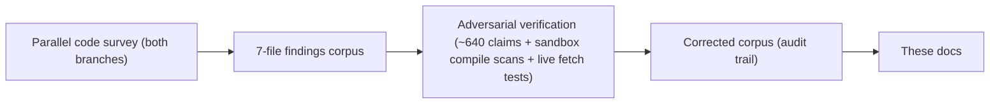

# Transformations — engineer onboarding docs

> Start here. Verified against `develop @ 5c5ccde5` and production `main @ c1d935da` (2026-09-03). Status: draft for engineer review.

**In one sentence:** This is the code-verified onboarding set for the Transformations repo — 765 per-vendor Python transform modules in production (843 on develop) that Token-Service fetches from GitHub raw and executes in a RestrictedPython sandbox during every evaluation, which makes a merge to `main` an instant, ungated production deploy — with a reading path for day one, your first transform, and everything after.

## What this is, and why you can trust it

- **What this repo is** — per-safeguard Python files that convert raw vendor API responses into values Token-Service can evaluate. There is no build, no pipeline, no artifact: the files on `main` *are* the deployment (see [01-transformations-overview.md](01-transformations-overview.md)).
- **Who runs the code** — Integration-Service mints raw-GitHub URLs pinned to `refs/heads/main`; Token-Service downloads and executes them per evaluation, behind at most ~300s of GitHub CDN plus a 3600s per-worker code cache (receipts in [02-execution-contract.md](02-execution-contract.md), cross-verified against the Token-Service and Integration-Service docs2 corpora).
- **The repo is public** — anonymous fetch of transform files was verified live; anyone on the internet can read every transform that guards production evaluations.
- **No CI gates code** — no test, lint, or sandbox check runs on any branch; the only workflows are the docs-drift/docs-sync actions shipped with this doc set. The docs and `local_tester.py` are the only pre-merge defenses ([12-local-development.md](12-local-development.md)).
- **What this set supersedes** — the root `README.md`, `CLAUDE.md`, and `CONTRIBUTING.md`, frozen since 2026-02-06 while 505+81 commits landed. The audit found `CLAUDE.md`'s flagship `_parse_input` pattern is sandbox-fatal in production, and `CONTRIBUTING.md`'s four sandbox prohibitions are all true but at least five more fatal restrictions are missing — two of them (underscore-prefixed names, `nonlocal`) have already broken shipped files. The corrections record is [14-known-issues.md](14-known-issues.md).
- **What could not be verified** — the deployed CPython minor version, and which broken files live tenant configs actually reach (an Integration-DB question): where verification wasn't possible from the code, the doc says so rather than guessing. (Branch protection on `main` — a server-side setting — *was* verified, live via the GitHub API: disabled; see [13-release-and-branches.md](13-release-and-branches.md).)

> [!IMPORTANT]
> **This repo's branch semantics are inverted relative to the sibling repos.** `main` IS production at fetch time — a merge to `main` deploys itself: typically live within seconds, worst case ≤300s of GitHub CDN plus ≤3600s of Token-Service's per-worker code cache, and rollback is another merge riding the same windows. `develop` is the staging ground: 505 commits ahead and invisible to production (a minted URL for develop-only code 404s), while `main` carries 81 hotfix commits never back-merged.
>
> These docs are therefore pinned twice: the machine-readable pin `develop @ 5c5ccde5` (the drift checker reads exactly that phrase from this file) plus production `main @ c1d935da`, and behavioral claims about production cite `main:` paths. Full story: [13-release-and-branches.md](13-release-and-branches.md).

## How these docs were built

Three passes, the second deliberately adversarial to the first:

1. **Survey** — a parallel code survey of both branches produced a 7-file findings corpus (repo anatomy, catalog, execution contract, tooling, quality patterns, branch skew, old-docs audit).
2. **Verification** — a separate pass re-opened roughly **640 individual claims** at their cited file and line, and went beyond reading: it rebuilt the production sandbox verbatim from Token-Service's `codeexecutor.py` (RestrictedPython 8.5) and ran every non-schema `.py` on both branches through `compile_restricted` (main: 9 of 767 fail; develop: 21 of 855), simulated the develop→main promotion merge, and confirmed public visibility by anonymous raw-GitHub fetch. Corrections were recorded per file.
3. **Writing** — these docs were written *from the corrected corpus only*; the corpus is retained outside the repo as the audit trail.

## Suggested reading paths

| Path | When | Read, in order |
|---|---|---|
| **Day 1** | Before your first ticket | This page → [00-platform-overview.md](00-platform-overview.md) → [01-transformations-overview.md](01-transformations-overview.md) → [02-execution-contract.md](02-execution-contract.md) |
| **Contributing** | Before writing or editing a transform | [03-writing-a-transform.md](03-writing-a-transform.md) → [12-local-development.md](12-local-development.md) |
| **Reference** | When the work touches them | [04-catalog.md](04-catalog.md), [GLOSSARY.md](GLOSSARY.md) |
| **Operations** | Before merging *anything* to `main` | [13-release-and-branches.md](13-release-and-branches.md) → [14-known-issues.md](14-known-issues.md) |

> [!TIP]
> **Two habits worth forming on day one:**
>
> - To know what production runs, read `main` — never `develop`, which is missing main's changes on 66 files including four production hotfixes. Diff `origin/main`, not the months-stale local branches.
> - A green `local_tester.py` run is not a green production run: the local tester does **not** execute RestrictedPython, so the exact patterns that break production (underscore names, `strptime`, dict-item `+=`) pass locally. [12-local-development.md](12-local-development.md) lists what local testing cannot catch.

## Full index

Organized the way the site sidebar is.

**Getting started**

| Doc | One line |
|---|---|
| [README.md](README.md) | This page: index, reading paths, conventions, verification methodology. |
| [00-platform-overview.md](00-platform-overview.md) | The Spektrum platform: every repo, how they connect (shared doc, authored in the Token-Service set and pinned there to Token-Service `develop @ 7a51c9d0`, 2026-08-31). |

**The system**

| Doc | One line |
|---|---|
| [01-transformations-overview.md](01-transformations-overview.md) | What this repo is: code that IS the deployment. |
| [02-execution-contract.md](02-execution-contract.md) | How transforms run in production: fetch, sandbox, errors. |

**Contributing**

| Doc | One line |
|---|---|
| [03-writing-a-transform.md](03-writing-a-transform.md) | The contract, the conventions, and the anti-patterns. |
| [12-local-development.md](12-local-development.md) | local_tester, schemas, and what local testing cannot catch. |

**Reference**

| Doc | One line |
|---|---|
| [04-catalog.md](04-catalog.md) | The catalog: SRN dirs, category dirs, vendors, reachability. |
| [GLOSSARY.md](GLOSSARY.md) | Terms you will hear in week one. |

**Operations**

| Doc | One line |
|---|---|
| [13-release-and-branches.md](13-release-and-branches.md) | Merge = deploy: the branch skew and the promotion risk. |
| [14-known-issues.md](14-known-issues.md) | Broken-in-production files, dead zones, and corrections. |

## Conventions used in every doc

- **Citations.** Inline `path:line` relative to the repo root, meaning the develop pin `5c5ccde5` — e.g. `local_tester.py:274`. Evidence from production carries a `main:` prefix and means `main @ c1d935da` (because main is production, production behavior always cites `main:`). Cross-repo evidence names the repo and is verified against that repo's docs2 corpus (e.g. Token-Service `src/utils/codeexecutor.py:661`).
- **Receipts.** Dispute-prone claims carry a 1–3-line verbatim quote from the cited code directly beneath them. Secret-like values are never quoted — one production-data finding is described by location only.
- **Scannability.** No paragraph over three sentences outside a `
` block; enumerables as tables; a mermaid diagram wherever prose would describe structure or flow; heavy detail folded into `
`. Callouts use GitHub alert syntax: `[!WARNING]` traps, `[!IMPORTANT]` invariants, `[!CAUTION]` production breakage or security, `[!NOTE]` asides, `[!TIP]` shortcuts.
- **No screenshots.** This is a headless code repo — nothing here has a UI to capture, so no doc in this set carries screenshot placeholders. The two platform-UI placeholders in the shared [00-platform-overview.md](00-platform-overview.md) were removed from this copy; the originals live in the Token-Service set.
- **Secrets.** Env var *names* appear freely; secret *values* never do.

## Viewing these docs as a site

From the repo root: `pip install -r requirements-docs.txt`, then `mkdocs serve` — the set renders at `http://127.0.0.1:8304` with navigation, search, and rendered diagrams (the sibling sets hold 8300–8303). The markdown here stays the canonical source.

## How these docs stay in sync with the code

Four layers, all committed in this repo — with one wrinkle the siblings don't have: drift is checked against **both branches**, because production (`main`) moves through hotfixes that `develop` never sees.

1. **Drift detection on every PR** — `scripts/docs_drift_check.py` compares the `develop @ 5c5ccde5` pin above against any ref (citation scan + the territory map in `docs2/.docmap.yml`); the `docs-drift` GitHub Action runs it per PR and posts a sticky comment on drift. Report-only, never blocks. Local: `./scripts/install-hooks.sh` installs a warn-only pre-push hook.
2. **Scheduled repair** — the `docs-sync` Action (weekday cron + manual dispatch) checks develop **and** `origin/main` against the pin; on drift it runs the `/docs-sync` skill and opens a `docs:` PR against develop. Main-side drift becomes "in production (main) this differs" `[!CAUTION]` callouts rather than rewriting the develop-based text; the repair PR never targets `main` directly.
3. **Drift repair on demand** — the `/docs-sync` Claude Code skill (`.claude/skills/docs-sync/`) re-verifies affected claims against the actual diff, updates docs and citations, and bumps the pin.
4. **The citation contract** — every claim cites `path:line`, so staleness is machine-detectable. Uncited claims break the system — don't merge them.

## Proposing corrections

These docs are only useful while they stay true. If you find a claim the code contradicts:

- **Open a PR** against `docs2/` on develop, citing the contradicting code in the same `path:line` format (with the `main:` prefix if the evidence is production-side).
- **Say which kind of wrong** — did the code move past a pin (and on *which branch* — main moves without develop ever seeing it), or was the doc wrong at the pin?
- **Add a row** to [14-known-issues.md](14-known-issues.md) if the correction survives review and reveals a trap others might hit.

The bar for merging a docs change is the same as for writing one: **no uncited factual claims**.
